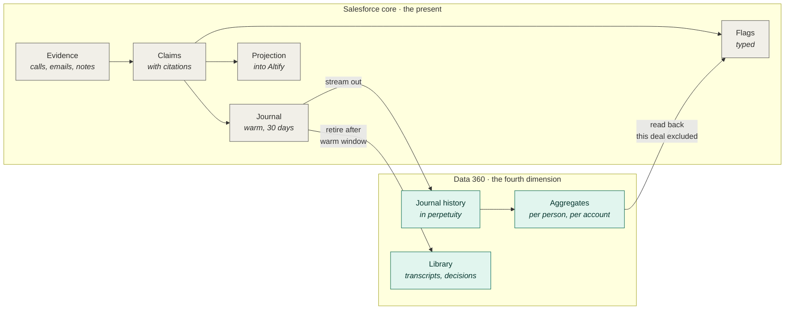
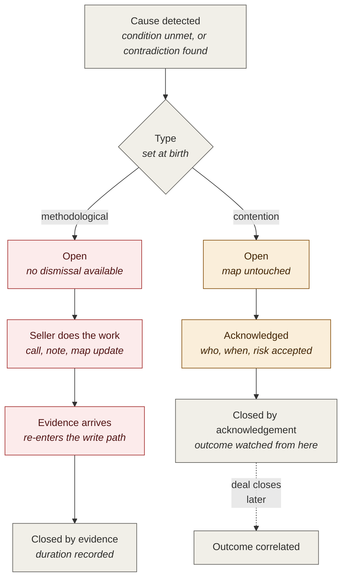

# AAO Architecture

> **The version lives on the stamp line below and nowhere else.**

**v3.1 · 2 August 2026 · Formed in the consolidation: Architecture v3.0 with Theory v1.4 and Computable Share v1.6 absorbed as stamped sections at the end. The 2 August rulings are carried at this head and marked against the body where they supersede it.**

> **Authoritative for:** the inventory — where things live, what code drives each step, every ruling — plus the argument (Theory section) and the per-org corpus analysis (Computable Share section). **Defers to:** Glossary for vocabulary, Model & Flow for fields, Charters for the AI.

**Carried at this head, superseding the body where named:**

**LAW #1, above everything below it.** No dependency on any ALTF package version, ever; the system runs with Altify absent. The ontology ships as our seed custom metadata (two fields, shipped default plus subscriber override), org-overridable, built and test-checked in sandbox session 49. The label sourcing question is closed; no option that read the package won.

**The body's sentence "no Altify API name appears anywhere in our code or metadata" is marked wrong** — ruled by Matthew: you cannot query without naming what you query, and no resolution layer exists or should. The real rules: no metadata on ALTF objects, no version dependency, graceful absence. Reading stable API names is not a dependency.

**The body's Criterion Text correction is itself corrected:** the assessment proposition is the PAIR, Criterion Text plus Long Question — the field's inline help calls it the text of the criterion while its description calls it a title, and the required half was demoted on the description alone. The v2.9 sentence "the display name is never read" is withdrawn. The content hash covers both fields.

**The licensed-seller filter needs absence behavior:** with no Altify installed there is no PackageLicense row and the pipeline sees nothing — the filter becomes a gate with defined empty-state behavior; what scope means with no licence to read is Matthew's open ruling, together with the seat-gaming hazard (owner-licensed scoping lets one seat run the org).

**The qualifier object chain enters the inventory:** Sales_Process → Sales_Process_Stage → Sales_Process_Stage_Qualifier (junction: Mandatory, Importance, sort) → Sales_Process_Qualifier; answers on ALTF__Qualifier_Answer__c against the global qualifier; Version on Sales Process auto-increments and ALTF__Qualification_Dirty__c signals recalculation; the template qualifier pair is a standalone authoring library. Full field truth in Model & Flow.

**The scope resolver and the account boundary are ruled** — the two-key lock, dual-write, curated-overlap weighting, net-new-to-both — detail in Charters; the scope stamp law in Model & Flow. **The two rubric hashes the body describes at two grains are two mechanisms and are declared as such** (per-question content hash on contracts; per-org config hash on the rubric snapshot).

---

*The absorbed documents follow, stamps intact.*

---

# PART I · Architecture (absorbed; stamps intact)

# AAO Architecture

> **The version lives on the stamp line below and nowhere else.**

**v3.0 · 2 August 2026 · Matthew Weisberg**
*Formerly the AltifyOS Architecture — title migrated under the ruling that file titles move at each document's next natural bump.*
**Companion to:** AAO Glossary, Data Flow, Object Model, Theory. Working analysis alongside: Computable Share.

> **Authoritative for:** the inventory: where things live, what code drives each step, and every ruling.
> **Defers to:** Glossary for vocabulary; Object Model for why an entity exists and how it is keyed.
> **Retrieval warning:** project knowledge returns chunks by relevance and a chunk may not carry its source. Every heading in this file is stamped with the version it last changed at, `arch v3.0` for this bump. **If a retrieved passage carries no stamp, do not trust it — open the file.**

**Changed in v3.0.** **Two things land at once: the Answer / Claim correction is absorbed at last, and the 2 August rulings arrive.** The corrections record of 31 July was authoritative over this document until its next bump; this is that bump. **The entity inventory moves from fourteen to sixteen**: Journal Event is retired as an entity — it existed only because *Claim* was busy naming the mirror row — **Answer** (the upserted current-state row) and **Claim Basis** (the junction naming what a claim rests on, half frozen, half live) enter, and **Participant** enters from this sprint, one row per Source per person, written in the Source after-insert. *Claim is a mirror row, a receipt is a journal row* is superseded: **they are Answer and Claim**, and the naming gap that passage tolerated is closed rather than tolerated. The replay invariant is restated — **replaying claims must reconstruct the answers exactly** — and Answer's key carries every word of the reasoning that ruled Claim's key, unchanged. The memory plane goes **from six tables to seven**, gaining the decision log, with participation's memory home named open. Two ratification sentences are marked wrong in place: nothing named Claim commits at a hold — the candidate holds — and what survives a decline is the Candidate, never a claim. The deduplication passage gains the reinforcement distinction: the same evidence twice writes nothing; new evidence confirming what stands writes a claim with outcome `Reinforced`. **The 2 August rulings**: the **capability law** — a capability claim is unverified until tried from the runtime that will make the call; the **after-insert law** — a throw in derived after-insert work destroys the evidence that caused it, so the safe direction is always to lose the derived thing; **flag ageing** — a flag ages from when its question became askable, never from when the answer last turned bad; a **sixth flag type, missing-relation**, keyed on deal plus relation kind; **flags get no charter** — nothing may gate a flag being raised; **contention splits three ways**, ordinal, insight, and the new pattern contention — authored queries over the memory plane, written once by a model at setup, frozen, executed by Apex; **licensing, scope and partial module ownership** gain a section of their own and a build phase, with the licensed-seller read settled on `UserPackageLicense`, module ownership distinguished from graceful absence, the capability matrix confined to the projection layer, and the admin error log as the first admin-facing surface; **native writes stated absolutely** — Opportunity and Account are never written, Contact stays toggleable, and shadow objects are permanent for toggle-off customers; and the **cited-type rule** — a type earns a lookup when its live state will be compared against the frozen snapshot. The projection-cost section gains one sharpening: persona is the one target where divergence resolves by union. The end line drops its version; the stamp line above is now the version's only home.

**Changed in v2.9.** **The Gate 1 rulings of 29–30 July graduate — coextension and its consequences, and three rulings from the 30 July session.** One new section below, after the multi-span ruling it extends. In brief: **coextension governs establishment** — evidence carries a verdict only when it covers every element the proposition names, at the scope and quantity the proposition requires, and all eight blind rejections across two runs were scope or quantity mismatches, never fabrications; **the citation unit is a span set adjudicated element by element**, and element coverage routes the record state — full coverage writes the verdict, partial coverage writes `UNVERIFIED` carrying the spans that exist, no coverage writes nothing; **abstention narrows accordingly** — it is reserved for genuinely nothing, because partial coextensive evidence written as `UNVERIFIED` is what lets truth accumulate across calls instead of restarting on each one; **dispositional claims about the customer establish only from the decision maker or a mapped DM-influencer** — from anyone else the same words write `UNVERIFIED` with receipts, which regrades Gate 1 run 2 to 75% and below its own bar; and **reconciliation becomes a named stage** — extraction proposes, reconciliation against standing state disposes, with bounded reads defined in Data Flow. The controls description is corrected: **deterministic verification plus blind adjudication are the controls that fire; ratification is a calibration loop**, not a per-claim gate. The full experiment record is the Gate 1 results document; this section holds the rulings' final wording. Heading stamps move to v2.9; the preserved v1.8 changelog defect is untouched.

**Changed in v2.8.** **The quantifier ruling graduates from Computable Share, where it was argued on 29 July and corrected by Matthew the same day — one new ruling section below, nothing else moved.** Three parts: where a rubric sentence says *each*, it means each, over exactly the set the sentence names; a quantified proposition over an empty set resolves to **unanswerable, never to true**, because vacuous truth cannot clear a gate — a production census found 146 of 208 open opportunities with no key player flagged, so the naive strict reading would have auto-passed a mandatory Stage 2 gate on seven deals in ten; and the numerator is established **per person from evidence**, because a quantified proposition is not atomic — *validated with each key player* on a nine-player deal is nine Claims, one per person, each with its own citation, never one claim carrying nine. Three supporting arguments were corrected before graduation and arrive corrected: **assessment answers carry a populated note field** — one names three people — so validation can sometimes be read, though never counted, because no record carries person, date and citation as separate fields; **the key-player flag is derived from Political and Status, not authored**, so the 146 empty sets have at least three possible causes and the gaming-hole argument is dead — a derived field cannot be unflagged; and the per-person structure costs **no new entity**, because the insight-card-to-contact join already exists. The measurements and the census stay in Computable Share, which is their grain. Heading stamps move to v2.8; the deliberately preserved v1.8 changelog defect is untouched.

**Changed in v2.7.** **Gate 1 ran, three times, on the Tungsten call of 23 July — and the headline is that fidelity held.** Twenty-nine cited spans across the runs, every one verbatim, contiguous, inside a single speaker turn and correctly attributed: **zero fabrications**. A blind re-adjudicator, given the quotes and the claims and nothing else, upheld ten of eleven. **A citation may now carry up to five spans** — ruled below — because a single contiguous quote cannot express an accumulation, and forcing one made the model either abstain or overstate a fragment. **Three test-design corrections, all mine.** Route C was handed the transcript alone in run one, which is not a test of route C but a test of half of it; supplying the map, the criteria and the insight map moved committed verdicts from five of twenty-one to eleven. Machine-generated topic labels arrive inline in Einstein transcripts and are not spoken words; nineteen were present and a model citing one would pass a naive span check, so **annotations are stripped before the charter sees a transcript** and the strip is recorded. And a rule injected into run three — that a row we authored evidences our recording, not the customer's act — silently answered an open judgment call; it is withdrawn from the charter and returned to Computable Share, where the measurement now sits: criteria provenance is worth two propositions on this deal. **Two findings that are the product working.** A mandatory Stage 2 qualifier, Customer Insights, stands Yes in production and the evidence says false — no insight card records a validation event against any named key player, two Inner Circle key players carry no coverage, and the decision maker says on the call that he has not talked to one of them in detail. That is the first real catch. And TC_15 is the compound exemplar with a measurement at last: the extractor read *willing and able* as established, the adjudicator accepted willing and rejected able, which is the parked decompose-versus-binding-clause decision biting in production data rather than in argument. **The email-domain ruling gains a second specimen**: both the Altify seller and the customer's own decision maker resolve to Lead in this org, so record type cannot separate the sides and domain can.

**Changed in v2.6.** **Cross-references drop their version numbers, and the reason is a defect this document was carrying.** The defers-to line pointed at Object Model v1.7; six sentences in the body pointed at the same retired version and a seventh sent the reader to Glossary v1.7. Every one of those is a direction to a reader, and every one pointed at a file that no longer exists in project knowledge. **Re-numbering them would have made it worse**: bumping this document invalidates nineteen pointers to it in the other five files, fixing those invalidates the pointers back here, and the next real content change fires the same cascade again. **So the convention changes — a cross-reference names the document, never its version.** There is exactly one live copy of each document, so the name is unambiguous; a version number in a pointer could only ever be right or wrong, never useful, because the version it names is deleted the moment it is superseded. **Heading stamps are untouched by this and still carry the version**, since a stamp says which chunk you are holding, and that is the thing retrieval actually loses. **No content changed** beyond the pointers. Architecture v2.4, Glossary v1.7 and Data Flow v2.0 are retired from project knowledge as of 29 July 2026. *Left alone and flagged: the v1.8 entry below reads `arch v2.5`, which it cannot have said at v1.8 — an earlier bump replaced that string file-wide and overwrote its own history. Correcting a historical entry is a separate decision and not this one.*

**Changed in v2.5.** **Memory is settled: six tables, all Engagement, and the platform's doors are verified one-way.** The DMO category rule is confirmed against Salesforce's own material and is stricter than carried — category inherits from the first mapped source, every later mapping must match, and a stream's category and its Engagement event-date choice lock at creation; ingestion upserts on primary key, so history appends by key design. The event time is the evidence-occurred clock, nominated permanently at stream creation. **Two memory tables added**: the proposition-state snapshot — long shape, one row per deal per applicable proposition per change, derived from the journal and never written beside it, because the executive pattern query is the product — and the rubric snapshot, keyed per question version, carrying the resolution route. Wide is ruled out: a question is a row value, never a column. **The computable-share classification is done** (Computable Share v1.0): 44 distinct propositions — the 44 qualifier placements are 19 sentences — split six predicates, thirteen charter-with-state, twenty-five evidence-only, twelve carrying the solicit star; classification lands in rule data keyed by question Id plus content hash, routes and never establishes, five judgment calls open. **Tiered flag surfacing joins the open list.** Gate 0 closed; Gate 1 scoped model-only — extraction, span check, blind re-adjudication, no Apex, no writes, outside the org.

**Changed in v2.4.** **Assessment scoping is real, and the mechanism is found — the v2.2/v2.3 account is corrected.** The applicable set resolves per deal through a three-read configuration chain: the Opportunity Manager Settings custom setting names the Opportunity field that carries plan type, that field's value matches an `ALTF__Opportunity_Plan_Type_List__c` row by name, and the row's `AssessmentQuestionIds` codes are the set. Resolution semantics observed in two orgs and mirrored cell for cell: a matched row with a populated list restricts to exactly those questions; empty list, null value, and unmapped value all resolve to every active question. **`ALTF__Sales_Process_Mapping__c` was read and holds neither assessment scoping nor the qualifier-to-condition link** — it maps plan-type strings to sales processes, eleven rows — so the "unread and remaining candidate" framing is struck and the qualifier-to-condition fallback, a setup-time mapping charter, is the live path. **Altify versions the qualifier rubric only**: assessment scope and question content carry no versioning, so the rubric snapshot — source field name, scoping rows, active question content, keyed by org Id — is re-read and hashed every run, and the hash delta is the change detector; custom settings admit neither triggers nor Change Data Capture. Question codes recycle across rubric generations and across orgs, so **question identity binds to record Id and content, never to the code string**. Answer rows with null values exist, so the unanswered state has two physical shapes. The Note-implementation read is done — classic enabled with one record ever, Enhanced zero — and the slow-lane surface list becomes an install-time discovery. **Written clearing of red flags added to the open list at Matthew's direction.** This org has zero Opportunity record types, so both scoping systems key on `Type` strings here. The header version line, stale at v2.2 through one version, is corrected.

**Changed in v2.3.** **Six rulings absorbed from the theory-and-decisions note, which is retired — this document, the glossary, the data flow, the object model and the new Theory document are its five destinations.** Null, `UNVERIFIED` and abstention are three record states and null is the empty one; an `UNVERIFIED` claim now carries a citation. **Day-one red**: every gating proposition stands red from opportunity creation, the escalation threshold governs surfacing rather than existence, and the metric is cleared-against-runway — the completeness score is retired as a concept. **The `SystemModstamp` poll acquires its third consumer**: re-verification of standing propositions on human map edits, with no new path and no trigger. **Ratification narrowed twice and sharpened once**: state-established claims bypass the gate at every level, decision criteria bypass it by ruling, and a yellow clears itself when a human does the work by hand — forced by human precedence, not offered as a courtesy. **Publication state settled as one axis**, closing the first item on ratification's open list and correcting the second — held is live for nothing, including contention's aggregate. Surface rules for the yellow count, with the mechanical reasoning that keeps approval counts off leadership surfaces. **Computability is classified, never assumed** — setup-time inference over configuration and the data. **Guidance may infer, because guidance establishes nothing.** **Task rendering reopened**: whether flags render as standard Tasks is undecided until that write is designed toggleable, and earlier versions asserting it were recording a decision never taken. A fifth companion, **Theory v1.0**, now carries why the design is superior for its niche; this document stays the inventory. The end line, stale at v2.1 through two versions, is corrected.

**Changed in v2.2.** **A fourth flag type, Ratification — the yellow flag — and the gate that makes configurable autonomy possible.** Absorbed from the ratification design note, which is retired into these four documents rather than maintained beside them. **v2.1's removal of completeness from the flag table was correct and did not imply the removal of yellow**; two different things were living under one word and only one of them was a flag. Plus the assessment rubric read on 26–27 July: the proposition text is a field nobody had read, the severity rubric is the score fields rather than the deprecated Mandatory checkbox, and **Altify's own org is configured atypically on the one number the flag rule would key on.**

**Changed in v2.1.** **Decision criteria adopted as a projection target**, adding a fifth Claim subject type and no new entity. Read from the org on 26 July 2026, including two field conventions invisible from the schema that each silently break a record. **A criterion never raises a flag unless a human promoted it**, and the promotion field already exists. The insight-versus-criterion boundary ruled, with a seed rule shipped rather than learned. Guidance about a person acquires an instruction rather than only a diagnosis.

**Changed in v2.0.** **Note capture is designed and moves out of the open list**, which was the largest open item in the document. Two destinations on two clocks: a published reconciliation destination we own, and a poll over notes already attached to the opportunity. Claim's key recorded as ruled. **A fourteenth entity, Note Evidence.** Long text fields ruled out as monitored evidence and retained for backfill, with both reasons. Two flag requirements added that the seller's experience depends on: a flag states where to answer it, and a flag shows the last evidence it considered. The Agentforce callout retired — the instructions field it named has been corrected.

**Changed in v1.9.** Journal Event amended: **four keys, two clocks, and subject identity.** The four keys cannot identify which claim a row belongs to, so replay could not reconstruct the mirror as previously specified.

**Changed in v1.8.** Format only — every heading now carries a `arch v2.5` provenance stamp and the file states what it is authoritative for. **No content changed.**

**Changed in v1.7.** Projection's compare-and-swap restored — it was lost in the v1.5 restructure and survived only as a line in the object model — and corrected: **the watermark is a pair, not a value.** Four entities identified as crossing into memory, each carrying an irreversible category decision.

**Changed in v1.6.** Entity list corrected from eight to thirteen — six entities the glossary declares ours were missing, and one previously-proposed merge is withdrawn. Claim declared a mirror row, resolving an apparent conflict with Receipt. Surfacing added as an object. **Agentforce ruled out as substrate.** Companion chain repaired.

**Changed in v1.5.** The largest revision so far, and mostly corrections rather than additions. A hard ruling added: no Apex triggers on objects we do not own. Guidance separated from flags — qualifiers lead methodological conditions rather than trailing them. Ingestion admitted on both planes. Normalisation given a resident copy so span verification never crosses planes. Backfill redesigned around a structured snapshot and made outcome-blind by allowlist. Journal events given two clocks. Notes reclassified from answers to evidence.

**Changed in v1.4.** Decision criteria examined and named as the strongest evidence target found so far — informal criteria in particular. A third gap pattern named: filled but unattributed. Relationship ownership located, with the invisible-row hazard it creates for projection.

**Changed in v1.3.** Level of Relationship corrected — there are two constructs, and the account-level one is already derived from opportunity maps by design. Segmentation examined and recorded as the inverse pattern: filled, and unverifiable. `ALTF__Account__c` identified as an existing roll-up cache, which is precedent for ours.

**Changed in v1.2.** Journal events keyed four ways rather than two, so account and seller-buyer grains stay declarable later instead of requiring the corpus to be reprocessed. Level of Relationship recorded as a named candidate with its rubric gap and its one-way-ratchet problem.

**Changed in v1.1.** Aggregates in Data 360 explained rather than assumed — what a calculated insight actually is, and why core cannot do this one. Backfill corrected: Batch Apex is blocked against Data 360 objects when using query locators. Platform claims sourced in the closing reference.

---

## What this document is · arch v2.9

The data flow says what happens to a piece of evidence. This says **where each thing lives, what kind of code moves it, and what shape it has when it lands.**

It is written to be read cold. Terms are defined where first used, so someone who has not read the glossary can follow it, and someone who has will find nothing contradicted.

**Status is marked throughout.** *Settled* means read off the org or already decided. *Proposed* means this document is making a call that has not been ratified. *Open* means named deliberately so it does not evaporate, and not yet designed.

> **A standing hazard, for anyone reading findings in this document.** The only org we can query is Altify's own, and it is systematically unlike the orgs this product is sold into. It has a decade of methodology data, native call capture into core, and its own package installed. Roughly **80% of installs will have none of those.** Three separate design errors in earlier versions came from generalising Altify's situation — assuming transcripts arrive in core, assuming relationship maps already exist, assuming standard-object triggers were available. Every number quoted from production carries an unstated question: *does this survive in an org with no Altify history?*

### The system in one paragraph · arch v2.9

Sales methodology defines, in advance, the conditions a deal must satisfy to be winnable. Those conditions are binary. The system reads the customer's own methodology out of their org at run time, reads their calls, emails and notes, and establishes each condition as true, false, or unverified — every establishment carrying the verbatim words that produced it. Every necessary condition stands red the day the deal opens; evidence clears them, and where one is still standing as time runs out, it escalates. Sellers clear flags by doing the work, not by dismissing them. The point is not to get people to use software. It is to make the deal's underlying truth retrievable rather than inferred.

---

## The two planes · arch v2.9

Everything runs on one of two planes, and the split is not arbitrary.

**Salesforce core** answers *what is true now*. It holds the methodology, the maps, the claims, the flags. It is transactional, it enforces rules at write time, and it is where sellers already work.

**Data 360** answers *what has been true over time, across deals and people*. It holds the permanent archive and the aggregates computed over it.

> **The rule: present tense on core, fourth dimension in memory.** Anything a seller acts on today is read from core. Anything requiring history across deals is read from Data 360. A judgment that needs both reads core and consults memory — never the reverse.

**Why the journal streams out rather than being queried in place.** Core storage is finite and scales with licence count, so a customer with heavy call volume fills it faster than a large customer with light usage. History therefore lives in Data 360 permanently and on core only for a warm window, defaulting to thirty days. *Settled.*

**Why history is never consulted in the write path.** Reading Data 360 from Apex consumes Data Services credits and adds latency to a transaction already carrying model callouts. Salesforce's own guidance is explicit here and warns against precisely the patterns we would otherwise reach for — loops, query locators and recursion, anything producing repeated queries. Contention against history therefore runs **after** the write, on a schedule. *Settled, and documented rather than assumed — see the reference at the end.*

**The exclusion that is easy to miss.** Every read of history filters out the current opportunity. The system writes its own conclusions into the journal, so without that filter it finds its own output sitting in history and reads it as independent corroboration. Confidence would climb with no new evidence. *Settled, and it is a filter rather than an absence — it has to be written in every query.*

### What an aggregate is on this plane · arch v2.9

Worth spelling out, because "aggregate" means something different here than on core, and the difference has consequences for what we can build.

**A calculated insight is a separate table, not a field.** It has its own API name ending `__cio`. You declare its **dimensions** — the grain, which for us is the person — and its **measures**, the actual arithmetic. It runs on a schedule and the results materialise into that object, which you then join back to by the dimension key. Closer to a materialised view than to anything on core.

So the translation from familiar ground: on core, a rollup summary is **a field on the parent record**. Here it is **a separate table keyed by whatever grain you declared.**

**Why core cannot do this particular job.** Not scale. Shape. A core rollup only aggregates up a defined parent-child path — children into their parent, and nothing else. But *this person across five unrelated opportunities over thirty years* has no such path. Those opportunities are not children of the person, and several sit on entirely different accounts. There is no relationship to roll up. Data 360 does not need one, because the grain is declared rather than inherited.

**Our measures are counts, and deliberately nothing cleverer.** Per person: how many prior opportunities they appeared on, how many times they held each status value, their most recent status and when.

Insights support the standard aggregates — count, sum, average, minimum, maximum. **There is no "most common value."** So *this person was hostile on four of five prior deals* is not a measure. It is counts grouped by status, and choosing the dominant one happens in our Apex.

> **That constraint is a gift and should be treated as one.** The aggregate hands us a distribution; our code makes the judgment and has to be able to defend it. An insight that quietly resolved a person to `Enemy` would be inference wearing arithmetic's clothes, and it would sit upstream of every rule we wrote to prevent exactly that.

**Insights are close to immutable once shipped**, which matters far more for a packaged product than for an internal build. Dimensions cannot be added later unless they are key qualifier dimensions, existing measures and dimensions cannot be removed, and a measure's API name, data type and rollup behaviour are fixed at creation. Get the grain wrong in v1 and we ship a second insight in v2 and carry both indefinitely.

**So: define insights narrowly and put everything interpretive in Apex,** where it versions like ordinary code.

**Reading them, and the two mechanisms are not the same.** Insights come back through ConnectApi — pass the `__cio` name with dimensions, measures, filter, sort and paging. Data model objects are queried with static SOQL, supported from API version 61.0; below that only the first 201 rows return. Insight queries cap at 4,999 rows with offset paging, which is ample for one person and means paging for a bulk pass. *The exact ConnectApi signature should be confirmed against the Apex Developer Guide before anyone writes against it.*

**On AI reading these directly.** It is possible — prompt templates can ground on a Data Graph for structured data, or on a retriever over vector-indexed unstructured content. **We mostly will not use it, and we depend on none of it.** Comparing a historical distribution against a present value is arithmetic, and handing a model prose about someone's history to judge would reintroduce the inference the whole design removes. The retriever path becomes interesting only if we later want an agent reading the transcript library itself.

---

## Where the truth lives · arch v2.9

*Proposed.*

**Claims land on our objects first. Altify's fields receive a projection.**

The reasoning is narrow and worth stating precisely, because it is easy to mistake for a criticism of Altify's schema and it is not one.

Altify's fields hold **answers**. Sarah's Buyer Role is Decision Maker. That is what the field is for and it is correct. What the field cannot hold is the **proof** — which call, which sentence, which model, under which version of the rules, at what time. The map row has one notes field of 1,024 characters shared across everything tracked about that person, and it records when each attribute last changed but only who last touched the row as a whole.

So the proof needs a home with room and grain. Ours.

**Three consequences, all of which we want anyway.**

Our package installs and runs in an org that has never had Altify. Altify becomes what it was always specified to be — enrichment when present, not a dependency.

Our package does not break when Altify ships on its biweekly cadence, because **no Altify API name appears anywhere in our code or metadata, reads or writes.** Field names are looked up at run time. The glossary already required this for reading; it extends to writing without exception.

Where Altify *is* present, its architecture does the job it is actually good at: organising truth so it can be traversed and retrieved, and supplying the methodology that gives an answer its meaning.

**Evidence does not all live on one object, and should not.** An initiative card reading *budget for this initiative is confirmed*, linked to Sarah as Owner, **is** the evidence that Sarah holds budget authority. Not a pointer to it. The trail runs claim → card → the verbatim line in the transcript that produced the card. Two hops, both real records, and the map's small note field carries none of it.

The map note stays what it is for: the essence of a person, written by a human in their own words.

### The cost of projecting rather than writing directly · arch v3.0

**Human precedence becomes eventual rather than immediate**, and this is the honest price of the ruling against triggers on objects we do not own. A human editing the map in Altify's interface performs a write we cannot trap, because trapping it is exactly the trigger we gave up. Between two passes we could overwrite a human judgment — the one outcome the system exists to prevent.

The mitigation is compare-and-swap, and it is sound. **Before projecting, read what is there. If it differs from what we last wrote, someone else wrote it**, and by the actor-stamp default that someone is `HUMAN`. Mark it human-authored, never overwrite, raise contention.

That detects a human edit with certainty. What it cannot do is detect it *at the instant it happens*, so the exposure is one pass wide — and it is a read rather than a guess. State it to Toby in those words rather than let him find it.

**One target is exempt from contention entirely, and it is the only one.** *Added in v3.0.* The contact-carried persona — `ALTF__Contact__c.ALTF__Altify_Personas__c` — is additive: the machine only ever adds and never removes, so **a detected divergence resolves by union rather than by contention**, because both values are true. Everywhere else, human precedence becomes eventual and compare-and-swap is the mitigation; here there is nothing to mitigate.

> **The watermark is a pair, not a value.** *Corrected in v1.7.*
>
> Value comparison alone is insufficient, and the hole is specific: **a human who sets a dimension to the value it already held leaves no difference to detect.** They confirmed something deliberately, we read no change, and we overwrite their confirmation on the next pass — the precise failure the mechanism exists to prevent, occurring silently.
>
> So the watermark carries **our last written value *and* that dimension's `_Last_Modified__c` as it read at the instant we wrote.** A timestamp that has moved while the value has not is a human confirmation, and it is the only evidence of one that exists.
>
> **It must be captured outbound and cannot be reconstructed later.** Altify gives a per-dimension `_Last_Modified__c` and only a record-level `LastModifiedById`, so the timestamp is the sole per-dimension signal available. Read it after our own write lands, store it beside the value, and compare both on the next pass. Miss that capture and there is nothing to go back for.

---

### One poll, three consumers · arch v2.9

*Consolidated in v2.3, because the third job arrived and the mechanism did not change.* The `SystemModstamp` poll on customer objects serves three consumers from one query and one watermark: **human-precedence detection** for projection's compare-and-swap; **held-candidate withdrawal**, the self-clearing yellow under ratification; and **re-verification of standing propositions.**

The third is why no new mechanism was needed. A standing proposition — *at least one supporter at decision-maker level or above* — can flip with no new evidence arriving, because a human moved the map. **Nothing changes from nothing**: the map moves exactly two ways — our own cited write, which the same pass reads back, and a human edit, which this poll already returns. Both observable, no silent decay, no trigger. **Cost scales with edit volume rather than pipeline size**, because the poll returns changed rows, never deals; nobody scans every deal every day.

**Ruled: provenance does not change the flag.** A standing proposition flipping false raises red in the ordinary batch whether our write or a human edit moved it — no settling period, no special case. Provenance changes who gets asked about it, never whether it fires. And **machine-or-human stays decidable from absence**: a write not carrying our charter stamp is human, which holds through OAuth where the acting identity is opaque, because we never need to know *which* human — only that it was not us.

## Rulings · arch v3.0

*Settled. These constrain everything downstream, and unlike most of this document they are not open to redesign.*

### No Apex triggers on objects we do not own · arch v2.9

**Not on Opportunity, Account, Contact, Task, Note, Attachment, or any other standard or customer object. Not ever.** Triggers exist only on our own objects, in our own namespace.

This was previously treated as a technical question about whether such a trigger would package. It is not a technical question.

**The failure mode is categorically wrong.** Everything else we might get wrong degrades service — we run late, we abstain, we miss a piece of evidence. A trigger in a customer's save path converts any defect of ours into *their CRM not saving records*. Our slowness becomes "Salesforce is slow." Our governor limit becomes a rep who cannot close a deal at quarter end. No packaged product should be able to fail that way.

**And it does not survive enterprise review**, which matters because high-compliance organisations are the target rather than an edge case. *This package executes code on every write to your Opportunity object* is not a sentence that passes a bank's security review regardless of the code's quality. Most large orgs also run a governed trigger framework with strict internal ownership, so a package adding its own is frequently blocked by change control independently of security.

**Our own write law is untouched.** Those triggers sit on our objects, where our failure is our own.

**What follows from it.**

Change detection on customer objects is **polling**, not interception. Query by `SystemModstamp` since the last run, select what is needed, compare against our stored watermark. This works everywhere, needs no customer configuration, and is the same compare-and-swap already used for projection. *An earlier version of this document claimed polling was unavailable for long text fields. That was wrong — the restriction is that a long text field cannot appear in a `WHERE` clause, not that a row carrying one cannot be selected.*

**Change Data Capture is the faster option and a customer decision.** Salesforce publishes change events natively when an admin enables them per object; we subscribe to the event stream rather than executing inside the save. It runs after commit and cannot block a write, which is a materially different conversation with an InfoSec team than packaged Apex in the save path. It still requires the customer to switch it on, so it is an option and never a default.

Polling versus CDC is therefore per-customer configuration, not an architectural fork. Both feed the same pipeline.

### Agentforce is not part of this build and never was · arch v2.9

*Ruled in v1.6. Anything asserting otherwise is wrong, including sources outside this document.*

**Agentforce is the commodity layer of the AI stack.** It is an agent runtime, it will be matched by every vendor within a release cycle or two, and building on it as required substrate would put the product's foundation in the one place where nothing is defensible.

**We are building the proprietary layer beneath it** — the data architecture that makes enterprise revenue truth retrievable rather than inferred. That layer has value precisely because it is not commodity, and it must not acquire a dependency on something that is.

The distinction to hold onto: **an agent runtime consumes what we produce. It is a consumer, not a substrate.** Agentforce, a headless assistant over MCP, a competitor's runtime, or something that does not exist yet are all the same shape to us — surfaces that read our output. Nothing in this design may require any particular one of them, and the design is stronger for being indifferent.

**What we do depend on**, and the distinction is not pedantic: a model gateway for inference, reached through the Trust Layer, and Data 360 for ingestion and the memory plane. Neither is Agentforce. The compute table's *Core → Trust Layer* rows mean the model gateway and nothing more.

> **The source of this error has been removed.** *Retired in v2.0.* Earlier versions of this document carried a standing warning that the project's own instructions field asserted Agentforce as required native substrate, and that every new conversation would inherit the error before reading a word here. **That field has been rewritten and now carries the ruling.** The warning is retired rather than deleted, so the correction is legible to anyone reading an older version beside this one.

---

### Null is the empty state, `UNVERIFIED` is an answer, and abstention writes nothing · arch v2.9

*Ruled in v2.3. The full vocabulary is the glossary's; the ruling is recorded here because two design errors were traced to collapsing these.*

| State | What it means | What is written |
|---|---|---|
| **Null** | Nobody has said anything about this proposition | **No claim row.** Nothing |
| **`UNVERIFIED`** | Somebody addressed it and it came back open | **A claim row, with a citation** |
| **Abstention** | The model looked and declined to commit | **Nothing.** No claim, no value, no citation — a decision-log row only |

**An `UNVERIFIED` claim carries a citation like any other claim** — the span asserting the answer is open is what distinguishes *asked and open* from *never asked*. It is a finding, not an establishment: it satisfies no condition and clears no flag, but it records that the work was done. **The flag does not care which; the seller does** — under day-one red the gating flag stands on null and on `UNVERIFIED` alike, and the citation's presence is what carries *nobody has raised this* versus *they do not know* to the surface.

**Abstention leaves the mirror identical to null, and only a low abstention rate keeps that tolerable** — no field fixes it. Abstention is also not silence: evidence that does not bear on a proposition writes nothing and is the ordinary case, and the charter output schema must keep the two apart or the abstention rate measures nothing.

### A citation may carry several spans · arch v2.9

**Ruled 29 July 2026, from Gate 1.** A verdict may cite **between one and five verbatim spans**. Each span is separately checked and must be a contiguous substring of a **single speaker turn**. A span is never spliced across a speaker change, and a set of spans is never presented as one quotation.

**Why the single-span rule failed.** Some propositions are established by accumulation rather than by a sentence. On the Tungsten call the decision maker briefed a new stakeholder, sent him materials, undertook to connect him, and said he would recommend a pilot — four acts, four turns, no one of which establishes *a key player is advocating on our behalf* and all of which together plainly do. Forced to one span, a model has exactly two moves: abstain, losing a true fact, or pick the strongest fragment and let it carry weight it does not hold. The first is a silent miss. The second is the wrong-and-confident failure the whole design exists to prevent. Neither is acceptable, and the rule caused both.

**What the change does not loosen.** Every word still traces to a named speaker at a named moment. Verification is unchanged and is applied per span, so a set fails if any member fails. The reader test is unchanged in kind and stricter in application: the question is whether the *set* carries the verdict, and the blind re-adjudicator is shown the whole set precisely so that a case assembled from fragments can be rejected as a case.

**The known cost, named.** Fragments can mislead in combination in a way one sentence cannot — four hedged statements can be stacked to look like a commitment. The re-adjudication step is the control, and on the first run it earned its place: it rejected a compound verdict the extractor had accepted, on the ground that one clause of the sentence was carried and the other was not.

### Coextension, element coverage, and who may establish disposition · arch v2.9

**Ruled 29–30 July 2026 from Gate 1 runs 2 through 4 and the 30 July session. These extend the multi-span ruling above: that ruling made the citation plural; these make it structured.**

**Coextension governs establishment.** A span set carries a verdict only when what it is about is the same thing — at the same scope and the same quantity — as what the proposition is about. Every blind rejection across two runs was a coextension failure and none was a fabrication; the three failure shapes are **part for whole** (an SOW standing for contract plus security documents), **instance for pattern** (one tentative next step standing for a joint action plan), and **one for many** (a single person's disposition standing for "key players" in the plural). The rule is near-mechanical to check: does the set name every element the proposition names, at the quantity the proposition requires? Plurality is itself an element carrying a quantity, so bare plurals decompose like anything else and need no separate quantifier machinery. **What the rule does not catch is nominal coverage** — a set with something touching each element while nothing says the thing — and that residual risk is named rather than counted as solved; its failure modes are asymmetric in the safe direction, since under-coverage lands in `UNVERIFIED` and over-coverage should fail the blind reader.

**A proposition decomposes into named elements, and coverage routes the record state.** Every element covered → the verdict is written with the full span set. Some covered → **`UNVERIFIED`, carrying the span set that exists.** None → not addressed. All three states already exist and `UNVERIFIED` has carried its citation since Glossary v1.6, so no new state is introduced — what is new is that the blind reader adjudicates coverage element by element, which also answers where a blind rejection lands without inventing policy for the ambiguous case. Who decomposes propositions into elements, and when, is open and named in the results document; it has the shape of the required role set — derived once per proposition per rubric version, cached, human-ratified from a short list.

**Abstention narrows.** Abstention is reserved for genuinely nothing. Where partial coextensive evidence exists it is written as `UNVERIFIED` with its receipts, because a blank abstention transfers nothing to the next pass and incremental truth requires context to accumulate — the specimen is a buyer's explicit refusal to date the gates, which was citable and went uncited. A refusal to commit is evidence, not silence.

**Dispositional claims about the customer establish only from rank.** A claim about the buying organization's disposition — priority, preference, commitment — establishes as a verdict only when the establishing speaker is the mapped decision maker or a person the map shows influencing one. From any other mouth the same words are real but are *that person's* disposition, not the organization's: coextension applied to the speaker. They write `UNVERIFIED` with receipts, never true. The system's own per-person contact accumulation legitimately informs how well the speaker's rank is known — which is a permitted use of coverage, unlike the validation proxy rejected in the quantifier ruling. **Consequence, applied retroactively as rulings must be: Gate 1 run 2 regrades to six of eight, 75%, below its own bar.**

**Reconciliation is a stage, not an afterthought.** A call verdict is a proposal. Before anything writes, it is reconciled against what already stands — the standing value and note for the same proposition, the journal's prior claims for the same proposition, and the establishing speaker's map row — under bounded reads defined in Data Flow, never a whole-opportunity scan. A clean call-true over a standing establishment appends a receipt; a call-true against contradicting standing state raises a contention flag rather than writing. Extraction proposes; reconciliation disposes.

**The controls, described accurately.** Deterministic span verification catches fabrication and caught none, because fabrication was never the failure mode; over-reading was, and byte comparison is structurally blind to it. **Blind re-adjudication is the control that fires** — it rejected five of six over-readings that extraction, its own review, and the human reviewer had all passed. Ratification is a **calibration loop**: it tunes charters over time through written reasons, and its hedges carry signal, but it does not gate individual claims. Abstention is a model behaviour, not a control. The blind reader receives decomposed propositions and span sets, never the transcript, the narrative, or the first verdict — richer evidence, never richer context, because whole-call generosity is exactly what it exists not to have. For run comparability the reader is **pinned**: one prompt, one model, unchanged across runs, ratified once.

**Flag content forks on coverage.** A flag over nothing says *not started, here is what to go get*. A flag over partial coverage says *here is what already stands, with its receipts, and here is the element missing*. Same state machine, two sentences — this extends the Decision Team ruling that a false prompts naming one holder of each required role rather than demanding coverage on all of them.

**Smaller rulings recorded with their final wording, argued in the results document:** the sentence is the proposition and the display name is never read; knowledge is a positive indicator even when what is known is bad, with the badness carried by the flag; criteria surfacing in conversation are logged as criteria records in loop one and read as state in loop two; joint-plan propositions cite plan-content acts — who does what by when — never meeting logistics; where a truth condition can be computed from reference data it is computed rather than sought in speech; and rubric questions should be authored checkably with stage-phased thresholds — for Altify's own rubric a rewrite it owns, for customers authoring guidance; **implementation-phase content — risk mitigation, execution plans, post-contract pilot operations — belongs in the insight map's initiatives as notes on executing the sold solution, never in assessment**, because implementation risk does not risk the deal and a question whose answer cannot kill the deal is not methodology. Scoring and weighting live in the existing rubric arithmetic **above** binary verdicts, never inside them: a fact is established or it is not, and what it is worth is a separate, already-existing layer.

**Where a set spans both kinds of evidence,** the same rule holds across the boundary: rows cited from committed state are listed alongside the spans, and the verdict's basis is recorded as state, transcript, or both. A basis of *state* alone still requires that the row be named and its field value quoted.

### The quantifier is strict, and an empty set is unanswerable · arch v2.9

**Ruled 29 July 2026. Argued in Computable Share, corrected by Matthew the same day, graduated here in v2.8. This is method — it holds for any org's rubric, not only this one. The census and the measurements that forced it stay in Computable Share, which is their grain.**

**One — the quantifier is strict.** Where a rubric sentence says *each*, it means each, over exactly the set the sentence names. No threshold, no majority, and no substituting a narrower or better-filled field for the author's words. Customer Insights says *each of the customer's key players*, so its denominator is the key-player flag on the opportunity's map, and every member must carry an establishment. The reason is enforcement rather than pedantry: a flag that argues with a seller has to be able to say *the qualifier says each, and here is who is missing* — and it cannot say that if we quietly rewrote the sentence.

Two facts about that denominator, so the ruling is not over-read. **The key-player flag is derived, not authored** — it falls out of Political and Status. And Matthew's standing position is that the flag is not to be over-weighted: it is redundant with Political and Buyer Role, which the charter already reads, so wherever a rubric references the term, the charter reads the political situation honestly and cites as well as the evidence allows.

**Two — an empty denominator resolves to unanswerable, never to true.** A quantified proposition over an empty set is vacuously true in logic and useless in enforcement. Where the set is empty the proposition is **unanswerable**, and the flag's sentence becomes the actionable one: *this cannot be answered because nobody is identified* — a different and better sentence than *validated with everyone*. The census that forced this part: 146 of 208 open opportunities — 70% — carry no key player at all, in the best-maintained org that exists, so the strict reading taken naively would have cleared a mandatory Stage 2 gate by vacuous truth on seven deals in ten. Because the flag is derived, that emptiness has at least three possible causes — Political and Status unfilled, the derivation not run, or genuinely nobody qualifying — and the guard needs no diagnosis: whatever the cause, a count over nobody is not an answer.

**Three — the numerator is per-person evidence, because a quantified proposition is not atomic.** *Validated with each key player* on a nine-player deal is **nine Claims** — subject the insight card, establishing speaker the key player, one per person, each carrying its own verbatim citation — never one claim carrying nine citations. The aggregate is a count over them, and the proposition-state snapshot already has the shape to carry the outcome: one row per deal per proposition per change. This is what makes the strict ruling affordable: the insight-card-to-contact join already exists (Owner / Informer), so it costs **no new entity, no shadow-contact field, and no misuse of Decision Criteria** as a person join. **Coverage is rejected as a proxy** — it records that we spoke to someone, not that we validated with them, and using it would admit inference into establishment; on the Tungsten deal it would have cleared seven of nine and buried the first real catch. **Seller attestation is rejected** — the Yes standing on that deal is exactly an attestation, and it is wrong. One narrowing from Matthew: assessment answers carry a populated note field — one names three people — so validation can sometimes be *read* in prose; what no record carries is person, date and citation as separate fields, so it can never be *counted*, and a strict count has to count.

### The capability law · arch v3.0

**Ruled 2 August 2026.** **A capability claim — a statement about what the platform permits — is unverified until tried from the runtime that will make the call**, never from whichever tool was convenient. It belongs here, beside *no triggers on objects we do not own*, because it constrains everything downstream in the same way.

Three design sentences were wrong in the same direction this sprint, and each was a true fact generalised to a place it did not hold: **Coverage as a frozen query** — participation is not queryable, because there is no Source-to-Contact relation and the roster is JSON in a `LongTextArea` that SOQL cannot filter into; **`required` on Source**; and **labels reachable by pattern query from Apex** — `ExternalString` is Tooling-only, and 2,576 of 2,930 ALTF labels are protected, so `System.Label` is shut too. A query from Workbench, a Tooling read from a script, and a call from packaged Apex are three different runtimes, and only the last one is the claim. The vocabulary — Capability Claim, Pattern Sweep — is the glossary's.

### The after-insert law · arch v3.0

**Ruled 2 August 2026.** **Anything hung off an after-insert trigger can turn our defect into the customer's lost evidence**, because a throw there rolls back the row that caused it — a failure in derived secondary work destroys the primary fact. `AAO_Ingest` already ruled it for the enqueue path; the Participant writer was the second instance rather than a special case, which is what made it a law. **The safe direction is always to lose the derived thing rather than the evidence**: derived after-insert work catches its own failures, logs them, and lets the insert stand.

### Flag ageing · arch v3.0

**Ruled 2 August 2026.** **A flag ages from when its question became askable, not from when the answer last turned bad.** `AAO_Raised_At__c` is immutable, and the deploy refused a reopen path that restarted it. A gap reappearing is the same standing question answering yes again, and restarting the clock would let a deal launder itself by closing and reopening.

### Flags get no charter · arch v3.0

**Ruled 2 August 2026.** **Existence and clearance stay deterministic. Nothing may gate a flag being raised** — a model deciding whether one fires is the machine deciding what is do-or-die, which is the same line that keeps a discovered criterion from flagging. The nuance lives in guidance: flag content forking on coverage, already ruled above, and tiered surfacing, already named as owed on the open list. Both are surfacing decisions, and neither touches whether the flag exists.

### Native writes, stated absolutely · arch v3.0

**Ruled 2 August 2026, gathering what was already true into one place with no exceptions to hunt for.** **Opportunity and Account are never written. No metadata, no triggers, no logic on anything native.** **Contact remains toggleable exactly as originally designed** — toggle on, we write it and its children; toggle off, **shadow persons persist and cannot reach the Altify map**, because `ALTF__Contact_Map_Details__c.ALTF__Contact__c` is required. **Shadow objects are therefore permanent for toggle-off customers, not transitional** — a consequence worth stating because every earlier framing of the shadow person treated promotion as its destiny.

### The cited-type rule · arch v3.0

**Ruled 2 August 2026.** **The Claim Basis enum grows typed rather than generic, and a type earns a lookup when we will compare its live state against the frozen snapshot** — which is the whole reason Claim Basis is half frozen and half live, and which a text Id cannot serve. A generic pointer would make every cited row a string to resolve; a typed lookup makes the live half of the comparison a traversal. The declared-versus-built ledger is Object Model's.

## The entities · arch v3.0

*Proposed. Sixteen of ours, plus what we read and project into. The intro line read "eight of ours" through v2.9 — a count the v1.6 correction below had already overtaken and nobody moved.*

### Ours · arch v3.0

**Sixteen, grouped by what they do.** *This read fourteen through v2.9 and the movement is two absorptions at once. From the corrections record of 31 July: **Journal Event is retired** — it existed only because Claim was busy doing the mirror's job, two immutable accounts of one fact with no mechanism to say which had drifted — and **Answer** and **Claim Basis** enter; the word Claim moves from the upserted row to the immutable one. From this sprint: **Participant** enters. Fourteen minus one plus three. Note Evidence added in v2.0. Corrected in v1.6 — earlier versions listed eight and were simply incomplete. The reasoning for every merge and every object-versus-metadata call is in Object Model; this table is the inventory.*

**Mirrors — upserted, answer *what is true now***

| Entity | Holds | Plane | Lifecycle |
|---|---|---|---|
| **Answer** | What is true now. One per question per subject, uniquely keyed, the target of human precedence and the source of every projection. Accumulates the quotes, so reconciliation months later reads a hot row with the words on it. *This row was named Claim through v2.9 — the word was defective on the upserted row, because it put "a claim is overwritten" into the design* | Core | Upserted |
| **Link** | Person to insight, person to person. Deal-scoped and cited | Core | Upserted |
| **Roll-Up** | One record per opportunity. Derived arithmetic only | Core → Data 360 | Upserted; streams for trend |

**Ledgers — appended, answer *what happened and when***

| Entity | Holds | Plane | Lifecycle |
|---|---|---|---|
| **Claim** | One establishment, from one piece of evidence, never edited: four keys, two clocks, **and subject identity** — absorbed unchanged from Journal Event, which is retired. Carries what the answer was before and what it became, the quotes, the coverage, the actor, the charter and rubric version. **Each row is a receipt.** Append-only | Core → Data 360 | Warm 30 days, then permanent |
| **Claim Basis** | The state rows a claim rests on, values frozen at claim time — half frozen on the junction, half live through the lookup. Each row names which part of the proposition it covers. **Records what was cited, not what was available.** Also carries a contention flag's frozen basis, per the flags record | Core | Append-only, with its claim |
| **Candidate** | Proposed claims between the model reading and anything being written, with per-row verification state. **Its rejected rows are the decision log** | Core → library | Retires |
| **Fulfilment** | One row per persona per opportunity: a gap opened, stood this long, was closed by this, then | Core → Data 360 | Opens and closes |
| **Surfacing** | What guidance was shown, on which deal, in which ritual, when | Core → Data 360 | Append-only |

**Evidence**

| Entity | Holds | Plane | Lifecycle |
|---|---|---|---|
| **Source** | Evidence normalised to one shape, versioned, immutable. What quoted spans are byte-checked against. **Resident on core regardless of where it arrived** | Core → library | Retires after warm window |
| **Shadow Person** | A participant who is not a Contact, or whom the org will not let a package create as one | Core | Promotable |
| **Note Evidence** | One row per note offered as evidence: its text as it arrived, author, arrival time, opportunity, and the flag or proposition addressed. **Many rows to one flag.** *Consolidation into Source is deliberately open — Object Model* | Core → library | Retires |
| **Participant** | *Added 2 August.* One row per Source per person, written in the Source **after-insert**, synchronously, outside the adjudication path — **participation is a fact about evidence arriving, not a product of judging it.** Counts distinct artifact hashes rather than rows, so a call arriving as three Source rows reads as one occasion. Its memory home is open — Data Flow | Core | Permanent; purge follows its Source |

**Rule data — derived at runtime from the customer's own methodology, human-ratified, versioned**

| Entity | Holds | Plane | Lifecycle |
|---|---|---|---|
| **Evidence Contract** | Per proposition: what would establish it, speaker requirement, prerequisites, gating, kind, threshold, decay class | Core | Versioned against the rubric |
| **Non-Establishment Rule** | Patterns that resemble establishment and are not. Accumulates from observed false positives | Core | Versioned, **never deleted** |

**Operational**

| Entity | Holds | Plane | Lifecycle |
|---|---|---|---|
| **Flag** | The enforcement mechanism and the measurement instrument | Core | Opens, then closes or does not |
| **Run** | Bookmarks, attempt counts, retries, dead letters | Core | Purgeable |

**Answer's key is ruled.** *Recorded in v2.0 as Claim's key; the key moved to Answer with the rename and every word of the reasoning holds unchanged.* Typed lookups per subject type as the authoritative identity, plus a subject-type discriminator, plus one derived text field carrying a unique index. **On delete of a subject, null-and-flag.** The index is not a convenience: it is the failure detector for the read-before-write that human precedence depends on, so `DUPLICATE_VALUE` is a merge path and never an error path, and the function composing the derived key is frozen, versioned and single-writer in exactly the sense normalisation is. The reasoning, the two obligations and what would overturn it are in Object Model. **Field work is unblocked.**

**Claim is a mirror row. A receipt is a journal row. They are not the same record.** *Clarified in v1.6.*

This looked like a contradiction and was only ever a naming gap: Claim and Receipt carry an identical payload — value, citation, actor, charter version, timestamp — and one is upserted while the other is never edited. Both are correct, because they are different rows serving opposite questions. **The mirror upserts the present; the journal appends the past.** Claim is where a write lands and where human precedence is enforced. The journal row it produces is the receipt, and it is never touched again.

> **Superseded in v3.0, per the corrections record — they are Answer and Claim, and the naming gap this passage tolerated is closed rather than tolerated.** *A word that makes a correct architecture sound broken to its own author is a defective word.* The mirror row is the **Answer**; the immutable row is the **Claim**, and a receipt is what a Claim carries. The two-sided structure the passage defends is unchanged and was always right; only the words were wrong, and the wrong word hid that Journal Event existed only because Claim was busy doing the mirror's job.

A useful invariant falls out and should be tested rather than assumed: **replaying the journal must reconstruct the mirror exactly.** *Restated in v3.0 under the corrected nouns:* **replaying claims in evidence-occurred order must reconstruct every answer exactly.** If it ever cannot, something is being written to an answer without leaving a claim, which is the failure this separation exists to catch.

**Surfacing is an object, and it cannot be either of the two things it resembles.** *Added in v1.6.*

Guidance must record that it was shown, at the instant it was shown, or the question *does surfacing change behaviour* is unanswerable forever. But it has nowhere to live. **Not a Flag** — guidance is explicitly not a flag, and giving it a flag record imports the lifecycle that makes flags nag. **Not a Claim** *(a journal row — Journal Event, until the rename)* — the journal side holds accepted changes, and a thing being displayed is not a change. Diluting it with display events would break the audit purpose that already keeps the decision log separate.

So it is its own append-only record, and it is the natural home for every system-to-seller interaction we later want to measure.

**One merge withdrawn: Fulfilment cannot fold into Flag.** *Corrected in v1.6.*

The object model proposed absorbing the fulfilment record into Flag, on the reasoning that a missing persona raises a flag and a flag's open-and-close timestamps are the gap history. **That is wrong**, and the glossary already contained the refutation: personas seed from the **full rubric**, while flags fire by **stage**. A persona gap therefore exists from deal creation and does not flag until its stage threshold. Folding fulfilment into Flag would lose every gap that has not yet flagged — which is most of them, and precisely the early window where the information is worth most.

### Seven tables on the memory plane, all Engagement, and every door is one-way · arch v3.0

*Named in v1.7 as six; the seventh — the decision log — arrives with the corrections record. Previously carried as a single line, which understated four separate decisions that cannot be undone.*

**Claim** *(the journal side — this crossing read Journal Event until the rename)***, Fulfilment, Surfacing and Roll-Up** all carry `Core → Data 360`, and two more tables materialise on the memory plane itself — the **proposition-state snapshot** and the **rubric snapshot**. **The seventh is the decision log**: the Candidate's rejected, abstained and declined rows, designated for the library, streaming as **Engagement on the evidence-occurred clock** — both locked at stream creation, so this is decided rather than discovered. Complete candidate logging was ruled conditional on retrospectives being able to read it after retirement, and this is that table. Each needs a data model object, and **a DMO takes its category from the first data lake object mapped to it and cannot be recategorised afterwards.** Getting one wrong means deleting the DMO and rebuilding it, along with anything downstream that referenced it.

**The trap is reasoning from what the record is on core rather than what memory receives.**

Claim and Surfacing are obvious — both are append-only sequences of things that happened, and they arrive that way.

Fulfilment and Roll-Up are where the mistake gets made. On core they are **upserted**: a fulfilment row opens and later closes; a roll-up is recalculated in place. Both describe a state, and *a record describing a state* reads like a profile to anyone reasoning from the core shape.

> **But memory does not receive the record. It receives each arrival.** A fulfilment row that opens in March and closes in July streams twice, and those two arrivals are the whole point — the gap's duration is the interval between them. A roll-up streams on every recalculation, and the series *is* the trend. **What core upserts, memory receives as events.**
>
> Categorise on what arrives, not on what the core record looks like at rest.

**The category rule is verified — 28 July 2026, and stricter than carried.** A DMO inherits its category from the first source object mapped to it and every later mapping must match; a data stream's category — and an Engagement stream's event-date choice — cannot be changed after creation, only deleted and recreated. So the doors are one-way and **so is the clock**: the evidence-occurred timestamp is nominated at stream creation, permanently.

> **This error has already been made once, in writing.** A retired document in this project asserted that the memory model stores profiles which accumulate value over time — plausible-sounding, and an inversion of the ruling above. It was reasoning from the core shape rather than from what arrives. Treat the categorisation as a live hazard rather than a settled preference.

**Ruled in v2.5 for six and holding for seven: all are Engagement, and we own no Profile.** The **proposition-state snapshot** takes long shape — one row per deal per applicable proposition per change, carrying verdict, applicability and rubric version; a question is a row value and never a column, so a rubric edit is never a schema migration. It is **derived from the journal and never written beside it** — one account of the quarter, not two — and it exists because the executive pattern query, the state of a proposition at day N across last quarter's deals, is the product, and replay makes it expensive precisely when a leader asks. The **rubric snapshot** is keyed per question version — org Id × question record Id × content hash — carries text, heading, scores, applicable plan types and the resolution route, and its event time is the config read; ingestion upserts on primary key, so append is achieved by key design, never assumed from category. Profile exists for identity resolution; Salesforce's Individual is that, and the only candidate of ours — the shadow person — stays parked. The event time on every stream is the **evidence-occurred clock**, nominated at stream creation, permanently. **Participant is not among the seven and its memory question is open** — either participation streams as an eighth table or the counts roll up before their Sources retire; named in Data Flow, not designed either way.

**Why Candidate is an object and not a variable.** A model call is a callout, and a callout cannot share a database transaction with a write. The proposed claims have to survive between asynchronous steps. Row-level state also means verification passes or fails per claim rather than per batch, and a chain that dies partway resumes from the survivors instead of paying to read the transcript again. *Settled.*

**Why the Roll-Up hangs off the standard Opportunity.** Altify's verdicts hang off the Altify Opportunity record; Altify's maps hang off the standard one. The standard Opportunity is the only parent both halves share. Anchoring the roll-up to the Altify record would hide it for every deal not yet under Altify — which is exactly the population that matters when establishing a baseline. *Settled, from the org.*

**Source is resident on core no matter which plane it arrived on, and it is immutable once written.** *Decided in v1.5.*

Span verification is a byte comparison against the normalised source, and it runs inside the write path. If a source lived only on the memory plane, every verification would become a cross-plane read — consuming credits, adding latency, inside the one transaction we have already ruled must never read history. That would undo the rule for the single most frequent operation in the system.

So normalisation happens once, its output is versioned, a resident copy lives on core for the write path and the warm window, and the permanent copy retires to the library. **Where the normalisation executes is then a routing decision rather than an architectural one** — which is what we need, given that both ingestion paths will exist in the same org.

The immutability is load-bearing rather than tidy. If the core copy and the library copy differ by so much as whitespace, a span verified today fails tomorrow and the citation chain rots silently. Normalisation must therefore be deterministic and its output frozen.

> **One hazard specific to the memory plane.** Data 360's unstructured pipeline chunks and vectorises content for retrieval. If a chunk boundary becomes the stored form, our byte offsets are meaningless. **The raw normalised text must be preserved separately from any vectorised representation** — two artefacts, two jobs, and conflating them breaks verification rather than degrading it.

**Claims carry two clocks: when the evidence occurred, and when we processed it.** *Decided in v1.5, and it is a decision with a deadline — it must be right before backfill runs even once. This passage and the two below read "journal events" until v3.0; the rows are Claims, and the keys, clocks and subject identity moved onto Claim unchanged when Journal Event retired.*

Backfill reads a 2024 transcript today. If history is read on processing date, every backfilled deal collapses onto a single day and the entire trend is worthless: contention would compare a person's present state against a "history" that all happened this morning. Two clocks are the difference between a memory plane and a timestamp of when we ran.

**Retrospective records are also marked as such**, so nothing downstream reads a map we constructed last Tuesday as evidence of what a seller knew in 2024. Same reason, one level up.

**Claims also carry subject identity, and this amends the four keys.** *Corrected in v1.9.*

The four keys are opportunity, account, external person and internal person. **None of them is dimension, proposition, card or attribute** — so a journal row as previously specified cannot identify *which claim* it belongs to, and **replay cannot reconstruct the mirror.** That is the invariant this separation exists to make testable, and it was untestable.

So whatever form the answer's identity takes, **the Claim carries it in the same form.** Solving the two separately would build two mechanisms for one problem and leave the invariant unverifiable. *The key was still open when this was written and is ruled above — the constraint held under every option on that list and holds under the one chosen.*

**The roll-up pattern is Altify's, not ours.** `ALTF__Account__c` holds an account lookup, a relationship level described as *selected for this account on an opportunity map*, a segment described as *selected in an Account Manager plan*, a Targeted flag, and a **Last Completeness Processed** timestamp. That is not a domain object. It is a denormalised cache of state derived from elsewhere, carrying a job watermark — structurally identical to our roll-up, one grain up.

Which is worth knowing before defending the design to anyone: we are extending an existing pattern down to the deal, not introducing one.

**Claims carry four keys, not two: opportunity, account, external person, internal person.** *Decided in v1.2, and it is the cheapest decision in this document to get right and among the most expensive to get wrong.*

The obvious keying is opportunity plus the person the claim is about. That is enough for everything in v1 and it silently forecloses everything after it. Aggregates on the memory plane are only available at grains the underlying events were keyed for, so a grain we did not record is a grain we cannot declare later — we would have to reprocess the corpus, which means re-paying every model call. That is the one cost the design cannot absorb.

Adding the account is trivial and opens every account-grain question. Adding the **internal** person — which seller was actually in the room, resolved from participants rather than assumed from the deal owner — opens the seller-to-buyer grain, which is where relationship standing actually lives. Neither costs anything today.

**The Roll-Up carries only what Altify does not.** The Altify Opportunity already holds 109 fields including pillar scores, freshness stamps and action throughput. Duplicating any of it produces two numbers that disagree within a quarter. Ours carries flag counts by type, contention count, unfilled role count, the position bookmark, and the age of the oldest open methodological flag. *Settled.*

### What we read but never own · arch v2.9

Altify's methodology records — assessment questions, sales process qualifiers, stages, help text — are read at run time and never shipped. Absence produces no questions rather than an error, so a customer on a 2014 version or a rewritten rubric works without configuration.

### What we project into, when present · arch v3.0

The relationship map, the insight map, the assessment answers, the qualifier statuses, **the decision criteria with their holder links**, and — *added in v3.0* — **the contact-carried persona**, `ALTF__Contact__c.ALTF__Altify_Personas__c`, the one target where divergence resolves by union because the machine only ever adds. Every write dynamic, every write toggleable, none of it required for the system to function.

**Decision criteria are the newest target and the only one adopted after the projection rule was written.** *Added in v2.1.* They qualify because the criterion carries an opportunity, so writing to it cannot leak across deals — the test `ALTF__Contact_Influence__c` fails, which is why influence stays on our own Link object and is never projected anywhere.

**The write is three DML per pass and not per criterion.** Insert the criteria, one statement. Update them to stamp `Name` with each record's own 15-character Id, which is the convention on every existing row and is not a label. Insert the holder junction rows. Bulkified, the count does not grow with volume.

**Two conventions are invisible from the schema and each one silently breaks a record**: `Name` holds the record's own Id, and `ALTF__Subject__c` holds the criterion text and is what the interface displays. A criterion written without Subject renders blank; written without the opportunity it never reaches the deal's map at all. `ALTF__AltifyId__c` is stamped by something on Altify's side and we do not write it. The reasoning and the experiment that established all of this are in Object Model.

---

**Criteria writes bypass ratification by ruling — see Flags — so they land at every autonomy level.** Projection's own toggle still governs whether they land in Altify at all; the bypass removes the human gate, never the projection switch.

## Licensing, scope and partial module ownership · arch v3.0

*Ruled 2 August 2026 — a section of its own, and a build phase of its own. Three global filters govern what the system runs on and writes to, and they are configuration, never inference.*

**Licensed sellers only, and the read is settled.** `UserPackageLicense` joined to `PackageLicense` on `NamespacePrefix = 'ALTF'` — **platform objects, so an upgrade cannot break the read.** Eighty assignments in the sandbox. `AllowedLicenses = -1` means unlimited, **so the pool infers nothing.** And a distinction that will save someone a wrong afternoon: **`sfLma__License__c` is the ISV's own licence management and is not this.**

**Opportunity types excluded by configuration.** An org names the deal types the system does not touch, and exclusion is a filter every entry path applies — never a judgment call per deal.

**Module ownership, which is not graceful absence.** Graceful absence is a dimension missing from the schema producing no propositions. This is different: **the objects exist because the package is installed and the customer is not licensed for the module, so a write fails on permission rather than absence.** And **a package licence is not a module licence** — the `UserPackageLicense` read above settles who is a licensed seller, not which modules the org owns — **so the module read is still owed and must probe rather than count.** Probe: attempt the class of write in a way whose failure is cheap and legible, and record the answer as configuration.

> **The shape uses a property already ruled.** Claims land on our objects and projection is what varies, so **the capability matrix lives entirely in the projection layer and no charter knows about it.** A customer with relationship map only still gets the whole evidence engine. **Projection probes before it writes, and a projection failure never touches the claim, the flag or the roll-up.**

### The admin error log · arch v3.0

**The first admin-facing surface in the design.** One rule keeps it usable: **expected-unavailable is configuration, not an error.** A module the org does not own failing its probe is a fact to record once, or the log fills nightly and trains an admin to ignore the one real failure. The log carries **a named contact or set of contacts at the org**, so a real failure has somewhere to go.

## Flags · arch v3.0

*Proposed. This is the newest part of the design and the most load-bearing, because flags are simultaneously how the system enforces and how it is measured.*

**Flag type is set when the flag is born and never changes.** Type determines two independent things: **how it can be cleared**, and **how it is measured**. Both follow from the type, so nothing downstream has to reconstruct a flag's origin to know how to treat it.

| Type | Raised when | Clears how | Measured by |
|---|---|---|---|
| **Methodological** | **Standing from opportunity creation** on every gating proposition; held by `FALSE`; escalated past its threshold | **Evidence only.** No acknowledgement, ever | **Cleared against runway**, and time from escalation to evidence-cleared |
| **Contention, negative** | Present state contradicts history, unfavourably | **Acknowledgement.** A human accepts the risk in writing | Not time-to-clear. **Deal outcome after acknowledgement** |
| **Contention, positive** | History is better than present state — an opening, not a defect | Acknowledgement | Deal outcome after acknowledgement |
| **Ratification · yellow** | A candidate passed span or state verification **and** blind re-adjudication, and the active autonomy level holds its class | **Approval or decline.** Approval is what causes the write — the flag is a gate, not a notification | Time to decision · approval rate by class · **and deal outcome after decline** |
| **Missing-relation** | *Added 2 August, ruled as the sixth flag type.* Keyed on **deal plus relation kind**; rolls up, naming the specific rows inside it. **Built general — the class does not know what a Solution or a Pressure is** | **Count reaches zero.** No dismissal | **The count is the headline and the members are the work.** First instance: a Solution card with no edge to any Pressure or Obstacle, failing Altify's own published definition of a Solution — three of its four admission questions are about links to other cards |
Colour is display, derived from type: methodological and negative contention render red, positive contention green. **Type is the field reports group by.** Nothing reasons about colour.

**Flags get no charter, and flag ageing is from askability — both are rulings now, stated in Rulings above.** Nothing gates a flag being raised; a flag ages from when its question became askable, `AAO_Raised_At__c` immutable, no reopen path that restarts the clock.

**Ratification never escalates to red.** A pending approval is not a deal defect and must never read as one.

> **A discovered criterion never raises a flag on its own.** *Amended in v2.2.* Every other flag cause traces to a proposition the customer's own methodology declared. A criterion is discovered from evidence, so letting one go red would be **the machine deciding what is do-or-die**. **v2.1 named `ALTF__Required__c` as a human promotion lever; that is withdrawn.** A criterion never flags at all. It persists as context on call preparation and deal review and as a count on the roll-up, and the lever was an unnecessary mechanism for a case nobody asked for.

> **Completeness was removed as a flag type in v1.5, and that ruling stands.** It is now **guidance**, which is not a flag at all. **v2.2 adds yellow back for a different reason and this is not a reversal** — two things were living under one word. Completeness is a non-gating proposition still unverified past its escalation point, and it belongs to guidance. **Ratification is a write that passed every check and is waiting for a human to permit it.** Only the second is a flag, and the word goes to it. *Stated at length so the correction is legible to anyone reading v2.1 beside v2.2.*

### Day-one red, and the metric it implies · arch v2.9

*Ruled in v2.3.* **Every gating proposition stands red from the moment the opportunity is created.** Nothing raises a red flag, because it was never down — evidence is the only thing that moves, and it only moves one way. The **escalation threshold is repurposed rather than deleted**: it governs when a standing red surfaces, enters the brief and starts ageing, never whether it exists. Raising was the wrong verb for a condition that was unmet all along.

**The metric flips with it: cleared against runway, never a completeness score.** A deal's ceiling is set on day one — every condition its stage will ever demand, all red — and the only direction is down. The number a surface reads is how much of that ceiling has been cleared against how much runway remains, which is the via-negativa scoreboard stated as arithmetic. A completeness score is retired as a concept: incompleteness is already the loudest thing on the screen by construction, and a number describing it adds nothing.

**The residue is the deal nobody worked: all red, forever, which is correct and must also be distinguishable from a deal the system never looked at.** The flag's *last evidence considered* timestamp is the distinction — *evidence was read and none of it establishes this* against *nothing has been read* — and it is already owed to the seller for a different reason.

### Ratification: the gate that makes autonomy configurable · arch v3.0

*Absorbed in v2.2 from the ratification design note, which is retired into these documents.*

**The enterprise this is built for will not let a machine write to its CRM unsupervised on day one.** The design cannot answer that by waiting for AI maturity, because the compounding record **is** the product and it only compounds if it starts. Ratification is how a customer buys the whole system and turns autonomy up over time rather than buying a reduced system and upgrading later.

**Three properties make that a structural claim rather than a sales line.**

**The checks never change.** A candidate at the gate has already passed verification and blind re-adjudication. **Ratification is a fifth gate and the only one a human operates.** No level permits a write that failed a check and no level removes one. Level 1 is the same system plus a human at the end.

**Two classes pass the gate at every level, including level 1.** *Ruled in v2.3. Ratification gates model-established claims only.*

**State-established claims.** Ratification exists so a human can check machine inference before it writes, and a state-established claim involves none — *decision team named* is Apex counting Buyer Role values, and the arithmetic is replayable by the customer themselves. There is nothing to second-guess, so holding it is not caution, it is delay. This is the principle applied honestly rather than a concession to make level 1 tolerable, and it means **a level-1 customer gets the computable half of the methodology working on day one with zero approvals.** *How much of the rubric that covers is unmeasured, and should be established before it is relied on.*

**Decision criteria.** Ruled directly. A criterion is an additive row with its citation attached for inspection; it collides with no existing human value, it never raises a flag on its own, and its whole worth is being visible on the person it belongs to at the moment of call preparation — a gate would hold back exactly that. One consequence lands free: criterion claims are live on commit, so the *Formal Decision Criteria* predicate reads identically at every autonomy level.

**Bypassing the gate bypasses nothing else.** Both classes still pass verification, and evidence-established criteria still pass blind re-adjudication. The only thing skipped is the human at the end.

**Data entry still collapses toward zero.** The seller reads a proposal with a verbatim quote attached and says yes. That is signing, not authoring.

**The ramp is earned with evidence, which is the product's argument pointed at itself.** Every disposition carries actor and timestamp, so approval rate by class over a window is arithmetic over data we already hold. *You have approved 312 of 318 relationship-map writes over 60 days — move Support and Coverage to level 3.*

**The ruling: the Claim commits, only its effect waits.** The gate sits **between commit and project**, on both loops.

> **The first sentence is marked wrong in v3.0, per the corrections record — nothing named Claim commits at a hold; the candidate holds.** Publication state lives on **Answer and on Candidate, never on Claim.** A held write is a **held Candidate** at the gate; on approval the claim is written and the answer upserted; **a decline writes no claim and survives on the Candidate and nowhere else.** The gate's placement — between commit and project, on both loops — stands unchanged; what was wrong was which row does the waiting.

> **A declined write is not waste — it is data.** Because the claim survives the decline we retain what the machine believed, the citation that produced it, the charter and version behind it, and the fact that a human refused, all on one row. *The noun is corrected in v3.0: it is the **Candidate** that survives the decline and carries all of this — a decline establishes nothing and writes no claim. The dataset the passage defends is intact; it lives on the decision log.* A quarter after install that makes approved and declined writes comparable **against deal outcomes** — not *how often do sellers agree with the machine*, which is vanity, but **what happened on the deals where they said no.** Holding the claim itself would have bought one consistent truth on every surface and destroyed that dataset. Rejected on those grounds.

**Two consequences, each one step from a defect.**

**A held or declined claim does not satisfy its condition.** Otherwise approval is theatre — the seller refuses and the flag clears anyway.

**A decline leaves the condition `UNVERIFIED` and does not retire it.** A decline is not a human establishment of the opposite; it is a refusal to publish. The maturity clock keeps running and the red flag fires on schedule. **This is what keeps Decline from being a dismiss button in its fifth costume**, after the Task checkbox, the note field, deleting the subject, and completing a rendered Task. It also means declining makes the seller's position worse rather than easier, which is the structural reason no policing is needed.

> **The evidence watermark scopes to the claim, never to the proposition.** *Do not re-propose this identical claim from this identical evidence*, so nobody is asked the same question twice from one transcript. **Never** *stop asking this question*, so new evidence always speaks. Wrong in either direction gives you nagging or silence.

**Autonomy levels.**

| | **Level 1 · guided** | **Level 2 · scoped** | **Level 3 · standing** |
|---|---|---|---|
| **Held** | Every write | Only classes the customer names | Nothing. Contention still surfaces |
| **Yellow volume** | High, and a real cost | Low | None |
| **For** | An org that has never permitted software to write to its CRM | The practical default | Mature orgs |

**The level-2 selector follows truth-decay class by precedent rather than invention: default by Claim subject type** — map dimension, assessment answer, qualifier status, insight attribute; decision criteria are off this list because they bypass the gate entirely, and the state-established members of every class sit outside it regardless — which is already a declared discriminator under the key ruling and ships working with no configuration. **Override per proposition** through a `requires-ratification` attribute on the Evidence Contract, roughly twenty-five checkboxes per sales process. *Recommended, not ruled.*

**Mechanics that need no new machinery.** Held candidates stay on the **candidate ledger**, never the mirror — the mirror upserts, so a second held write for one subject would overwrite the first and leave nothing to sequence. Candidates already carry the proposed value, citation and charter version, and already retire as the decision log. **Ordering is per subject only**; two held writes against one person's Support are approved in proposal order, while different subjects have no ordering relationship at all, because a cross-deal barrier would let one undecided item freeze the queue. Batch approval **journals every step and projects only the terminal value.** Supersession is explicit and carries its own receipt, because *newest wins silently* discards an establishment that happened and breaks the replay invariant.

**Approval is the one path with no model in it.** A note is evidence and must be assessed; an approval ratifies a candidate that already passed every check. Read the candidate, commit publication state, journal, project, recompute flags — pure Apex, and the platform's prohibition on callouts from triggers never binds. **The surface is the reconciliation destination**, unchanged, which is why it works headlessly by construction.

**Yellow measures the org's autonomy setting, not the deal.** A deal at level 1 showing fourteen yellows is not worse than one showing two; it is the same deal at a different setting. **Yellow therefore never enters the same counter as red on any leadership surface.** A seller's brief legitimately shows both as their own work. A leader ranking deals by risk sees only red, or a level-1 customer's entire pipeline reads as catastrophic on install day.

**A yellow clears itself when a human does the work by hand.** *Added in v2.3, and human precedence forces it rather than permits it.* A held write whose value a human has since set directly would now overwrite that human's value, which is forbidden — leaving the flag open asks permission for something the system is not permitted to do. The same poll that detects human edits withdraws the candidate: the human wrote what was proposed, withdrawn silently; the human wrote something else, withdrawn, and it becomes contention. **Neither is an approval and neither is recorded as one** — which sharpens what an unapproved backlog means. Sixty open yellows are not approved, not declined, **and not done by hand either.**

**Persistent non-approval routes to whoever owns the rollout, never to whoever owns the number.** *Ruled in v2.3, with the reasoning recorded because it is mechanical rather than philosophical.* The moment a seller believes a manager sees their approval count, they approve in bulk without reading. **That erases the denial record — the only evidence of whether the machine was wrong — and converts a safety gate into a rubber stamp. The autonomy ramp is earned on that record, so destroying it makes level 3 unearnable.** Red-flag age already tells a leader a deal is not being worked, without watching the person.

**Ratification does not apply to flags.** Flags are ours and are not projections. **Nothing gates a flag being raised**, and a customer cannot configure the system not to tell them something.

### Why the two clearance rules are genuinely different · arch v2.9

A **methodological** flag says a condition necessary to win is not met. No budget holder identified. No influence over a decision maker. Needs assessment not matched to what is being sold. There is nothing to acknowledge, because acknowledging it changes nothing about the deal. It clears when the seller does the work — identifies the budget holder and gets them onto the map, or has the call, or logs the note — and the system reads the resulting evidence. A seller could fabricate that, but fabricating is a different act from clicking dismiss, and it leaves a record.

A **contention** flag says something else entirely: the system has noticed a disagreement between what history says and what this deal's records say. Sarah reads as a supporter here; across five prior opportunities she was consistently hostile. The system raises it and **does not change the map.** It does not demote Sarah. Its obligation is to identify the contention, not to win the argument. The seller clears it by acknowledging it, and that acknowledgement transfers the risk to the person who accepted it — which is only legitimate because it is written down.

> **This corrects the glossary.** *Acknowledgement never clears a red flag* was written as a universal. It is true of methodological flags and false of contention flags. The rule that actually holds: **how a flag clears is a property of what caused it.**

### Contention splits three ways · arch v3.0

**Ruled 2 August 2026.** **Ordinal contention is integer subtraction** — rung arithmetic in Apex against a threshold, no model, free, replayable. **Insight contention is semantic and needs a model at runtime, on a schedule** — there is no ladder to subtract; it stays out of the write path and remains parked for v1 on the open list below. **Pattern contention is new**: **authored queries over the memory plane at grains beyond sentiment, written once by a model at setup, frozen, executed by Apex** — the recipe-ruling shape. It must be setup-time because **Calculated Insights are immutable once shipped**, and a model inventing aggregates at runtime fights that wall nightly. Its aggregate's Calculated Insight grain is one-way and undecided — the open list carries it.

### Why contention is not measured by time-to-clear · arch v2.9

Because clearing it is a click, and a click measures nothing.

What matters is what the seller did next. A decision maker who is a known adversary is grounds to disqualify, or at minimum to escalate and run a structured review. If the seller accepts that risk and then drags the deal a further hundred days before losing it, that is a fact about the cost of accepting the risk. If a pattern emerges where these deals get disqualified early instead, that is sales velocity improving because the system surfaced something nobody knew.

Same on the positive side: deals carrying a green contention that close won faster are the system finding advantages the seller did not know they had.

**Which means the acknowledgement timestamp and actor must be captured at the instant it happens.** Not derivable later, not reconstructable from the flag closing. Without it the correlation to outcome is permanently lost.

### Flag lifecycle · arch v2.9

**A flag that clears can be raised again**, unless what established it cannot un-happen. A contract sent stays sent. A budget approved in March can be withdrawn in June, and a seller who marked it confirmed must not silence the system when the buyer says otherwise on a later call. Repeat nagging is prevented by the rule that the *same* evidence never raises the same flag twice — not by retiring the question.

**A rendering is not the flag, and whether standard Tasks are a rendering is reopened.** *v2.3 — earlier versions asserted Tasks as the surface, and that recorded a decision never actually taken.* Creating a Task involves no trigger, but it is a **write to a native object we do not own**, and that class of write must be designed toggleable per customer — the projection pattern — before it ships. What binds regardless of rendering: the flag is the record on our object, state flows from the flag to any rendering and never back, and no gesture on a rendering — completing, dismissing, deleting — clears anything, because each of those is a dismiss button under another name.

---

## Guidance · arch v2.9

*Proposed in v1.5, and it replaces something this document previously had backwards.*

Earlier versions listed **completeness** as a flag type that surfaces only once methodological flags are clear, on the logic that do-or-die comes before optimisation. **That ordering is wrong, and not by a little.**

Take a stage-two qualifier reading *connect with IT to prepare for the feasibility study*. Weeks later, a methodological condition about technical validation goes unverified and raises a red flag. **The qualifier is the leading indicator and the red flag is the lagging one.** Suppressing the qualifier until the red flag clears means the seller only receives the guidance after they have already failed to act on it. That is not a priority inversion, it is a causal one.

### Guidance is not a flag, and making it one is the mistake · arch v2.9

The distinction that actually holds is **push against pull**.

A **flag** is a demand. It counts, it ages, it wants clearing, and it comes looking for you through whatever rendering ships.

**Guidance is an offer.** It is assembled at the moment of a ritual — a morning brief, a call preparation, a debrief, a retrospective — and it never interrupts. That is what makes it nag-free: nothing pushes it. Same underlying state, an entirely different delivery contract.

Which is why guidance must not be a flag type. Calling it one imports the whole flag lifecycle — raised, aged, escalated, cleared — and **the lifecycle is precisely the machinery that nags.**

### What it looks like in use · arch v2.9

A seller opens a morning brief a month into a deal, at stage two, with a demonstration today. The brief has two parts.

The first is the roll-up across their open deals: red flags by deal, contentions awaiting acknowledgement, counts and ages. That is the do-or-die layer, and it is flags.

The second is preparation for what is actually on the calendar today. For this deal it says: begin the contract conversation, and identify an IT contact who can own a feasibility study. Neither is a flag. Both come from stage-two qualifiers. **One of them is the gate in front of a methodological red flag that will fire in three weeks if the connection is not made now.**

The demonstration may go beautifully and still fail tactically if neither of those happens. Altify's job is both halves — guidance from the necessity of avoiding death, and guidance from the necessity of tactics in the flow of the work.

### Computed fresh, but surfacing is recorded · arch v3.0

**Guidance is derived and holds no state.** It is recomputed at each ritual from the live qualifier set and the current deal position. Persisting it would create a second source of truth that goes stale between the moment it is written and the moment it is read.

**But the act of surfacing must be written down at the instant it happens**, and this is the same trap as contention acknowledgement. What was shown, in which ritual, on which deal, when. Acted-upon is a later join against the qualifier's own state change.

That record has a home as of v1.6: the **Surfacing** object. It is neither a flag nor a claim, for reasons given in *The entities*.

Without that record, the question you actually care about — *does surfacing guidance change what sellers do* — is unanswerable forever, because it cannot be reconstructed after the fact.

### Guidance may infer, because guidance establishes nothing · arch v2.9

*Ruled in v2.3, and stated because a reader finds the apparent contradiction immediately: the whole architecture keeps inference out of the record, and then guidance selects one person from twelve.* The resolution is what guidance touches. Guidance writes no value, carries no citation of its own, and points at claims that carry theirs. **Inference is forbidden where it would write and permitted where it only suggests.** What changes is what judgment operates on — established, cited facts rather than raw documents — so a bad recommendation is traceable to the specific facts it used, and a good one inherits their provenance.

### Criteria are what turns guidance about a person from a diagnosis into an instruction · arch v2.9

*Added in v2.1, and it closes the last place where per-person guidance had to either stay vague or start inferring.*

Guidance about a person could previously only diagnose: thin coverage, low support, and they are a Decision Maker. **That is a warning with no instruction attached**, and the instruction is the part a seller needs. Filling it from insights would mean driving every conversation from a company-level goal, and filling it from anything else would mean inference.

**A criterion in that person's own words is the instruction, and it arrives with no inferential step.** Focus on ROI. Focus on InfoSec. Focus on onboarding. The criterion does double duty: it is the evidence that the person exercises decision authority, and it is the content of what to do about them.

**Criteria persist for the life of the deal and are never satisfied by us.** Nothing in the criterion family records satisfaction, and we do not add it. A criterion is a standing fact about what a person weighs, and standing facts do not expire because they were addressed once — a seller who sent Sarah an ROI document has performed our action, not obtained her confirmation, and she is the required speaker. **So an unmet criterion appearing in every call preparation for Sarah is not nagging.** It is the correct answer to what to do with Sarah, and guidance is an offer assembled at a ritual rather than something pushed.

**Reinforcement is free.** Every re-statement of the same criterion is another receipt in the journal, so guidance can order a person's criteria by what they have pressed most recently and most often. No new field and no new concept.

**Where it surfaces:** call preparation and deal review. **Not the morning brief**, which carries only what must be done now. A criterion promoted to mandatory by a human becomes a flag and reaches the brief that way — through their decision, never ours.

### The assessment rubric, read · arch v2.9

*Read from the org 26–27 July 2026. Several things here correct earlier versions of this document and of the glossary.*

**The proposition text is `ALTF__Long_Question__c`, not `ALTF__Criterion_Text__c`.** *Correction.* Criterion Text is described in the schema as a title — "a short phrase capturing the essence," such as *Access to Funds*. The proposition is a 1280-character sentence in a field no earlier version had read: *Does our Insight Map accurately represent what the customer needs to achieve from their initiative?* Earlier judgments that the assessment side was thin were made against titles and were wrong. **With its help text attached, the assessment side reads better than the qualifier side, not worse.**

**`ALTF__Active__c` is a required discovery filter, and it settles the corpus size.** 88 questions exist, **25 are active** — four under *Is there an opportunity?*, five under *Can we compete?*, six under *Can we win?*, four under *Is it worth winning?*, six under a renewal heading. The twenty-five we have been costing against is correct.

**Section headings are a picklist on the object, not records.** So phases are metadata and are discovered by describing the field, not by querying. A customer renaming one changes the phase vocabulary, which the rubric version stamp must catch. **Assessment Criterion and Altify Assessment Question are the same object** — the inline help uses the internal name and the tab uses the label.

**`ALTF__Mandatory__c` on the assessment question cannot carry flag severity.** Its own inline help reads: *this field should be deprecated, as it is not used by the Altify application.* It is false on all 88 rows. **Do not ask a methodology owner to populate it** — an earlier draft of this design proposed exactly that, and it would have built flag severity on a field Altify has disowned.

**The severity rubric is the score fields, and they are authored.** Yes Score, No Score and Unknown Score, admin-set, with help text instructing the author to size them by how damaging that answer is. In this org they run −4 to +4 and discriminate.

> **The rule keys on relative magnitude, never an absolute cutoff.** Scores are org-defined, so a fixed threshold flags everything in an org using ±10 and nothing in an org using ±1. **Normalise against that org's own observed maximum spread.** In this org the relative rule and a naive cutoff of two happen to agree, which is exactly why someone will be tempted to hardcode the two.

> **And the standing hazard bites directly here.** Altify's help says Unknown Score is *typically set to 0*, because the position is neither positive nor negative. **In Altify's own org it equals No Score on every active question.** So this org is the atypical one, and a day-one flag keyed on the declared cost of not knowing would fire correctly here and fire on nothing in a normal install. **Where Unknown Score is zero or null, fall back to No Score magnitude** — a zero is the author declining to say that not knowing costs anything, and we do not overrule them by inventing severity they withheld. *One active question already carries a null Unknown Score, so null handling is required from the first build rather than discovered later.*

**The assessment rubric is org-global in authorship and per-deal in application — the account below this sentence was v2.2's and was wrong.** *Corrected in v2.4.* v2.2 correctly observed that the question object carries no scoping lookup, then named `ALTF__Sales_Process_Mapping__c` the remaining candidate. It was read on 28 July and is not the mechanism — it maps plan-type strings to sales processes and nothing else. The mechanism lives in configuration the schema hunt could not see, resolved in the next section. What survives of the old paragraph: answer rows exist under headings the interface does not display, and those are answers to deactivated questions — plus, found later, answers stranded when a deal's plan-type value changed, because answers outlive their scope.

### The applicable set, resolved · arch v2.9

*Read from production and confirmed by experiment in a second org, 28 July 2026.*

**Three configuration reads resolve the applicable set for any deal, deterministically, with no model.** `ALTF__Opportunity_Manager_Settings__c.ALTF__Opportunity_Plan_Type__c` names the Opportunity field that carries plan type — an org choice: production names `Type`, the demo org names a custom category field. The deal's value in that field matches an `ALTF__Opportunity_Plan_Type_List__c` row by `Name`. That row's `ALTF__AssessmentQuestionIds__c` — comma-separated codes matching `ALTF__Assessment_Question__c.Name` — is the applicable set. This is a configuration read, not setup-time inference: nothing is proposed and nothing needs ratifying.

**Resolution semantics, observed and mirrored.** A matched row with a populated list restricts to exactly those questions. An empty list, a null value, and a value matching no row all resolve to **every active question** — filter semantics with an unrestricted default, established by census in production and by direct experiment in the demo org. **We mirror this cell for cell**, because a verdict must land on the set the seller's screen shows, or flags reference questions the seller cannot see.

**Production's sets, census-verified.** Seventeen questions for the new-business plan types, thirteen for the renewal types, five shared, tiling the twenty-five active exactly — with hard zeros on the off-set criteria across a thousand-plus answers, which is mechanism rather than behavior. Per-deal extraction runs against thirteen to seventeen propositions, never twenty-five.

**The key is `Type` in this org and is `Type` nowhere by right.** Production has zero Opportunity record types; both this chain and the sales-process mapping match `Type` strings here, while the demo org keys the same chain on a custom field. Whether Altify's code consults RecordType before falling back is unverified and does not need to be: **we read the pointer, never assume it.**

**A code is org-local vocabulary and is recycled.** The May 2025 rubric migration renamed the prior generation's questions *(migrated)* and reissued clean codes to new records, and the demo org uses codes production never has. **Question identity binds to record Id and content hash, never to the code string.**

**Altify versions none of this.** `Version__c` on Sales Process stamps qualifier-rubric changes; the plan-type rows and question content changed as recently as October 2025 with no version anywhere. **The rubric snapshot closes the gap**: every run re-reads the source field name, the scoping rows, and active question content, hashes them against the last snapshot in Data 360 — keyed by org Id, since orgs demonstrably diverge — and a delta bumps the rubric version verdicts already stamp. Custom settings admit neither triggers nor Change Data Capture, so re-read-and-hash is not a fallback; it is the only detector, and it catches a deployment's configuration changes on the first run after they land.

**Two shapes of unanswered.** Answer rows exist with a null `ALTF__Answer__c` despite the picklist defaulting to Unknown. Absent row and null-valued row are both the empty state; discovery and the journal treat them identically, and the answer-count field's semantics against nulls are unverified.

**A rubric edit is not a determinism failure.** *Clarified in v2.3, correcting an overstated framing.* Determinism promises the same evidence under the same stated rubric produces the same answer, with the claim carrying the version it was written under — never that an answer survives a change to the question. The well-behaved path needs no machinery: deactivate the old question, create the new one, and the live set stops reading the old claims. The narrow residual — a question tightened in place over a stale claim — and the low-priority fingerprint field that catches it on read are in Object Model.

### Decision criteria establish two assessment propositions · arch v2.9

*Found in Altify's own documentation, not in the schema, and it changes what the criteria work is for.*

**Altify attaches criteria to two assessment questions by matching the criterion title** — formal criteria against *Formal Decision Criteria* under "Can we compete?", informal against *Informal Decision Criteria* under "Can we win?". Both are active. There is no lookup in either direction; the coupling is a string match in their interface.

**The two questions are not the same shape, and this matters more than the coupling.**

| | Asks | Establishment |
|---|---|---|
| **Formal Decision Criteria** | *Has the customer defined the formal decision criteria they will use to evaluate alternatives?* | **A predicate.** Criteria records with type Formal exist on this opportunity, or they do not. Free, replayable, no model |
| **Informal Decision Criteria** | *Are there intangible, subjective factors we can leverage to influence the key players' decision?* | **Not a count.** Recording three informal criteria does not establish that any is leverageable. Needs a model reading the criteria we recorded |

> **We cannot key on the title string.** A customer who renames that question breaks Altify's own attachment, and our discovery rules forbid depending on their text. **So this is the qualifier-to-condition link again in a second costume** — a setup-time mapping, proposed once, ratified by a human, cached. Two independent instances of one missing link is a stronger argument for building that mechanism properly than either alone.

> **The predicate counts live claims — never held, never projected.** *Amended in v2.3; v2.2's version said committed claims and forbade the verdict moving with the autonomy level, and both halves are corrected.* Never projected, because projection toggles independently of ratification, and an org with projection off would read empty at every level. **Never held, because a state-established proposition cites state, and a held claim is not state — it is a pending write, and counting it would cite a row that is not there.** So the verdict does move with the level, and that is correct rather than tolerated: a level-1 customer bought a system in which nothing is true until they say so. For this predicate the point is then moot — criteria bypass ratification, so criterion claims are live on commit at every level. It binds on the next one: *Decision Team* counts Buyer Role claims, which are ratifiable map dimensions. The full argument is in Object Model.

### The open dependency · arch v2.9

Guidance as described needs to know **which qualifier gates which methodological condition.** That link either exists in the customer's own methodology or it does not, and we cannot invent it — the whole design reads the customer's methodology rather than supplying our own.

`ALTF__Sales_Process_Mapping__c` was read on 28 July and does not hold it — plan-type strings to sales processes, eleven rows, nothing else. *Corrected in v2.4; earlier versions called it unexamined and suggestive.* **So the fallback is the path**: a mapping charter — inference over configuration, run once per sales process, human-reviewed, cached — identical in risk class and mitigation to the Role charter — the class is named **setup-time inference**; see below and Glossary. What is not available is a model guessing the link per deal.

---

### Setup-time inference, and the computability classifier · arch v3.0

*Named in v2.3, because the same shape now exists in four places and unnamed patterns get reinvented divergently.* **Setup-time inference**: a model reads configuration once per sales process, proposes a structural mapping, a human ratifies it, the result is cached and consulted at run time with no model in the loop, and it re-runs on a schedule or on configuration change. The four instances: persona derivation — *named the Role charter until the glossary's retirement* — the qualifier-to-condition mapping, the criterion-to-question mapping, and **the computability classifier** — which proposition is state-established, which is evidence-established, and which truth-decay class it carries.

**Computability is classified, never assumed.** *Ruled in v2.3.* Whether *decision team named* is computable from the map is a fact about an org's configuration and its data, not about the sentence — and **the classifier must check the data, not just read the question.** In this org, Buyer Role is blank on 45 of 166 active-opportunity map rows; a classifier that read only the schema would declare the proposition computable and then count blanks as absences. The honest output is three-valued per proposition: state-established here, evidence-established here, or state-established in principle but the data does not support it yet — and the third routes to guidance, never to a silent wrong count.

## Backfill · arch v2.9

*Redesigned in v1.5. Previously a single row in the compute table, which badly understated it.*

### Why it cannot be skipped · arch v2.9

Contention compares present state against history. Cold-seeding attenuates priors from history. **If backfill covers only open opportunities, both features are inert on the day of install** and stay inert until enough history accumulates organically — six months at least, probably longer.

That is not a degraded launch. It is a launch missing the thing that makes the memory plane worth paying for.

### The structured snapshot · arch v2.9

**Take every final field value on a closed opportunity, serialise it to JSON, and treat that as a Source.**

This needs no new machinery, which is the strongest argument for it. A JSON snapshot fits the existing Source definition without modification — evidence normalised to one shape, versioned, immutable. A claim citing `Champion__c = "Sarah Chen"` is byte-verifiable against that snapshot exactly as a quoted sentence is verifiable against a transcript. Same admission gate, same candidate ledger, same blind re-adjudication, same write law. **Nothing is special-cased**, and when a proposal slots into existing machinery unmodified that is usually the sign it is right.

It is also far cheaper than reading transcripts. Structured fields carry much higher signal density per token than conversation.

**Include the long text fields.** The constraint that makes them awkward for live monitoring — a long text field cannot appear in a `WHERE` clause — does not apply here, because backfill already selects a bounded set of closed opportunities by close date and can simply select the field on those rows. On a closed deal a maxed-out narrative field is often *the* deal history, written contemporaneously by the person who was there. The real cost is heap, roughly 128KB per field per row against a 6MB synchronous limit, which forces small batch scopes — and anything touching a model is already at scope 1.

**Also open: whether backfill reads attached notes, files and transcripts.** Undecided, and it is the point where backfill and the notes question intersect. Attachments on a closed deal are frequently where the real narrative lives, and equally frequently where the confidential material lives.

### Outcome blindness, by allowlist · arch v2.9

**The charter reading a closed opportunity must not see how it ended.** If it can, it will infer warmer relationships on won deals — not through any defect, but because outcome knowledge biases inference, always. Contention would then compare today's map against a history *derived from outcomes*, and would quietly degenerate into "this deal pattern-matches your losses." That is prediction wearing verification's clothes, and it is the exact thing this system exists not to do.

Same discipline as the blind re-adjudication charter, pointed at a different variable.

> **It must be an allowlist, not a denylist.** Stage, won flag, amount and forecast category are the obvious leaks. Outcome also seeps through loss reason details, pushed-or-delayed reasons, close date against created date, amount against original amount, and contract issue descriptions — and those are only the ones visible in an org we have read. **You cannot enumerate the leaks in a schema you have never seen.**
>
> So enumerate what goes *in* — people, roles, situation text, dates, relationship indicators — and exclude everything else by default. The failure modes are asymmetric. Over-exclude and we get less history, which is already accepted. Over-include and the memory plane is contaminated with hindsight, and that one does not announce itself.

### Terminal state only · arch v2.9

A closed deal yields no trajectory. We cannot know a person was hostile in March and supportive in July — only where they ended.

**Which is the better input anyway.** How a person ended up across four prior deals is a more useful comparison than how they fluctuated inside any one of them. The constraint and the requirement happen to agree.

### Two tiers, and only one of them is universal · arch v2.9

**Tier one — existing methodology state.** Where prior Altify data exists, stream the closed-deal map rows straight into memory, marked as uncited human assertion. Costs nothing, no model calls, ships immediately. **This tier is empty in roughly 80% of installs**, so it is a bonus rather than a foundation.

**Tier two — the structured snapshot above.** Universal, cheap, works in an org that has never had Altify. **This is the floor.**

Contention is the right consumer for uncited history because contention establishes nothing. It raises a question. *Your map says Supporter; four prior deals ended with this person as an Enemy* is useful and needs no citation, provided we are explicit that history records what people asserted rather than what was proven.

---

## What kind of code drives each step · arch v2.9

*Proposed, and this is the section to argue with, because placement decisions are cheap now and expensive later.*

| Step | What happens | Compute | Plane |
|---|---|---|---|
| Evidence arrives, **native path** | Calls and emails captured into core | Native platform | Core |
| Evidence arrives, **connector path** | Gong, Zoom, Chorus, S3, any API-reachable store | **Data 360 connector ingestion** | Data 360 |
| Detect change on customer objects | Poll by `SystemModstamp`, diff against watermark | Scheduled Apex — **never a trigger** | Core |
| Note arrives, **published destination** | Response to a flag written into our own object | **Apex trigger on our own object**, queued at high priority | Core |
| Note arrives, **opportunity poll** | New note rows since the watermark, licensed-seller scope, private excluded | Scheduled Apex — **never a trigger** | Core |
| Normalise | One shape: text, source, timestamp, deal, speaker. Deterministic and frozen | Apex or Data 360, **resident copy always lands on core** | Either → Core |
| Resolve the deal | Read the key, or narrow by email → contact → account → open deals | Apex | Core |
| Admission gate | Cheap deterministic checks before any model reads anything | Apex | Core |
| Read the rubric | Describe plus queries against the customer's own methodology | Apex, **scheduled** | Core |
| Narrow to what is live | Filter to the questions actually in scope for this deal | Apex | Core |
| Propose | Model reads the evidence and the questions | **Model call** | Core → Trust Layer |
| Check the quote | Byte comparison against the normalised source | Apex | Core |
| Re-check blind | Second model sees the claim and its quote, nothing else | **Model call** | Core → Trust Layer |
| Commit | Rules enforced at write time | **Apex trigger** on our objects | Core |
| Project | Dynamic write into Altify's fields, toggleable | Apex, dynamic DML | Core |
| Journal | Append the accepted change | **Apex trigger on our own object** | Core |
| Raise flags | Evaluate causes, set type | Apex | Core |
| Roll up | Recalculate the per-deal record | Apex | Core |
| Stream out | Journal to memory | **Native ingestion** | Core → Data 360 |
| Aggregate | Per-person and per-account history | **Calculated Insight**, nightly | Data 360 |
| Contention | Compare present against history | Apex reading memory, **scheduled** | Both |
| Backfill | Open deals to full fidelity; closed deals to terminal-state history | **Batch Apex, Iterable scope, outcome-blind** | Core |
| Retire | Move journal past the warm window into memory | **Scheduled + Batch Apex** | Core → Data 360 |

**Ingestion is the row most likely to be misread, so it is split deliberately.** Altify's own org captures Teams calls natively into core, and generalising from that produced the wrong table in earlier versions. **Most customers keep transcripts in Gong, Zoom, Chorus, an S3 bucket or behind an API, and those will never be in core.** Data 360 connector ingestion is not an alternative path for unusual customers; it is the majority path.

**Routing is per source type, not per org.** One customer will have email captured natively and calls arriving through a connector, simultaneously. Hub-and-spoke and multi-org estates make that certain rather than likely. So the pipeline accepts evidence from either plane and converges at normalisation.

> **Build the connector seam now even if the connectors come later.** A seam designed in at the start is small. The same seam retrofitted after the write path has hardened is a rewrite, and it lands on an engineering team that did not make the original assumption.

**Four rules behind that table.**

**A model is never called from a transaction a person is waiting on.** Model calls are callouts, they are slow, and the platform caps how many long-running Apex transactions can run at once. Everything a model touches is asynchronous. *Settled.*

**Chained work uses Queueable with a Transaction Finalizer**, so that the political map is committed before the assessment reads it, per deal. The ordering is enforced deal by deal rather than as a global barrier — one deal's map landing must not gate every other deal in the org. *Settled.*

**Backfill and incremental are the same logic behind two doors.** A one-time sweep that brings every open deal to full fidelity, and standing processing that fires on new evidence. If they are two implementations they will diverge, and the divergence will show up as deals that were backfilled behaving differently from deals that were not. *Settled.*

**Nothing in that table is a trigger on an object we do not own.** See *Rulings*. Where an earlier version reached for interception on Opportunity, Task or Note, the mechanism is now polling by `SystemModstamp` with a stored watermark, or Change Data Capture where a customer chooses to enable it. *Corrected in v1.5.*

**Backfill cannot use a query locator against Data 360.** Batch Apex is blocked against data model objects when scoped with `Database.QueryLocator`, though it works with `Iterable`. So any backfill step that reads history has two options: use an iterable scope, or — better — keep history out of the batch entirely and let contention pick it up afterwards on its schedule. The second is preferable regardless, because it keeps the credit-consuming read out of a loop that runs once per deal across the whole org. *Corrected in v1.1; the original said Batch Apex without qualification.*

---

## How the evidence channels differ · arch v2.9

*Proposed. They differ in two places and are identical everywhere after.*

| | Transcript | Email | Note |
|---|---|---|---|
| **Finding the deal** | Usually carries the opportunity natively | Roughly 60% carry it; the rest resolve by narrowing, or are skipped | Always carries it |
| **Admission gate** | Participants, external domains, deal-scoped | Recipients, domain spread, deal key present | **Different — see below** |
| Everything after | Same | Same | Same |

### Notes are evidence, not answers · arch v2.9

*Corrected in v1.5. An earlier version called notes "the return path" and treated them as answers, which was the same mistake this document had already caught once and failed to recognise in a second costume.*

We had established that completing a Task cannot clear a flag, because a checkbox anyone can tick is a dismiss button under another name. **A note is a text field, so a full stop and Enter satisfies it.** Identical failure. The Task version was obvious because a checkbox is visibly binary; the note version hid because free text *looks* like it carries meaning and nothing enforces that it does.

Notes are not a different species. **They are evidence with an unusual speaker**, which the Speaker Requirement already handles: *we have identified the Decision Makers* is a claim about our own knowledge, so the seller is the required speaker and their note can establish it. *Budget has been approved* is a claim about the buyer, so a seller's note never establishes it and a recorded call does.

### A flag does not clear because evidence arrived · arch v2.9

**It clears because the state the flag was about changed.**

A seller tells the system they met the budget holder on Friday. The chain is: note → claim that this person holds budget authority → written to the map → assessment re-reads the map → condition satisfied → flag closes. **Five steps, and skipping to the end produces a cleared flag sitting over an empty map** — the deal still has no budget holder while the system reports otherwise.

> **This is why a note does not belong to a flag.** There is no note field on a flag and no lookup between them. The connection runs through the journal: the flag closed because a claim changed, and that claim cites the note. *Why did this clear* is always answerable and the answer contains the note.
>
> A direct lookup would be worse, not more convenient, because it lets the two drift — a note attached to a flag that never moved the map would look like an answer and be nothing.

### Assertion and observation are not the same evidence · arch v2.9

For a transcript, byte-verifying a quote proves the model did not invent it — the words were genuinely spoken. **For a note, the note is the source**, so the span check passes trivially and proves only that the seller wrote it.

That is acceptable. Taking the seller's word is the intended behaviour. But it must be **recorded rather than smoothed over**, because contention will later compare a person's state against a history containing both things people observed and things people asserted. Not a confidence score — we do not do scores. Provenance, carried on the claim and into the journal, so the distinction survives the trip into memory.

### Routing, never establishment · arch v2.9

A note can be *addressed to* a flag in a way a transcript never is. Someone typing into a flag's answer box is responding to a specific question, and that is real signal about which proposition to evaluate first.

So Source carries an optional **in-response-to** pointer, used for routing and priority only. **If the note is addressed to the budget-holder question but its content establishes something else, the content wins and the address is discarded.**

### Latency · arch v2.9

This is the case that justifies an express lane. A seller who answers a flag should not wait for a nightly sweep.

**Precisely: queued immediately at high priority, not synchronous.** A model call cannot run in a transaction a person is waiting on, so the promise is seconds to a minute. Worth being exact, because *your answer is being processed* is a very different experience from a spinner that never resolves.

---

## Note capture · arch v2.9

*Designed in v2.0. This was the single largest open item in the document from v1.5 onward. What a note **is** was settled then — evidence, assessed like anything else, never an answer. What was missing was how it **reaches us**, and the ruling against triggers on customer objects had removed the obvious mechanism.*

### Two destinations, on two clocks · arch v2.9

**We do not control the surface a seller works on and never will.** It may be a headless assistant over MCP, a Lightning component, a Flow, a third-party client with API access, or something that does not exist yet. Guessing where a seller might type is unbounded. **So we publish one destination we control, and poll the one place notes demonstrably already land.**

| Destination | What it is | Clock | Why |
|---|---|---|---|
| **Reconciliation destination** | Our own object. Anything with permission writes a response to a flag into it | **Express lane** — queued immediately, seconds to a minute | It is ours, so **our own trigger fires**. A seller answering a flag gets feedback without waiting for a sweep |
| **Note poll** | Notes already attached to an opportunity in scope, owned by a licensed seller | **Slow clock** — every few hours, or nightly | It is where deal context already lands. Nothing to intercept, nothing to configure |

Both funnel into the same evidence item and run the identical loop after that. Nothing downstream distinguishes them.

> **The express lane is possible only because the destination is ours.** The ruling against triggers on customer objects is exactly what made notes hard. A destination on our own object gives back the one thing that ruling took away, without touching anything in a customer's save path. Polling a narrative field could never have delivered latency in seconds.

**Why the note poll needs no diffing, and this is the whole reason it works.** A note is a **row**, not a field. Rows arriving since the watermark are the delta, so there is nothing to reconcile against a previous version and no byte-stability problem to own. Notes are also small enough that an edited note is re-read whole as a new version rather than diffed. *This is the objection that ruled out the narrative field, and it simply does not arise for rows.*

**Scope on the poll:** opportunity-scoped, owned by a licensed seller, private notes excluded.

> **Which Note implementation — read and closed.** *Closed in v2.4.* Classic Notes are enabled with exactly one record ever created, in July 2026; Enhanced Notes are zero. The collector is the classic path, trivially — and the finding generalises into a rule: **the slow-lane surface list is discovered per org at install, never assumed.** In this org free text demonstrably lands in Tasks, Chatter, email and the assessment answer's own note field rather than in Notes; a customer org may invert that. The express lane is org-independent, and the internal September proof exercises it. The Enhanced-Notes constraint stands recorded for orgs that use them: encoded rich text must be stripped to plain text deterministically and **once**, or the byte check rots exactly as it would if normalisation were non-deterministic.

### Long text fields: out of scope as monitored evidence · arch v2.9

*Ruled in v2.0, and it reverses the direction v1.5 was heading in. Two independent reasons, and both should be recorded, because somebody will ask why the same field is evidence at backfill and not afterwards.*

**It is mutable, so provenance does not survive.** The value of a note as evidence is that we can say *you wrote this, here is the proof, and here is what we did with it.* A paragraph the seller can rewrite at any time makes that sentence false the moment it is edited, and our stored copy and their field disagree with no signal.

**And it cannot be read incrementally.** A Long Text Area cannot appear in a `WHERE` clause, so detection is a `SystemModstamp` filter with the field selected — which works and returns the whole accumulated field every time. Either we pay model cost on every sentence ever typed on every pass, or we own a diffing step whose output must be byte-stable because spans are verified against it. Both are worse than not monitoring it.

**Retained at backfill unchanged.** On a closed deal a maxed-out narrative field is often *the* deal history, written contemporaneously by the person who was there. Backfill reads it once, as a structured snapshot, immutable at that instant, and never monitors it again. Neither objection applies to a one-time read.

### What a flag owes the seller · arch v2.9

*Two requirements added in v2.0. Both are consequences of having two destinations rather than one, and neither is cosmetic.*

**A flag states where to answer it.** The accepted cost of publishing one destination is that a seller who types somewhere else does not get the express lane. They are not ignored — the poll picks up an opportunity note on the slow clock — but the fast path requires the published destination. If the flag does not say so, the person who genuinely did the work in the wrong place sees the flag tomorrow and concludes the system does not work.

**A flag shows the last evidence it considered, and when.** Silence and failure must be distinguishable. A seller who writes a note and finds the flag still open tomorrow cannot otherwise tell whether we read it and it did not satisfy the condition, or whether no collector ever fired. Both look identical and both lead to the same conclusion about the product.

> **This is a timestamp, never a critique.** We do not tell a seller their evidence was insufficient — that is a judgment about their writing and it invites an argument we would lose. The flag persisting *is* the message. What the timestamp answers is the seller's actual question, which is **did you even look.** The evidence watermark that stops the same note raising the same flag twice already holds this; making it readable costs nothing.

### The address is not the cause · arch v2.9

A response written into the reconciliation destination carries a pointer to the flag it was answering. **That pointer is routing and priority only.**

If the content establishes something other than what it was addressed to, **the content wins and the address is discarded.** A note written at the budget-holder flag can establish that somebody else is the real decision maker, which clears a different flag. Attempts key on the address, so effort remains reportable; whether anything cleared keys on the journal. Count progress on the address and one flag shows an attempt that went nowhere while another shows progress arriving from nowhere.

**A flag still does not clear because a note arrived.** The chain is unchanged: note → claim → map → assessment re-reads → condition satisfied → flag closes.

### What is not deduplicated, deliberately · arch v3.0

The same words can arrive through both destinations — an assistant logging its own activity, a UI that writes both, a seller pasting out of habit. **No matching rule is written, and none is needed.**

The journal appends **accepted changes**, not arrivals. A second identical note moves no value, produces no receipt, and disappears on its own. Weeks later, if something has genuinely changed, the value moves and that receipt is real — which is the signal you would want rather than one to suppress. **The only invariant required is the one already in place: the same evidence record is never read twice.**

> **Clarified in v3.0, from the corrections record — this passage and Data Flow each described one half of reinforcement and neither said which.** **The same evidence arriving twice produces nothing**, because the watermark stops it being read again — that is this passage's case, and it stands. **New evidence confirming something already standing writes a claim with outcome `Reinforced`**, moving no answer value — and it must, because guidance orders a person's criteria by what they have pressed most recently and most often, and that ordering is a count of exactly these rows.

The honest consequence, and it belongs in the report rather than in the mechanism: **attempt counts count arrivals, not acts.** A seller who writes in both places reads as two. Acceptable, provided it is named that way and not called responses.

---

### The qualifier corpus, read · arch v2.9

*All 44 mandatory stage qualifiers read 27 July 2026. The format is consistent — a short label, then one declarative sentence in the perfect tense about a completed state — which is a far better shape for a binary read than a bare title.*

**They split three ways, and the split determines which channel establishes them.**

| | Example | Establishment |
|---|---|---|
| **Cleanly readable** | *Budget Confirmed: the customer's decision maker has confirmed that budget is secured.* | Text, and the sentence **names its own required speaker** — the evidence contract writing itself |
| **State, not text** | *Decision Team: we have identified the Approvers, Decision Makers, Evaluators and Users.* | An Apex predicate. Those four are exactly the Buyer Role picklist. *Decision Criteria* is a predicate over criteria records. **Free, replayable, no model** |
| **Not readable** | *Issue Resolution: all outstanding issues resolved or under control.* | "All" needs a complete issue set; "under control" is a judgment. Also *where possible*, *as required*, *each of the key players*. **These must land on `UNVERIFIED`** |

**Two patterns worth more than the individual verdicts.**

**Compound qualifiers.** *Altify Selected* carries three conditions in one sentence — key players reviewed the proposal, acknowledged preference, and named us supplier of choice. **One verdict on a compound sentence is unsound**, because a model satisfies the easiest clause and marks the whole thing true. *Open: decompose into separate propositions, which grows the corpus and diverges from the customer's own records, or keep one verdict and have the evidence contract name the binding clause.*

**Roughly half are first person about our own actions** — *we have submitted*, *we have begun*, *we know*. Under the Speaker Requirement the seller is the required speaker, so these are **note-established, not transcript-established.** Qualifiers skew to the note door and assessment criteria skew to transcripts. **That is a channel split, and it retroactively earns the note-capture work.**

### What flags a qualifier, and what only guides · arch v2.9

**`ALTF__Mandatory__c` on the stage junction means the seller cannot advance the stage. `ALTF__Importance__c` is a forecast-scoring weight.** They are independent axes — 20 rows are Essential without being mandatory, 3 are merely Important and mandatory anyway. **Mandatory is the flag trigger, because being blocked is a fact; Importance orders what guidance says first.** Both are populated: Importance on all 122 rows, Mandatory on 44.

> **The escalation denominator must be Altify's derived close date, never the Opportunity's.** The Opportunity close date is seller-editable, so a flag keyed on elapsed time against it clears when the seller pushes the date out. **That is the dismiss button in a fourth costume**, after the checkbox, the note field and deleting the subject. Altify's calculated close date and weeks-to-close are derived and cannot be typed. Even stage spacing is an acceptable first default; once the journal carries history the memory plane replaces it with observed stage durations, which is arithmetic and not inference.

## Named, not yet designed · arch v3.0

**Whether flags render as standard Tasks.** *Reopened in v2.3.* The write must be designed toggleable per customer before it ships, exactly as projection is, because a Task is a native object we do not own. The attraction survives — a Task arrives wherever the seller already works, including a headless assistant — which is why this is open rather than closed. Until it is designed, flags render on our own surfaces only.

**Written clearing of red flags, end to end.** *Added in v2.4 at Matthew's direction — the chain is ruled; the loop is not built.* The chain stands as designed: written statement → claim → map → assessment re-reads → condition satisfied → flag closes, and skipping to the end is forbidden. What is not designed: the reconciliation destination's concrete shape and addressing; the speaker-requirement enumeration — which flag-clearing propositions a seller's written assertion may establish, since map dimensions like Support are seller judgments where the seller is the required speaker while buyer facts are not; and a walking-skeleton proof of the canonical case — *I met the budget holder and she is a supporter* landing as a cited map row that shifts the dependent assessment or qualifier answer and closes the flag. The September build must demonstrate this loop for written evidence, not only for transcripts.

**Tiered flag surfacing.** *Added in v2.5 at Matthew's direction; not yet designed.* Surface the highest-severity tier first, releasing lower tiers only as the tier above completes. The severity rubric and the temporal throttle exist; the tier sequencer would sit on top of both. One tension named before it is decided: a structurally unresolvable top-tier item holds everything beneath it invisible while those items' own clocks keep running, so they fire late through no fault of the seller. The decision — Matthew's — is whether the tier gate is absolute, or whether an item surfaces when its tier opens *or* its own escalation threshold hits, whichever comes first.

Written down so it survives.

**Note capture is no longer on this list.** *Closed in v2.0 — see the section above.* Two destinations on two clocks. Three things it left behind: a name for the reconciliation destination, since *shadow* is taken; whether Note Evidence consolidates into Source, which is decided with the field tables; and which Note implementation this org uses — read and closed in v2.4: classic, effectively unused; see Note capture.

**Which surfaces guidance appears on.** *Guidance itself is designed above; its delivery is not.* Morning brief, call preparation, debrief, retrospective — which exist, what appears in each, and how the surfacing record is written. The measurement requirement is settled: what was shown, in which ritual, when. The surfaces are not.

**Whether the qualifier-to-condition mapping exists in the data — answered: it does not.** *Closed in v2.4.* `ALTF__Sales_Process_Mapping__c` was read and maps plan-type strings to sales processes only. Guidance's link is a setup-time mapping charter, per the open dependency above.

**Whether backfill reads attachments, files and transcripts.** Undecided, and the point where backfill and note capture intersect. On a closed deal the attachments are frequently where the real narrative sits — and equally frequently where confidential material sits. The structured snapshot works without them; including them is a fidelity-against-risk judgment that has not been made.

**The insight-versus-criterion boundary, and the seed rule it needs.** *Ruled in v2.1.*

**An insight states something about the buyer's world** — goals, obstacles, pressures, the initiative behind the deal. **A criterion states a condition our solution must meet.** *They run a security review* is an insight; *must pass InfoSec* is a criterion.

> **A stated goal does not create a criterion.** A company goal of 3% uplift is an insight. It becomes a criterion only when someone says we must prove it. **This ships as a seed non-establishment rule rather than being learned from false positives**, because a model holding both taxonomies will manufacture criteria out of goals and it will look reasonable every time. The org already contains a human making the same mistake: *Exec Sponsor who purchased still there and now Head of Americas* is filed as a criterion and is an insight.

**Criteria are emitted by the insight charter, not a new one and not the relationship charter.** Criteria are unbounded text, which is the insight charter's shape rather than the relationship charter's enumerated values. Two charters reading one transcript would both fire on the same sentence with nothing to arbitrate; one charter holding the whole taxonomy has to choose, and the choice is auditable. The holder link is the link charter's existing job, and only where holder and informer differ — who spoke is deterministic from the participant roster.

**Contention over insights.** Contention today means sentiment: a person's present state against their history. Contention over unstructured content — a stated purchase driver against an account's historical buying pattern — has no ladder to subtract and needs a model. Parked for v1. *Classified in v3.0: the three-way split under Flags names this the second kind, and the parking stands. The third kind, pattern contention, carries its own open item: the contention aggregate's Calculated Insight grain is one-way, the ontology offered a finer grain than the design assumed, and it must be decided before the insight ships.*

**The three doors.** Trickle, nightly sweep, express lane. Same logic under three triggers. Operational rather than architectural, and it belongs with the question of what a heavy day actually looks like.

**Field-level detail.** Every field on all sixteen of our objects — *this line read "eight" and "Journal Event" through v2.9; the count is the entity inventory's and the crossing is Claim's* — and the mapping of Claim into a Data 360 engagement object. Largely done: the AAO Field Tables carry the closed objects, and what remains follows the inventory.

**Level of Relationship.** *Named in v1.2 as a candidate rather than a rejection; corrected in v1.3.* Worth reopening because the memory plane's declared-grain property makes it nearly free to compute, and because it is the highest-leverage input to account planning — meaning we would produce that substrate as a byproduct of deal work rather than as a second project.

**There are two LOR constructs, and the distinction was missed on first reading.**

`ALTF__LOR_Relationship__c` pairs a **Contact with a User** — where one of our people stands with one of theirs — carrying Current and Desired on a four-rung ladder: Vendor, Credible Source, Problem Solver, Trusted Advisor.

`ALTF__Account__c.ALTF__Level_Of_Relationship__c` is **account-level**, same ladder, and its own description reads *"Level of relationship that was selected for this account on an opportunity map."* **Altify already established the pattern of deriving account relationship level from deal-level activity.** Doing it from evidence is an improvement on an existing mechanism, not a new idea.

**The distributions say which of these is measuring something.** Account-level LOR carries a real rung on 242 of 2,369 accounts, distributed Vendor 118, Credible Source 69, Problem Solver 36, Trusted Advisor 19 — 49/29/15/8, a clean descending pyramid, which is what relationship depth should look like. On the dyad object, Current is filled on 129 of 207 rows but **Desired on only 69**, and only **52 rows carry a real upward gap.** Twenty-two record arriving at Trusted Advisor with Desired left Unknown.

So it is not unused. What almost nobody recorded is where they intend to get, and without that half there is no delta and nothing actionable.

**Which splits the work cleanly.** Current is evidence-derivable: the rungs are behavioural rather than characterological — *Credible Source* means they accept what we tell them, *Problem Solver* means they bring us problems unprompted. Those are reports of speech, the same line that scoped out Decision Orientation while keeping Status. Desired is **never** derivable. It is a target, a choice, a piece of strategy, and no transcript contains it. It is a ghost.

**Two blockers, and neither is engineering.**

*No rubric exists.* No answer path, no help text, no description of what a rung means — the four labels are the whole rubric, thinner than any dimension we currently compute. Authoring it belongs with whoever owns the methodology, alongside threshold calibration.

*The metric ratchets one way.* Transcripts contain only people who attend calls, so a contact who has gone cold produces no evidence and their level freezes at its last observed value — while going quiet is exactly the signal that a relationship has decayed. Under **Absence Never Establishes** we cannot demote on silence. The resolution is the pattern already in use: **staleness raises a flag, it never moves the value.** Design it in from the start, because the failure mode is a relationship metric that only ever reads better than reality.

**Segmentation, and why it is the opposite problem.** *Examined in v1.3.*

`ALTF__Segmentation__c` exists on both Altify Account and Account Division, valued A, B, C, D Segment. At account level **1,127 of 2,369 are segmented** — 48%, far higher than anything else in this family. At division level, 5 of 145.

**But the shape is wrong.** A 336, B 347, C 236, D 208 — 30/30/21/18, nearly flat, with A and B together making 60% of the segmented book. Tiering should be a pyramid. Either the labels carry no information or the implied capacity is impossible, because nobody invests strategically in 30% of their accounts. Note which one distributes plausibly: **LOR, which Altify derives from the opportunity map, looks real. Segmentation, which a human picks in a plan, does not.**

**And it is permanently outside what we can establish.** The values are *A Segment* through *D Segment* — no semantic content whatsoever, and the field description documents only where the click happens, not what the label means. There is nothing for evidence to bear on. This is not a rubric we can discover; it is a definition the customer has to supply. Contrast the LOR rungs, which tell you what to look for with no help text at all.

> **So segmentation inverts the gap-visibility pattern.** Personas, solution cards and desired LOR are *described and unfilled*, and showing the gap is the product. Segmentation is **filled and unverifiable** — a value with no receipt, which in our terms is `UNVERIFIED` with something already written in it. Distinguishing those two states is the entire point of the architecture, and this is the first place the distinction earns its keep on a field we did not design.

We do not compute segmentation. We can mark it unverified, and more usefully surface the inputs a human would need to verify it — the same division of labour as current against desired LOR. Altify has already reached this conclusion internally: one of the account-planning skills gates on a segment integrity check validating A and B labels against the underlying maps, triggered by the question *are our As really As*. **Read that test before inventing one.**

One further number, recorded because it will matter to whoever builds account planning: of **340 accounts flagged Targeted, 256 carry no relationship level at all.** Three quarters of what the business decided to pursue has no measured relationship depth behind it.

**Decision criteria, and the strongest evidence target found so far.** *Examined in v1.4.*

Four objects. `ALTF__Decision_Criteria__c` carries a required Account, an optional Opportunity, a **Formal / Informal** type, a 255-character Subject holding the criterion itself, a Required flag and a Milestone. `ALTF__Decision_Criteria_Contact__c` links a criterion to a person and holds nothing else. `ALTF__Decision_Criteria_Position__c` records **Better / Same / Worse** per criterion per competitor. The insight-card link is named `ALTF__Decision_Criteria_Obstacles__r` — an insight attached to a criterion is an **obstacle** to it, a directed relationship rather than a join.

**Adoption, and it is unlike anything else in this schema.** 402 criteria. **Every one carries its Subject text.** **Every one carries an Opportunity**, despite Opportunity being optional and Account required — so in practice this is a deal artifact regardless of what the schema permits. Required is flagged on 98. Milestone is dead at 7.

**Formal 329, Informal 73.** And only **104 of 402 criteria have any person attached** — 26%, through 159 links across 81 contacts.

> **Informal criteria are the best-fitting target for evidence-derived establishment anywhere in Altify's schema.** An 82/18 split is what form-filling produces: formal criteria are the ones already on paper, so those are the ones that get typed in. Informal criteria — political, personal-win, the executive who was burned by a vendor last year — are **only ever spoken.** Nobody documents them, which is exactly why they are missing and exactly why we would find them. In the methodology they are where deals actually turn.

**And a criterion attributed to a person is the evidence that the person is a decision maker.** Someone saying *it has to integrate with our SAP instance* is that person exercising decision authority. The chain runs: transcript line → criterion with its verbatim Subject → the link to that person → **and that link is the citation for their Buyer Role.** Structurally the same as an insight card carrying budget authority, and stronger, because a criterion is more specific than an insight.

**A third gap pattern, and the one we are best placed to close.**

| Pattern | Example | What we do |
|---|---|---|
| Described and unfilled | Personas, solution cards, desired LOR | Show the gap; the gap is the product |
| Filled and unverifiable | Segmentation | Mark unverified; surface what a human needs to verify it |
| **Filled but unattributed** | **Decision criteria — 74% carry no person** | **Attribute it. A diarized transcript gives this away free** |

Attribution is the one thing a recorded call hands us at no cost. We know who spoke. A form makes a seller remember; a transcript already recorded it.

**Competitor positioning** — the Better/Same/Worse matrix — is deliberately left for later. It is a coherent extension of the same criteria spine rather than a separate system, so deferring it costs nothing structural.

**Relationship ownership, and a constraint on projection.** *Located in v1.4.*

Two mechanisms exist. `ALTF__Contact_Map_Details__c.ALTF__User__c` is a plain User lookup on the map row, filled on **82.7% of opportunity rows** across only 13 distinct users — higher than Support at 54.8% on the same rows, which is diagnostic of a default rather than a decision. `ALTF__LOR_Relationship__c` is the other: many users per contact, each with a ladder position, and **no account or opportunity field at all.**

**There is no constraint at the data layer.** A plain User lookup, not required, no filter. Account Teams and Opportunity Teams are not enabled in this org — both objects fail to query — so the picker cannot be gated on either, and whatever narrows it is interface logic, most plausibly licence assignment.

> **Which creates a specific hazard for the projection: invisible rows.** Write a User the picker would not have offered and the row exists but the seller cannot see or edit it. **Human precedence holds in principle and fails in practice, because nobody can override what they cannot see.** The rule is therefore narrower than "any valid User": project only a User the interface would itself have offered, and treat the picker's filter as part of the contract rather than as cosmetic.

**Ratification's open list, ordered.** *Absorbed in v2.2. The first blocks the field tables.*

1. **Settled in v2.3: the gate governs publication generally — one axis.** Held is live for nothing: projection, condition satisfaction, a predicate's count, contention's historical aggregate, the roll-up, guidance. The note below was the argument, and it decided exactly as it suspected it would. One statement in the retired theory-and-decisions note is superseded by this ruling and marked wrong here: at level 1 the roll-up was said to reflect conclusions the customer never approved. **It does not** — held claims are invisible to the roll-up, and what a leader sees on an unratified deal is standing red, which is the truth stated more carefully.
2. **Settled by the axis, and v2.2's read here was wrong.** v2.2 said held enters history. It does not: **held streams as data and is filtered from contention's historical aggregate until it is live; declined streams and is filtered permanently** — a human's refusal should not become evidence about that person on somebody else's deal. Both are the publication-state filter, one filter on every historical read, the same shape as current-deal exclusion.
3. **What happens to the backlog when the level changes?** A level change applies going forward and the backlog needs an explicit bulk action with its own confirmation. *Not settled.*
4. **Conversation backfill at level 1** — the sharpest operational hazard. Tier-three backfill at level 1 means **thousands of yellow flags on install day**, delivered to the customer least tolerant of it. *Narrowed in v2.3: state-established and criterion claims bypass the gate, which thins install-day yellow volume; evidence-established claims from the structured snapshot still queue.* *Read: backfill carries its own autonomy setting, ratified once at the run level by the admin who launched it. Settle before backfill is built, not after a pilot finds it.*
5. **Who may ratify?** Our records inherit deal visibility from the Opportunity, which is why we build no permission system. **Visibility is not authority**, and this is the first test of that ruling. *Read: one permission, orthogonal to record visibility, shipped in the package.*
6. **Does a held claim expire?** *Unexamined — the self-clearing withdrawal added in v2.3 is one resolution path, and it is not an expiry.*
7. **Out-of-order approval within a subject.** *Read: no* — a skipped claim has no defined disposition and the journal carries a hole. **Matthew's call**, since it is about how much freedom the queue owes the seller.
8. **Concurrency.** The per-opportunity lease already named against the three doors is the mechanism, and **ratification is a second caller.** Recorded so the lease is not designed for one.

> **The argument that settled the first item, kept because it is the cost statement.** *A held claim does not satisfy its condition* was already a consequence of holding that is not projection, so the list of things that depend on being live was never one item — it is projection, condition satisfaction, predicates, contention's historical aggregate, the roll-up, and guidance. **Publication state is an axis every reader must filter on.** That cost is stated plainly rather than discovered: a filter that must be applied everywhere and is silent when forgotten is the classic defect shape, and current-deal exclusion is already one of them. This is the second.

**Unexamined in the org.** The template qualifier pair. *Struck in v2.4:* the Customization object (read — zero rows) and sales process mapping (read — eleven rows, plan-type strings to processes). Added in v2.1: `ALTF__Assessment_Competitor_Answer__c` and `ALTF__Insight_Card_Edge__c`, both present in the object list and never read, and the 109 fields on `ALTF__Opportunity__c` — which is where any connection between the assessment and decision criteria would have to live, since **there is no lookup between them in either direction on any of the four criteria objects.** The decision criteria objects themselves came off this list in v2.1.

---

## Platform facts this design rests on · arch v2.9

Recorded so nobody has to re-derive them, and so a wrong one can be found and corrected rather than inherited. Verified against Salesforce documentation on 26 July 2026. **Anything here should be re-checked before it is built on** — Data 360 in particular moves fast, and it was renamed from Data Cloud in October 2025, so older material uses the previous name.

| Claim | Consequence for us | Source |
|---|---|---|
| Static SOQL against data model objects is supported from API 61.0. Below that, only the first 201 rows return | Sets our minimum API version for any history read | Apex/Data 360 release notes |
| Batch Apex is blocked against data model objects with `Database.QueryLocator`, supported with `Iterable` | Backfill scope, corrected above | Same |
| SOQL against data model objects consumes Data Services credits; loops, query locators and recursion are explicitly cautioned against | History never read in the write path | Same |
| Calculated insights are persisted objects named `__cio`, with declared dimensions and measures | Aggregates are separate keyed tables, not fields | Data 360 query guide |
| Insight queries return at most 4,999 rows, with limit and offset paging | Fine per person; page for bulk | Data 360 REST API reference |
| Insight dimensions cannot be added after creation unless key qualifier; measures cannot be removed and their type and rollup behaviour are fixed | Define insights narrowly; interpret in Apex | Calculated insights help |
| Insight time buckets roll up to the next tier — hourly becomes daily after 24 hours | Not binding at our grain, but do not build an hourly assumption | Same |
| Apex triggers are packageable in 2GP | The write law is enforceable on our own objects | 2GP components reference |
| A single transaction may reference at most 10 namespaces | Watch this if projection ever chains into other packages | 2GP components reference |
| A Long Text Area cannot appear in a `WHERE` clause, nor be aggregated, grouped or sorted | Fill rate and change cannot be queried directly. **Filter on `SystemModstamp` and select the field instead** | Verified by query, July 2026 |
| Long Text Area maxes at 131,072 characters | ~128KB heap per field per row against 6MB sync / 12MB async. Forces very small batch scopes | Field metadata |
| Change Data Capture publishes change events natively, per object, when an admin enables it | The after-commit alternative to interception. Customer-enabled, so an option and never a default | Change event objects present in org |
| Custom settings admit neither Apex triggers nor Change Data Capture | Rubric-scope change detection is re-read and hash per run; no event path exists | Custom settings considerations, Salesforce docs |
| A DMO inherits its category from the first source object mapped to it; every later mapping must match the category | The four crossings are one-way doors — confirmed, off review | Trailhead: Connect and Map Data in Data Cloud, verified 28 Jul 2026 |
| A data stream's category, and an Engagement stream's Event Date choice, cannot be changed after creation — delete and recreate | Category and clock are decided at stream creation, permanently. Evidence-occurred is the clock, or backfill collapses | Data stream category guidance, corroborated across sources, 28 Jul 2026 |
| Mapping an Engagement DMO requires an Event Time field; ingestion upserts on primary key and latest modified wins | Append history by key design — a re-sent key overwrites regardless of category. The rubric table must key per version | Trailhead and ingestion guides, 28 Jul 2026 |

**Ruled out on non-technical grounds.** Apex triggers on standard or customer objects. They would package; they must not be used. See *Rulings*.

**Unverified and load-bearing.** One entry left, worth an hour before anyone builds on it.

**The ConnectApi call for querying an insight from Apex** — taken from a Salesforce developer blog rather than the Apex Developer Guide.

*The DMO category rule moved to the verified table on 28 July 2026 — confirmed, and stricter than carried: the Engagement event-date choice locks at stream creation too.*

---

*End of architecture. The Answer / Claim correction is absorbed, the inventory stands at sixteen, and the 2 August rulings are in: the capability law, the after-insert law, flag ageing from askability, the missing-relation type, flags without charters, contention split three ways, licensing and module ownership as a build phase, native writes stated absolutely, and the cited-type rule. Corrections fold in as they are found; the reference table above is the record of what has actually been checked. The version lives on the stamp line at the top and nowhere else.*

---

# PART II · Theory (absorbed)

# AAO Theory

> **The version lives on the stamp line below and nowhere else.**

**v1.4 · 2 August 2026 · Matthew Weisberg**
*Formerly the AltifyOS Theory — title migrated under the ruling that file titles move at each document's next natural bump.*
**Companion to:** AAO Architecture, Glossary, Object Model, Data Flow.

> **Authoritative for:** why the design is superior for its niche, where it is not, and what would falsify either claim.
> **Defers to:** all four companions on what the design *is*. Nothing here is an inventory, a vocabulary, an entity argument, or a flow — if a sentence here appears to rule a mechanism, the companions win.

> **Retrieval warning.** Every heading is stamped with the version it last changed at, `theory v1.4` for this bump. A passage from this file without that stamp has lost its provenance; open the file. This document is written to be read whole, and more than the others it misleads in fragments — an argument's soft spot quoted without the argument reads as a concession.

**What this document is.** Argued, not measured. It exists so the argument can be attacked in one place rather than reconstructed from scattered asides, and so the difference between what has been reasoned and what has been established stays legible. **Every empirical claim in it is unmeasured**, and the last section says exactly which ones. Cut deliberately: positioning, messaging, and anything about how the argument is delivered to a market. That work is locked and lives elsewhere. This is the argument itself.

**Changed in v1.4.** **One addition, and it is the strongest external argument produced this sprint: three independent reads of Altify's own schema found one shape — the methodology asks a rich authored question and the schema stores the answer while discarding the reasoning.** A new section carries it, after the moat, because it is evidence for the moat's central sentence rather than a new claim. The framing matters more than the finding, and it is stated as a discipline: the methodology is not the problem — the nine Support questions are better than anything we would have authored — the fields hold answers, and **the proof needs a home with room and grain. Never *their schema is bad*.** The room-facing version lives in the competitive-rebuttals record; this document carries the argument rather than the pitch. No prior argument is retracted, nothing moves off the unmeasured list, and the end line drops its version — the stamp line above is now the version's only home.

**Changed in v1.3.** **The argument has its first measurements, and one section is added to say what they did to it.** Gate 1 ran four times across three deals. The binary bet held: zero fabricated citations anywhere, and the failure mode that did appear — over-reading, a true quote stretched past its scope — is exactly the failure the blind second reader exists to catch, and it caught it where human review did not. The axiom gains its first direct evidence; the unmeasured list is annotated below rather than silently shrunk. No prior argument is retracted.

**Changed in v1.2.** **The companion line was stale in all four pointers, and cross-references now drop their version numbers.** This document named Architecture v2.3, Glossary v1.6, Object Model v1.7 and Data Flow v1.9 — not one of which is in project knowledge any longer, so a reader chasing any companion from here found nothing. That is worse than a single wrong pointer. Rather than re-number and re-break on the next bump, **a cross-reference now names the document and not its version**: one live copy of each exists, so the name is unambiguous. Heading stamps keep their version, which is what the retrieval warning above is actually for. **No content changed** — no argument, no soft spot, no item on the unmeasured list is touched, and the macro loop added at v1.1 stands as written.

**Changed in v1.1.** **The macro loop added** — argued in both moat memos and written nowhere in this set: cross-deal patterns as counting rather than inference, heritage as the conversion function from diagnosis to prescription, and the discipline that the loop proposes and never promotes. **The category analogy recast** — "chart of accounts" collided with this set's own vocabulary, where account means company. **The proof obligation restored** to the soft-spot paragraph after v1.0 cut it as tactics, with the reasoning for why it is theory. One sentence sharpened in the statistical caveat: reference the studies, promise the fidelity, never promise their numbers. One item added to the unmeasured list: the macro loop's floor. *Considered and left out: the services answer to the axiom — that is delivery, and delivery lives elsewhere.*

**Changed in v1.0.** Created. Absorbs the theoretical frame from the retired theory-and-decisions transfer note. Tactical material on references, proof points and analyst placement was cut as out of scope for this set; the mechanisms those tactics answered — the demo asymmetry, the risk-transfer correction — are kept, because they are theory about the system's reception rather than plans for it.

---

## Three ideas, in dependency order · theory v1.3

The design is three ideas, and their order is not interchangeable — each is only coherent because the one before it holds.

**Structuralism.** The questions that matter about a deal exist before any evidence arrives. A sales methodology is a finite, enumerable set of necessary conditions, declared in advance by the customer's own configuration. The system never asks *what does this transcript contain?* It asks *which of these twenty-five known propositions does this transcript bear on?* Everything downstream — single-pass extraction, deterministic flags, the day-one red ceiling — is licensed by this and only this.

**Determinism.** Because the questions pre-exist, each answer can be an atom: **one binary a quote can verify.** A written value with a citation is stable between Monday and Tuesday; a re-read is a fresh derivation that can differ. So the system establishes at write time and only reads back at read time. Determinism depends on structuralism: without a fixed question set there is nothing stable to write.

**Incrementalism.** Because answers are stable written atoms, the record can accumulate one verified piece at a time and never needs a global re-derivation. A deal's truth at any moment is the sum of what has been established minus what has decayed — auditable row by row. Incrementalism depends on determinism: accumulating re-derivations accumulates noise.

The atom all three share: **a binary proposition, resolved by a verbatim span, written once, cited forever.**

## The binary is what makes verification payable · theory v1.3

Everyone else's answer to model fallibility is to make inference better. Ours is to make inference **checkable** — constrain its output to a shape so small that a second, blind model can adjudicate it cheaply.

That is only possible because the unit is one value plus one quote. Blind re-adjudication of a paragraph-length judgment is another judgment; blind re-adjudication of *does this span establish this binary* is close to a lookup. **The check is affordable precisely because the atom is small**, and the atom is small because structuralism let us pre-commit the questions.

Write-time verification also changes where error lives. **A wrong write leaves a row** — attributable, timestamped, citing its evidence, correctable by supersession with a receipt. A wrong read leaves nothing: a retrieval system that answers differently on Tuesday has no artifact to inspect, no denial record, no defect to file. Per-query re-derivation is a lottery run on every read; we run the lottery once, at write time, with a verifier watching, and then everyone reads the same ticket.

## Scope, and anti-scope · theory v1.3

The design wins where three conditions hold together, and its claim to superiority is **conditional on all three**:

1. **The questions pre-exist and are stable.** A governed methodology, a compliance rubric, an underwriting checklist — anywhere the conditions of success are declared before the evidence arrives.
2. **The evidence arrives unstructured and in volume.** Calls, emails, notes — too much for humans to journal and too consequential to skim.
3. **A wrong answer costs more than verifying one.** The domain punishes confident error harder than it punishes abstention.

Enterprise sales methodology sits at the intersection, and methodology *compliance* is a symptom of the deeper fit: **the methodology is the category system that predates the transactions.** No finance team re-reads a year of receipts to close a quarter — every transaction was filed the day it happened, into categories that existed before the money moved. The methodology is that category system for a deal, written before the first call.

**Where it loses, stated as plainly as where it wins.** Where questions cannot be enumerated in advance — open-ended research, exploratory analysis — structuralism has nothing to grip. Where the corpus is small enough to re-read cheaply, determinism's economics evaporate. Where approximately-right-immediately beats verifiably-right-eventually — brainstorming, drafting, triage — the verification tax buys nothing anyone wanted. A generic assistant is genuinely better in all three, and claiming otherwise would spend the credibility this document exists to protect.

## Via negativa · theory v1.3

A seller's hours are fixed. The system does not primarily add capability to those hours; **it subtracts waste from them.** A deal that cannot win, identified early, returns its entire remaining allocation — the highest-leverage act available in a fixed-capacity system, and it requires no generation, no creativity, no prediction. Only verification.

This is why abstention is coherent rather than embarrassing. In an additive system, *I don't know* is a failure to produce. In a subtractive one, a confident wrong *yes* is the worst possible output — it protects the waste — and *unverified* is honest inventory. It is also why the scoreboard reads **cleared against runway** rather than a completeness percentage: the ceiling is set on day one and the only direction is down. The metric and the philosophy are the same statement at two altitudes; the mechanics are the architecture's.

## The moat, in the form that survives scrutiny · theory v1.3

The weak version — *we have methodology expertise* — is a services claim any competitor can hire. The defensible version is architectural:

**The customer's own rubric, installed as the extraction schema and governed by them.** The moat is not that we know selling. It is that the customer's declared conditions of winning *are* the system's data model — their questions, their thresholds, their stage gates, read from their org at run time. A competitor can copy our output format in a quarter. They cannot copy the customer's configuration being load-bearing, because that requires being the system of record for the methodology itself. **Data as metadata**: the rubric is not content we processed, it is schema we run on.

**Enforcement, not education.** Methodology training decays in weeks; a layer that structurally cannot record an unverified condition as satisfied does not decay. The product is the enforcement, and enforcement compounds — every verified atom makes the next read cheaper and the record harder to leave.

**The honest statistical caveat.** Deals that follow the methodology close at higher rates in every vendor's material, ours included, and the selection problem is real: good deals may attract methodology rather than methodology creating good deals. The architecture's claim survives the caveat because it is not a causal claim about winning — it is a claim about **necessity**: a deal missing a necessary condition cannot close regardless of what caused what. Verifying necessary conditions needs no causal theory. That is a weaker claim and a sturdier one, and the design deliberately makes only it. Necessary, never sufficient: clearing every flag does not win the deal, and the system never says it will. **And the promise the design licenses is fidelity of enforcement — every seller, every opportunity, zero forms — never the magnitude of the outcome.** *Sharpened in v1.1: reference the studies, promise the fidelity, never promise their numbers.*

**The soft spot, named rather than hidden.** A competitor who cannot copy the architecture can copy the *output* — generate a plausible condition table per deal from retrieval, undercut on price, and demo identically. The divergence only appears under repetition: their table is a fresh derivation each time, so it drifts, and drift surfaces wherever the same question is asked twice in front of the same people. **The forecast call is that place** — a weekly, high-stakes, repeated read of the same deals — which makes it the natural audit surface where determinism becomes visible and re-derivation becomes an inconsistency someone has to explain. That observation fixes the proof obligation, and the obligation is theory rather than tactics because **it is the operational definition of demonstrable determinism: re-run a past quarter's forecast and produce the identical answer, line for line.** Nothing else in the category can do it, and it cannot be staged. How that proof is delivered to a market is a plan, and plans live elsewhere. *Restored in v1.1 after being cut from v1.0 as tactics — the sentence is the definition of the thing this section claims.*

## The schema stores the answer and discards the reasoning · theory v1.4

*Added in v1.4 — the strongest external argument this sprint produced, and it arrived three separate times before anyone noticed it was one argument.*

**Three independent reads of Altify's own schema found one shape: the methodology asks a rich authored question, and the schema stores the answer while discarding the reasoning.** Nine authored Support questions collapse to one picklist value. Four distinct person-to-card questions collapse to `Informer` or `Owner`. Two relationship kinds collapse to a bare triple with no strength, no basis, no note, no date. Three unrelated corners, one compression, every time in the same direction — the judgment survives and the grounds for it do not.

**The framing matters more than the finding, and getting it wrong would cost more than not having it.** The methodology is not the problem. The nine Support questions are better than anything we would have authored, and the sixteenth asks for *evidence that* a person believes your success will hurt them — which is the right epistemics, written a decade early. What the finding says is narrower and stronger: **the fields hold answers; the proof needs a home with room and grain.** That is the *Where the truth lives* ruling arriving from the vendor's own schema rather than from our design, and it is the same sentence three times now — the map note, the criterion Subject field, and this. **Never *their schema is bad***: the schema is doing what a CRM schema is for, and the argument collapses into an insult the moment it is said carelessly, taking the partnership with it.

**Why it belongs in this document rather than only in a deck**: it is external evidence for the moat's central claim. The customer's rubric can be the extraction schema precisely because the rubric's authors already did the hard authoring — and stored none of it where an answer could carry its reasons. The room-facing version is in the competitive-rebuttals record; this is the argument, not the pitch.

## Traversal · theory v1.3

The one claim in the set that is additive rather than subtractive. Because every atom is typed and keyed to real records, established facts compose across hops: *this criterion, held by this person, who influences this decision-maker, who is unengaged on this open condition.* Retrieval can assemble the same chain only by being lucky in the same three places at once; a written graph traverses it deterministically.

The discipline is that traversal produces **guidance, never diagnosis** — a named person with cited influence and the sentence to open with, not a score. The precise version of this claim is stronger than the absolute one: not *retrieval cannot do this* but *retrieval cannot do this repeatably at this cost with this audit trail.* The apparent tension with the no-inference rule is resolved by ruling, not by this document: inference is forbidden where it would write and permitted where it only suggests — the glossary carries it.

## The macro loop · theory v1.3

*Added in v1.1 — argued in both moat memos and written nowhere in this set until now.*

The per-deal argument above is subtractive. The cross-deal argument is the compounding one, and it follows from the same atom: **because every deal leaves the same concrete trail, patterns become countable.** Which propositions kill deals. Which sit unanswered longest before a loss. Where a team's execution sits against the declared optimum — provable, deal by deal, receipt by receipt, as arithmetic over journal rows joined to outcomes.

A competitor can attempt the same analysis. For them it is a large inference exercise over stores with no common shape, and **every pattern claim inherits the fluidity of the material beneath it.** For us it is counting, and a count carries its receipts.

**This is where heritage does its real work** — not as a standalone moat, which §the-moat correctly refuses, but as the conversion function: **a detected pattern is a diagnosis, and thirty years of methodology practice is what turns a diagnosis into a prescription.** The system improves the seller; the record improves the methodology itself; and the loop compounds inside the customer's own org, where nobody outside can see it, let alone reproduce it.

**The discipline carries over unchanged: the loop proposes and never promotes.** A discovered pattern enters the rubric only through the same human gate as any discovered rule. The axiom below survives the loop, or the loop breaks it — there is no third option.

## The axiom · theory v1.3

Everything above rests on one assumption, declared rather than smuggled: **the customer's rubric asks the right questions.** The system verifies conditions; it has no opinion on whether those are the conditions that matter. A customer with a bad methodology gets flawless enforcement of the wrong checklist.

Declared as an axiom because the design cannot discharge it — and does not need to. The customer chose the methodology before we arrived; we inherit their bet rather than placing one. The escape hatch, if it is ever built, is rubric discovery: mining the record for conditions that predict outcomes better than the declared set. It is out of scope, it is a prediction system rather than a verification system, and it would need this document rewritten before it needs code.

## The named hazard: it demos worse than it performs · theory v1.3

**Fidelity beats coverage over a quarter of production use and loses in a thirty-minute demo.** A competitor whose table is fuller — because it guesses — looks more capable in exactly the window where buying decisions form. Our differentiators are structurally invisible at first contact: determinism only shows under repetition, abstention reads as weakness until a guess burns someone, and audit trails are boring until the audit.

The corrected version of the buyer claim, kept because the correction matters: the operative force in enterprise adoption is **risk transfer, not speed.** An enterprise buyer adopts what they can defend having adopted, and that asymmetry favors this design — eventually, and only once its trustworthiness is *demonstrable*. Which lands on the residual: **known-and-defensible is not the same as correct**, incumbents hold the defensible slot today, and *provably trustworthy* is the right frame and the one thing this set cannot yet say, because there is not a single measurement behind it. The last section is the list of what would have to be measured first.

One narrowing, recorded here because it constrains the claim: this system produces the **evidence layer** — what is established, what is unverified, what decayed. Its superiority claim is **defensibility, not accuracy of prediction.** Anything that forecasts is somebody else's argument, built on top of ours or not built at all.

## What the first measurements did to the argument · theory v1.3

**The binary bet is no longer only argued.** Four runs, three deals, and not one fabricated citation — the model, asked narrow true/false questions against a bounded transcript, does not invent words. What it does instead is stretch true words past their scope, and that failure has a shape (coextension violations: part for whole, instance for pattern, one for many) and a working counter (a blind reader who sees only the claim and its evidence, and who rejected five of six over-readings that a human reviewer, holding the whole call in his head, had waved through). The division of labour this implies is now a design sentence: **feel finds; receipts carry.** The first reader gets the whole conversation because sentiment and influence live in context — that is the human spirit of methodology, kept. But whatever it claims must ride on spans a stranger can check, because whole-call generosity is precisely the disease the stranger is immune to.

**Incrementalism earned a mechanism.** Sales cycles run six to eighteen months and truth arrives in fragments across them. A system that can only say true, false, or nothing discards the fragments; a system that writes partial coextensive evidence as `UNVERIFIED` with receipts lets each pass inherit the last one's findings, so a proposition can climb from partly evidenced to established across calls. Abstention narrows to genuinely nothing. This is the same argument as truth decay run forward instead of backward.

**And one principle got said out loud that the design had been assuming: minds work the same way.** A rubric question that is unfalsifiable for a machine — four roles, all supportive, in one sentence, answerable only after eight months — was always unfalsifiable for the seller too; they just guessed. Stage-phased, checkable questions are better for both kinds of reader for the same reason. Whatever we would author for humans we author for the machine, and vice versa — which is why methodology authoring and evidence extraction, approached from opposite ends, arrived at the same rule: decompose the question, decompose the evidence, and let them meet at named elements.

## What is still unmeasured · theory v1.3

*Annotation, v1.3: extraction fidelity — whether the model fabricates citations — is no longer on this list; it is measured at zero across four runs. Extraction coverage, decay rates, and everything else below remain unmeasured.*

Every load-bearing empirical claim, listed so none of them hardens into fact by repetition:

- **TRUE/FALSE/UNVERIFIED reliability** per proposition class — the entire value proposition, and it has no number yet.
- **The abstention rate** — must be low for the mirror to stay legible, and requires the output schema to separate declines from does-not-bear before it can be measured at all. Whether a model makes that separation reliably is itself unmeasured.
- **How much of the rubric is state-established** — the day-one, zero-approval half of the methodology. Its size is asserted nowhere and should be, before anyone leans on it.
- **The compare-and-swap exclusion list** — the riskiest single mechanism: every field it misses is a human overwrite waiting to happen, and its completeness is currently a read of our own org, not a property.
- **Cost per pass** — estimated from token arithmetic, never observed under production volume.
- **The macro loop's floor** — how many closed deals with journaled trails it takes before a pattern is a pattern rather than an anecdote. Unmeasured, and no Team-3-shaped story leaves the building before it is.
- **Convergence** — how much of a rubric evidence *can* establish is bounded by what buyers and sellers actually say on calls, and nobody has measured that ceiling. The instrument must separate *the model did not extract it* from *nobody said it*, or the number blames the wrong component.

*Anything measured moves out of this section and into the architecture with a date on it. That is the direction of travel for the whole document: theory is what has not been tested yet, stated well enough to be testable.*

---

*End of theory. The argument has its first measurements and now its first external witness — Altify's own schema, three times over, storing answers and discarding reasoning. The rest stands as written: its sharpest exposure is the demo asymmetry; its sharpest dependency is the axiom; its sharpest debt is the first item on the unmeasured list — and its newest claim, the macro loop, is the one that must not be demonstrated with invented numbers before its floor is measured. The version lives on the stamp line at the top and nowhere else.*

---

# PART III · Computable Share (absorbed)

# AAO Computable-Share Classification

> **The version lives on the stamp line below and nowhere else.**

**v1.6 · 2 August 2026 · Matthew Weisberg**
*Formerly the AltifyOS Computable-Share Classification — title migrated under the ruling that file titles move at each document's next natural bump.*
**Companion to:** Architecture, Glossary. Working analysis, not canon — its rulings graduate into the four documents once argued.
**Inputs:** all 25 active assessment questions and all 44 mandatory stage-qualifier placements, read from production 28 July 2026. Confirmed and extended by a per-deal read of the New Business (Direct) process on 29 July 2026.

**Changed in v1.6.** **The corpus grows past the 44 for the first time: the dimension ontologies are routed.** The guided questions the glossary now records — Support nine, Political Status seven, Coverage three — are propositions like any other, and a new section below carries their routes. **Coverage is route P and never reaches a model** — three questions, all about our own activity, answered by counting our own Sources. **But it is not a frozen query**, because participation is not queryable: there is no Source-to-Contact relation and the roster is JSON in a `LongTextArea` that SOQL cannot filter into — **the participant junction is what makes it a query at all**, which is the capability law's first specimen in this document. **Support and Political are route E.** **Buyer Role is authored by us and lands `Inferred_Pending`.** **One measurement is owed and cannot be guessed**: Coverage's *meaningful* and *high quality* are not pure counts, the material to separate them exists on Source — `AAO_Substantive_Offset__c` from the small-talk boundary and `AAO_Duration_Seconds__c` — **the threshold is measured, and no document carries one until it is.** The current implementation is deliberately the weakest possible test, so **coverage understates rather than overstates.** No route assignment among the 44 changed, no tally moved, and no judgment call closed. The end line drops its version; the stamp line above is now the version's only home.

**Changed in v1.5.** **Census additions from Gate 1 runs 2–4, read from production 15–30 July.** The renewal question list is confirmed on two deals — thirteen: `RC_1`–`RC_6`, `RC_11`, `RC_13`, plus `TC_6`, `TC_7`, `TC_10`, `TC_14`, `AC_1` — **which closes this document's marked UNVERIFIED**: the shared five with new business are `TC_6`, `TC_7`, `AC_1`, `TC_10`, `TC_14`, exactly as the arithmetic predicted. A new findings section carries the rest: applicable-set scoping is a naming convention rather than a schema relationship; 30 qualifier placements observed against 31 previously written here; the map's opportunity lookup keys on the standard Opportunity while answers key on the Altify one; renewal propositions are largely telemetry with no usage channel in the design; the state route is carrying the system; confidence anti-correlated with survival; two Stage 4 renewal qualifiers share the display name "Contract Submitted"; identity hazards (Jefferson Vargas, Einstein's Misc filing, ASR name mangling); and the repeatability specimen — the same key-player census returning different arithmetic two weeks apart. **No route assignment changed.**

**Changed in v1.4.** **Three corrections from Matthew, all to the quantifier ruling's supporting arguments — the ruling itself survives untouched, and it has now graduated into Architecture, where every ruling lives.** The ruled section below is retained because the census and the measurements that argue it are this org's grain; where the two documents ever diverge, Architecture wins. First, **assessment answers carry a note field and it is populated** — TC_11's note names three people — so the claim that nothing records validation was too strong. The accurate statement is narrower: no record carries person, date and citation as *separate fields*, so validation can sometimes be read in prose but never counted, and a strict count has to count. Second, **`ALTF__Is_Key_Player__c` is derived, not authored** — it falls out of Political plus Status — so the 146 empty sets have at least three possible causes rather than the one v1.3 asserted, and **the gaming-hole paragraph is deleted entirely**: a derived field cannot be unflagged, so the hole it closed never existed. The empty-set guard stands on its own merits. Third, **a quantified proposition is not atomic**: *validated with each key player* is nine Claims on the Tungsten deal, one per person, each with its own span — not one claim carrying nine citations — and the aggregate is a count over them. The insight-card-to-contact join already exists (Owner / Informer), so the strict ruling costs no new entity, no shadow-contact field, and no misuse of Decision Criteria. **No route assignment changed and no tally moved.**

**Changed in v1.1.** **The companion line was stale, and cross-references now drop their version numbers** — it cited Architecture v2.4 and Glossary v1.7 while both had moved, and both of those files are now retired. That is the one defect a version-stamped set cannot afford, and it is corrected here. **Three findings from the 29 July production read** are folded in below and marked where they sit: the eight renewal-only codes are now known by observation rather than inferred from the code prefix; a revenue threshold for TC_18 was found to exist in the org, in help text rather than in data, which sharpens judgment call 4 without settling it; and the non-mandatory qualifier corpus is named as out of scope, because it was never counted and its absence was never argued. **No classification changed.** The route assignments, the tallies and the five judgment calls stand exactly as v1.0 left them.

**Changed in v1.3.** **Judgment call 3 is ruled, and ruling it exposed a second rule that had to be ruled alongside it.** The quantifier is **strict**: where the rubric sentence says *each*, it means each, over the set the sentence names, with no threshold and no substitution of a narrower field for the author's words. **And a quantified proposition over an empty set resolves to unanswerable, never to true** — because a census of production found that **146 of 208 open opportunities have no key player flagged at all**, so strict-each taken naively would have cleared a mandatory Stage 2 gate by vacuous truth on seven deals in ten, in the best-maintained org that exists. **The numerator is settled too**: validation is established per person from evidence, as a Claim carrying its citation and its speaker, not from a new entity, not proxied from map Coverage, and not attested by the seller. **One dependency is now named**: Customer Insights quantifies over the set that Decision Team creates, so it is structurally unanswerable until Decision Team is met, and the two sit at the same stage with no ordering between them. **No route assignment changed and no tally moved.**

**Changed in v1.2.** **The scope boundary is stated, because this document has been two documents wearing one name.** The three routes, the modifiers and the rule that classification routes and never establishes are **method** — they hold for any org's corpus. The twenty-five questions, the nineteen qualifier sentences, the codes, the fill rates and the plan-type sets are **Altify's org and nothing else**. Nothing said which was which, so a reader in a pilot customer's context would have inherited our question set as canon. The new section below draws the line; splitting the file into a method document and a per-org census is the right end state and is deliberately not done here. **Three measurements arrive from Gate 1 on the Tungsten call**, and each attaches to a judgment call rather than settling one: criteria provenance is worth two propositions on a single deal; the *each key player* quantifier produced the first real red flag, against a mandatory qualifier standing Yes in production; and the compound problem now has a measured specimen where two clauses of one sentence got different answers from two independent readers. **No route assignment changed.** The tallies stand.

> **One correction to the corpus count before anything else.** "69 propositions" was 25 questions plus 44 qualifier *placements*. The 44 placements are **19 distinct qualifier sentences** reused across the four live processes and the Test process. The classification unit is the proposition, so this document classifies **44 distinct propositions** (25 + 19), and the placement table at the end maps them back to their 44 stage positions.

---

## What in here is method, and what is only this org

**Read this before quoting anything below in front of a customer.**

**Method — holds anywhere.** The three resolution routes and what each one costs. The four modifiers. The rule that classification routes and never establishes, so evidence can always arrive and establish through loop one regardless of route. The source boundary. The storage decision — rule data on core, keyed by record Id plus content hash, re-derived when the rubric snapshot's hash moves. The shape of every judgment call: what has to be decided, who owns it, and what it costs either way.

**This org only — regenerate per install.** The twenty-five active questions and their text. The nineteen qualifier sentences and their forty-four placements. Every question code, every criterion name. The fill rates, including the 54.8% Support figure and the 45-of-166 blank Buyer Role. The seventeen / thirteen / five plan-type split. The route assignment of any *particular* proposition, because a route is assigned to a sentence and the sentences are org-configured.

**Why the distinction is load-bearing.** Roughly four installs in five will have no Altify history, no native call capture and a rubric they wrote themselves. Their corpus will not be twenty-five questions, their codes will not be TC_ and RC_, and their fill rates will be lower or absent. **The tallies in this document — six predicates, thirteen charter-with-state, twenty-five evidence-only — are a measurement of Altify's rubric, not a property of the methodology.** A different rubric yields a different computable share, and the number could move a long way in either direction. Quoting our share as the product's share would be the standing hazard doing exactly what the standing hazard does.

**What that implies for the build.** The classifier is setup-time work that must run per org against that org's own corpus, and it must be ratifiable by a human there. It cannot ship with our answers baked in. The only thing that ships is the method.

---

## The three routes, and where the classification lives

Every proposition resolves by one of three routes. **Classification only routes — it never establishes.** Evidence can always arrive and establish through loop one regardless of route, and a routed-computable proposition that is unanswered red-flags on the same clock as everything else.

| Route | Meaning | Error rate |
|---|---|---|
| **P — predicate** | Deterministic Apex over the discovered methodology graph. No model | Zero |
| **C — charter with state** | The loop-two charter reads the transcript **and** our committed rows together — maps, insights, criteria, line items — establishing from whichever supports, citing rows when it cites state | Model, gated by verification |
| **E — evidence only** | Exists only in what people said or wrote | Model, gated by verification |

**Modifiers:** **fill** — computable only where this org populates the field, checked against data, never assumed; **★ solicit** — evidence unlikely to surface passively, so the flag actively asks (*tell me when you know*), landing in the written-clearing loop; **cmp** — compound sentence, subject to the parked decompose-vs-binding-clause decision; **qty** — quantified over a set the map defines (*each key player*), so the denominator is state even where the evidence is text.

**Source boundary, ruled this session:** predicates and state reads touch only the discovered methodology graph — our objects, Altify's, and the standard objects Altify itself binds (Opportunity, its line items, call participants). Never a customer's own custom field. Every binding is discovered per org, so an admin change breaks nothing silently.

**Where the classification is stored.** No field is ever added to a 1GP-managed Altify object. The classification is setup-time inference landing in **rule data on core** — one row per proposition, keyed by question record Id plus content hash, human-ratifiable, re-derived when the rubric snapshot's hash moves. Its memory-plane reflection is a column on the rubric-snapshot rows, so pattern analysis can slice outcomes by route. It is not a Profile table; Profile is identity resolution and this is versioned reference data.

---

## Assessment questions — 25 active

| Code | Proposition (short) | Route | State it reads | Speaker | Mods | Notes |
|---|---|---|---|---|---|---|
| TC_1 | Initiative currently a priority | C | Insight rows: initiative, pressures, recency | Buyer | — | Insight rows are buyer words one hop away; re-establishment cites the original source |
| TC_2 | Insight Map accurately represents customer needs | C | The Insight Map itself vs transcript | Buyer | fill | Self-referential to our substrate by name. "Accurately" is abstention-prone |
| TC_4 | Funds currently allocated | E | — | Buyer | — | The architecture's own exemplar of a buyer fact |
| TC_5 | Compelling event with a date and consequence | E | — | Buyer | cmp | Date + consequence in one sentence |
| TC_6 | Formal decision criteria defined | **P** | Criteria records, type Formal, buyer-informed | — | fill | **Judgment:** does a seller-entered criterion satisfy "customer defined," or must provenance be buyer? |
| TC_7 | Solution addresses key criteria | C | Criteria rows + importance vs line items / solution rows | — | fill | The needs-match class. Needs both sides populated |
| AC_1 | Customer's partner supports our solution | E | — | **Judgment** | — | **Judgment:** required speaker — the partner directly, or buyer relaying? Quoted-third-party rule bites here |
| TC_9 | Advantage from previous favorable experience | C | Account history: closed-won at account (memory) | Buyer | fill | Memory-informed. Graceful absence in a day-one org |
| TC_10 | Key player confirmed unique value | E | Map: Key Player flag qualifies the speaker | Buyer, key player | fill | Speaker requirement is itself state-dependent — the contract reads the map to know who counts |
| TC_11 | Key player supporting / advocating | **P** | Map: Key Player ∧ Support at supportive rung | — | fill | Support is 54.8% filled here. Evidence establishes the map value first; the predicate follows |
| TC_12 | Regular access to executive key player | C | Map level/role + participant recurrence on calls | — | fill | **Judgment:** what counts as "regularly" — threshold belongs to the rubric owner |
| TC_14 | Intangible factors we can leverage | C | Informal criteria rows | — | fill | Ruled in v2.2: not a count — a model reads what was recorded |
| RC_11 | Direct access to the decision maker | C | Map Buyer Role = DM (45/166 blank) + participant history | — | fill | DM attending our calls is access, observed and computable |
| TC_15 | Inner-circle key player willing and able | C | Map: Political Status, influence edges (able) | Buyer | cmp | "Willing" is evidence; "able" is map state |
| RC_13 | The key players want us to win | **P** | Map: Support across Key Players | — | fill, qty | **Judgment:** quantifier — all key players, or a majority? |
| TC_16 | Known risks mitigable | C | Risk/obstacle insights | Seller | — | Our-side judgment; written channel primary |
| TC_13 | Cultural alignment achievable | E | — | Seller | ★ | Never in a buyer call. Written, solicited |
| TC_18 | Revenue meets our requirements | E | Amount is readable; the threshold is not ours to invent | Seller | ★ | **Judgment:** does a rubric-owner threshold exist? If yes this promotes to P. *See the 29 July finding below — one does, in help text.* |
| TC_20 | Strategic growth from winning | E | — | Seller / leadership | ★ | Internal strategy judgment |
| RC_1 | >70% of licenses assigned | E | — customer-internal fact | Buyer / CS | ★ | Ruled this session: their org's data, not ours. The founding member of the solicit class |
| RC_2 | Altify aligned to multiple selling motions | E | — | Buyer / CS | ★ | Customer-internal usage fact |
| RC_3 | Methods leveraging AI or automation | E | — | Buyer / CS | ★ | Customer-internal usage fact |
| RC_4 | Customer benefited from managed services | C | Account's closed-won line items: MS purchased (memory) | Buyer | cmp, ★ | Purchased is computable from our own sales history; "benefited" is evidence, solicited |
| RC_5 | ROI documented and agreed | E | — | Buyer | cmp | Documented ∧ agreed; agreement is the buyer's clause |
| RC_6 | New sales leaders using Altify | C | Contact/participant churn suggests new leaders (memory) | Buyer / CS | ★ | Detection is state; the usage fact is customer-internal, solicited |

### Which of the 25 are new business — observed 29 July 2026

**v1.0 presented the 25 as one flat table and left the set membership implicit. That was a gap, and reading the code prefix as the guide would have been wrong.** A per-deal read of a New Business (Direct) opportunity returned exactly **seventeen** active questions: TC_1, TC_2, TC_4, TC_5, TC_6, TC_7, AC_1, TC_9, TC_10, TC_11, TC_12, TC_14, TC_15, TC_16, TC_13, TC_18, TC_20.

The complement is therefore known by subtraction and is **eight renewal-only codes**: RC_1, RC_2, RC_3, RC_4, RC_5, RC_6, **RC_11 and RC_13**. The last two matter. They sit in the middle of this table among new-business questions and carry no marker distinguishing them, and both are load-bearing — RC_13 is one of the six pure predicates and RC_11 is a charter-with-state that reads the map's DM role. **Neither is in scope for a new-business deal.** Any test scoped to a new-business opportunity that includes them is testing propositions the seller's screen will never show.

**Which five of the seventeen are shared with renewal is not determined by this read and remains UNVERIFIED.** The census says thirteen renewal, five shared; eight renewal-only plus five shared is thirteen, which is consistent, but consistency is not observation. The shared five are readable from the renewal plan-type row and have not been read.

### The TC_18 threshold exists — in help text, not in data

TC_18's judgment call asked whether a rubric-owner revenue threshold exists, and said the question promotes it to a predicate if one does. **One does.** The question's help text in production reads, verbatim: *"Is this opportunity a minimum of 50 licenses?"*

This does not settle judgment call 4, and it should not be read as settling it. The threshold is authored as guidance to a human reader, in a rich-text field no process parses, expressed in licenses rather than in the currency the Amount field carries. Promoting TC_18 to a predicate would require the rubric owner to author the threshold somewhere a process can read, and would require a license count on the opportunity that is trustworthy. **What changed is the question**: it is no longer *does a threshold exist* but *will the rubric owner move the one that exists into data*. That is a smaller question with a named owner.

## Mandatory qualifiers — 19 distinct sentences across 44 placements

| Qualifier | Proposition (short) | Route | State it reads | Speaker | Mods | Notes |
|---|---|---|---|---|---|---|
| Why Act | Discovery done; DM's goals and pressures understood | **P** | Goal/pressure insights linked to the DM exist | — | fill | **Judgment:** is recorded the proof of understood? The recording is the only observable |
| Decision Team | Approvers, DMs, Evaluators, Users identified | **P** | Map Buyer Role — exactly that picklist | — | fill | Ruled in v2.2. The canonical predicate |
| Decision Criteria | Customer has defined their criteria | **P** | Criteria records, buyer-informed | — | fill | Same judgment as TC_6 |
| Customer Insights (each) | Insight map validated with **each** key player | C | Map key players = denominator; validation events = evidence | Buyer | qty | The quantifier the v2.2 read flagged: per-person evidence over a state-defined set |
| Customer Insights (DM) | Insight map validated with the decision maker | C | Map DM + validation event | Buyer, DM | fill | The ≥$50k renewal variant; single-person quantifier |
| Altify Selected | Proposal reviewed ∧ preference acknowledged ∧ supplier of choice | E | — | Buyer, key players | cmp | The compound exemplar — three clauses, one checkbox. The parked decision binds here first |
| Budget Confirmed (project) | DM confirmed budget secured | E | Map qualifies the DM | Buyer, DM | fill | Names its own speaker — the contract writes itself |
| Budget Confirmed (renewal) | DM confirmed budget secured for renewal | E | Map qualifies the DM | Buyer, DM | fill | |
| Renewal Funds | Customer confirmed funds allocated | E | — | Buyer | — | |
| ROI Agreed | DM agreed ROI justifies cost | E | Map qualifies the DM | Buyer, DM | fill | |
| Path to Partnership (×2) | Joint action plan mutually aligned | E | — | Buyer | cmp | Mutual alignment needs the buyer's half |
| Signature Request | Approved contract + security docs submitted | E | — | Seller | ★, cmp | Internal action; never in a buyer transcript. Written, solicited |
| Signed Contract Received | All docs signed, counter-signed, filed — MSA, SOW, PO as required | E | — | Seller | ★, cmp | "As required" — the v2.2 not-readable case. UNVERIFIED-prone by design |
| Leader Adoption | Key sales leaders known ∧ their adoption known | C | Leadership-titled map contacts (known) | Buyer / CS | cmp, ★ | Half map predicate, half customer-internal fact |
| Communicate Value | Awareness and communication strategy begun | E | — | Seller | ★ | "Begun" — vague, abstention-prone, written |
| Issue Resolution | All outstanding issues resolved or under control | E | — support system outside the boundary | Seller / CS | ★ | "All" needs a complete issue set we cannot see. UNVERIFIED-prone |
| Buying Process | Buying process understood: timeline, budget, infosec, legal, procurement, players per stage | C | Insight coverage across named facets | Buyer | cmp | Test process only *as a mandatory placement* — see the scope note below | 
| Project Funds | DM confirmed funds can be made available | E | — | Buyer, DM | — | Test process only *as a mandatory placement* — see the scope note below |

**Placements:** Why Act, Customer Insights (each), Altify Selected, Budget Confirmed (project), Path to Partnership serve both New Business processes and Test; Decision Team and Decision Criteria are NB Direct (Decision Team also Test Stage 1); Signature Request and Signed Contract Received serve all four live processes at Stage 4; Leader Adoption, Communicate Value, Issue Resolution, Renewal Funds, ROI Agreed, Budget Confirmed (renewal), Path to Partnership (renewal) serve both renewal processes; Customer Insights (DM) is ≥$50k renewal only; Buying Process and Project Funds are Test only.

*Confirmed 29 July against New Business (Direct): Why Act is the sole Stage 1 mandatory; Customer Insights, Decision Criteria and Decision Team are the Stage 2 mandatories; Altify Selected and Budget Confirmed are Stage 3; Path to Partnership, Signature Request and Signed Contract Received are Stage 4. Nine mandatory placements on this process, as the 44-across-five-processes count requires.*

### Scope note — the non-mandatory qualifiers were never counted

**This document classifies mandatory qualifier placements only, and v1.0 never said so.** The 29 July read of New Business (Direct) returned **thirty-one qualifiers on that one process, of which nine are mandatory.** The other twenty-two — AI Strategy, Competitive Landscape, RFX Requirements, Salesforce, Solution Demos, Business Case, Competitive Strategy, Solution Support, Executive Engagement, Solution Services, Investment Proposal, Relationship Strategies, Risk Mitigation, Implementation Timeline, Infosec and AI Reviews, Initiate Contracting, Contract Review, Altify Approval, and the non-mandatory placements of Buying Process and Project Funds — carry seller-entered state, weighted importance, and free-text comments, and none of them is in the classified corpus.

Two of them are already classified here under a different assumption: Buying Process and Project Funds appear above as Test-only, which is true of their *mandatory* placements and false of their existence. Both are live, non-mandatory, on New Business (Direct).

This is not a correction to any classification. It is a boundary that was drawn silently and should have been argued, and it opens a question rather than answering one — see the open list.

---

## Three measurements from Gate 1, 29 July 2026

*From three blind extraction runs plus one blind re-adjudication over the Altify+Tungsten call of 23 July, opportunity 006Hn00001S6HLfIAN. Twenty-nine cited spans, zero fabrications. These measure the judgment calls; they do not settle them.*

### Criteria provenance costs two propositions on one deal

Run three carried an injected rule: *a row we authored is evidence that we recorded something, not that the customer did it.* That rule is one answer to judgment call 1, and it was injected by accident rather than ruled. It has been withdrawn from the charter, but the measurement stands.

With the rule in force, **TC_6 and Decision Criteria both abstain** with the reason *the row does not carry the claim* — seven criteria rows exist, three flagged Formal, and none records who informed it. Without the rule, both establish true from the same rows. **Two propositions of twenty-one, on a deal where the seller typed the criteria.** The cost scales with every deal whose criteria were entered by a seller, which in this org is all of them, because the criteria-to-contact join is empty across all seven rows.

That empty join is a second finding in its own right. **TC_7 asks whether the solution addresses the key players' *most important* criteria, and nothing in the data records which criterion matters to whom.** TC_7's `fill` modifier is therefore not satisfied here: the question needs a link that does not exist, and no ruling on provenance repairs that.

### The *each key player* quantifier produced the first real catch

**Customer Insights — validated with *each* of the customer's key players — stands Yes in production and the evidence establishes it false.** The extractor cited three rows and two spans; the blind adjudicator, shown only the claim and the evidence, upheld it and rated the evidence **strong**.

The denominator is nine key players. No insight card records a validation event against any of them by name. Two Inner Circle key players carry no coverage at all. And the decision maker says on the call that he has not talked to one of them in detail and does not think that person understands what the product does.

**This is the quantifier of judgment call 3 doing real work.** Under *each*, the qualifier is false and a mandatory Stage 2 gate is wrong. Under *most*, it may well be true. The ruling is not cosmetic — it decides whether the system catches this deal's gap or waves it through. It also demonstrates the ordering the data flow already assumes: the gap is only visible to a reader who knows who the key players are **before** being asked whether they were validated.

### The compound problem, measured

**TC_15 — *is a key player in the inner circle willing and able to influence the outcome in our favor* — split cleanly down its conjunction.** The extractor established it true. The blind adjudicator returned *neither*, on the ground that willingness is carried by the customer's own words while **able** rests on nothing but our own Inner Circle designation and is actively undercut by his hedges: *maybe*, *hopefully*, *I'll try*.

Two independent readers, same evidence, opposite verdicts, and the disagreement is not noise — it is the conjunction. One sentence, two clauses, two different answers, one checkbox. **The parked decompose-versus-binding-clause decision now has a specimen from production rather than an argument**, and the specimen is the strongest case yet that a compound qualifier which cannot be answered clause by clause cannot be answered honestly at all.

---

## The quantifier, ruled — 29 July 2026

**This closes judgment call 3. It is method, not org-specific, and it graduated into Architecture at v1.4 — Architecture is authoritative for the ruling; this section is retained because the census and measurements arguing it are this org's, and they belong here.**

### The ruling, in three parts

**One — the quantifier is strict.** Where a rubric sentence says *each*, it means each, over exactly the set the sentence names. No threshold, no majority, and no substituting a narrower or better-filled field for the author's words. Customer Insights says *each of the customer's key players*, so the denominator is `ALTF__Is_Key_Player__c = true` on the opportunity's map, and every member must carry an establishment. The reason is enforcement rather than pedantry: a flag that argues with a seller has to be able to say *the qualifier says each and here is who is missing*, and it cannot say that if we quietly re-wrote the sentence.

Two facts about that denominator field, corrected in v1.4 so the ruling is not over-read. **The flag is derived, not authored** — it falls out of Political plus Status. And Matthew's standing position is that the flag is not to be over-weighted: it is redundant with Political and Buyer Role, which the charter already reads, so wherever a rubric references the term, the charter reads the political situation honestly and cites as well as the evidence allows.

**Two — an empty denominator resolves to unanswerable, never to true.** A quantified proposition over an empty set is vacuously true in logic and useless in enforcement. Where the set is empty the proposition is **unanswerable**, and the flag says *this cannot be answered because nobody is identified* — a different and more actionable sentence than *validated with everyone*. This is not a softening of part one; it is what makes part one survivable.

**Three — the numerator is established per person from evidence, because a quantified proposition is not atomic.** *Validated with each key player* on this deal is **nine Claims** — subject the insight card, establishing speaker the key player, one per person, each carrying its own verbatim span — never one claim carrying nine citations. The aggregate is a count over them, and the proposition-state snapshot already has the shape to carry the outcome: one row per deal per proposition per change. This is what makes the strict ruling affordable — the insight-card-to-contact join already exists (Owner / Informer), so it costs **no new entity, no shadow-contact field, and no misuse of Decision Criteria** as a person join. A Validation record would do nothing a correctly-subjected Claim cannot, and it would read false on every historic deal. **Coverage is explicitly rejected as a proxy**: Coverage records that we spoke to someone, not that we validated the map with them, and using it would admit inference into establishment for the first time. On the Tungsten deal a Coverage proxy would have cleared seven of nine and buried the finding this test was run to catch. **Seller attestation is also rejected**: the Yes now standing on that deal is exactly an attestation, and it is wrong. One narrowing, corrected in v1.4: assessment answers carry a note field and it is populated — TC_11's names three people — so validation can sometimes be *read* in prose. What no record carries is person, date and citation as separate fields, so it can never be *counted*, and a strict count has to count.

### Why part two was necessary — census, production, 29 July 2026

| | |
|---|---|
| Open opportunities | **208** |
| …with at least one key player flagged | **62** (30%) |
| …with **zero** key players | **146** (70%) |
| All opportunity-scoped map rows | 18,608 |
| …flagged key player | 6,125 (33%) |
| Opportunities with any map at all | 1,846 |
| …of those, with at least one key player | 1,381 (75%) |
| Mean key players where any exist | 4.4 |

**Strict *each* without part two would have cleared a mandatory Stage 2 gate by vacuous truth on 70% of open deals** — in an org with a decade of methodology history, native call capture and its own package installed. In the four installs in five that have none of that, it would be worse. This is the standing hazard arriving from an unexpected direction: not *does the finding survive in a thinner org*, but *does the mechanism survive*, and without part two it does not.

**What the 146 empty sets mean is not one thing, and v1.3 asserted one.** Because the flag is derived from Political plus Status, an empty set has at least three possible causes: Political or Status unfilled, the derivation not run, or genuinely no one qualifying on the deal. The census counts the emptiness; it does not diagnose it. And the guard needs no diagnosis — whatever the cause, a count over nobody is not an answer, and the flag's sentence, *this cannot be answered because nobody is identified*, is right in all three cases. *A gaming-hole argument that stood here in v1.3 — a seller clearing a strict gate by unflagging key players — is deleted: the flag is derived, so it cannot be unflagged, and the hole never existed. The guard stands on its own merits.*

### The dependency this exposes

**Customer Insights quantifies over the set that Decision Team creates.** Decision Team asks whether the Approvers, Decision Makers, Evaluators and Users have been identified; Customer Insights asks whether the map was validated with each key player. The second cannot resolve until the first is met — not merely harder, structurally unanswerable, because its denominator is the other qualifier's output.

Both sit at Stage 2 of New Business (Direct) with **no ordering between them**. The stage model expresses *these must all be answered before the stage completes*; it has no way to say *this one cannot be asked until that one is answered*. Tungsten happens to satisfy Decision Team, which is the only reason its Customer Insights gap was visible at all.

**Whether qualifier-to-qualifier dependency becomes a modelled relationship or stays an ordering convention in the charter is not settled here**, and it is added to the open list below. What is settled is that the dependency is real and that ignoring it produces unanswerable propositions presented as answerable ones.

---

## The dimension ontologies, routed · cs v1.6

*Added in v1.6, and it is the first growth of the corpus past the 44. The guided questions — enumerated 2 August, recorded in the glossary — are propositions, and propositions get routes. Per-dimension, this org:*

| Dimension | Questions | Route | Note |
|---|---|---|---|
| **Coverage** | 3 | **P** | Never reaches a model. All three questions are about our own activity, answered by counting our own Sources |
| **Support** | 9 | **E** | Authored ontology; the rung is computed from the answered propositions, per the glossary's dimension-kind correction |
| **Political Status** | 7 | **E** | Same shape as Support |
| **Buyer Role** | — | authored by us | Lands **`Inferred_Pending`** — an inference awaiting its evidence or its human, never an establishment |

**Coverage is P and it is not a frozen query — and the difference is the capability law earning its keep.** Participation is not queryable from the schema as shipped: **there is no Source-to-Contact relation, and the roster is JSON in a `LongTextArea` that SOQL cannot filter into.** *Coverage as a frozen query* was one of the three capability claims that were wrong in the same direction this sprint. **The participant junction is what makes it a query at all** — Object Model carries the entity, Data Flow the write path.

**One measurement is owed, and it cannot be guessed.** Coverage's third question asks about *meaningful* and *high quality* contact, and those are not pure counts. The material to separate a real conversation from a calendar collision exists on Source — **`AAO_Substantive_Offset__c` from the small-talk boundary, and `AAO_Duration_Seconds__c`** — but **the threshold is measured, and no document carries one until it is.** The current implementation is deliberately the weakest possible test — any counted occasion counts — **so coverage understates rather than overstates**, which is the safe direction for a dimension that feeds a flag.

**The method half of this section travels; the numbers do not.** That a Coverage-shaped dimension routes P once participation is a junction holds anywhere. That this org's ontology is nine, seven and three questions is this org.

## The tallies

Of 44 distinct propositions: **pure predicates 6** (14%) — TC_6, TC_11, RC_13, Why Act, Decision Team, Decision Criteria. **Charter-with-state 13** (30%). **Evidence-only 25** (57%), of which **12 carry the solicit star** — and the star concentrates exactly where predicted this session: the entire renewal assessment heading is customer-internal fact, and the first-person qualifiers (submit, file, begin, communicate) are internal actions no buyer transcript will ever contain.

**So the earlier hunch was wrong in the direction Matthew called:** the computable share is *smaller* than assumed — six clean predicates, not a dozen — and every one of the six is fill-dependent. What grew instead is the middle: a third of the corpus reads our own committed rows, which is the ordered-loops design earning its keep, and it means the five-transcript accuracy test covers the evidence half of 38 of 44 propositions.

**Per-deal, the numbers are smaller still.** A New Business (Direct) opportunity at Stage 2 carries twenty-one applicable propositions — seventeen assessment questions plus the four mandatory qualifiers at play. Of those twenty-one, five are pure predicates needing no test at all, leaving sixteen in scope for extraction.

## Judgment calls — Matthew's, left open

1. **Criteria provenance** (TC_6, Decision Criteria): does a seller-typed criterion satisfy "the customer has defined," or must the informing speaker be the buyer? **Measured 29 July: worth two of twenty-one propositions on one deal.** Note that the buyer-provenance answer is currently unimplementable here — the criteria-to-contact join is empty on all seven rows, so there is no record of who informed anything. Ruling for buyer provenance means committing to capture informer identity going forward, and abstaining on every criterion recorded before that.
2. **Partner speaker** (AC_1): partner directly, or buyer relaying the partner's position?
3. ~~**Quantifiers**~~ — **RULED 29 July 2026. See *The quantifier, ruled* above.** Strict *each*, over the set the sentence names, with an empty denominator resolving to unanswerable rather than true. The open version of this question read *all key players or majority; each validated or most* and assumed the only choice was where to set the fraction. That framing was incomplete: it never asked what happens when the denominator is zero, which is the majority case in production.
4. **"Regularly"** (TC_12) and **the revenue threshold** (TC_18): both belong to the rubric owner, not engineering. TC_18's threshold is now known to exist as help text — *minimum 50 licenses* — so the call narrows to whether the rubric owner will move it into a field a process can read, and whether a trustworthy license count exists to read it against.
5. **Recorded-equals-understood** (Why Act): the recording is the only observable — accept it as the proof, or hold the bar higher?
6. **Qualifier-to-qualifier dependency** *(added v1.3)*: Customer Insights cannot resolve until Decision Team is met, because it quantifies over the set Decision Team creates. Does that become a modelled relationship between qualifiers, or an ordering convention the charter enforces without a schema change? A modelled relationship is honest and queryable but adds structure to a rubric Altify owns and we do not; a convention is free but invisible, and invisible conventions rot. Note the same shape will recur wherever a quantified proposition counts over a set another proposition establishes.
7. **Non-mandatory qualifier scope** *(added v1.1)*: does enforcement cover only mandatory qualifiers, or all of them? Twenty-two of the thirty-one on New Business (Direct) are non-mandatory and unclassified. They gate no stage, so a flag on them cannot be justified by stage progression — but they carry seller-entered state that nothing verifies, which is the condition the product exists to end. Deciding to exclude them is defensible; excluding them by never counting them is not.

## What this feeds

The solicit class is the written-clearing loop's first concrete population — twelve propositions whose flags should ask rather than wait. The compound flags all land on the one parked decision, now with a named exemplar list. The classification rows land in rule data keyed by Id + content hash, reflected into the rubric snapshot, re-derived on hash change. And the five-transcript test's scope is now exact: it proves the E route and the evidence half of C — the P route needs no test at all.

## Census additions from Gate 1 · cs v1.5

**Scoping is a naming convention, not a schema relationship.** Twenty-five active assessment questions org-wide with no field tying a question to a sales process or stage; the `TC_` / `AC_` / `RC_` prefixes and the display frame are the only separators, and only qualifier placements carry a real process and stage. A customer org will not carry the prefixes — per-org discovery must not assume them.

**The renewal thirteen, confirmed on two deals:** `RC_1`–`RC_6`, `RC_11`, `RC_13`, `TC_6`, `TC_7`, `TC_10`, `TC_14`, `AC_1`. The UNVERIFIED above is closed. Renewal propositions are largely **product telemetry, not speech** — licences assigned, AI leverage, adoption — and the design has calls, emails and notes but no usage channel. Coverage will also be **stage-skewed the wrong way**: calls establish most where the deal is nearly decided, least where a seller could still change the outcome.

**Two placement facts against this document's earlier counts:** 30 qualifier placements observed on New Business (Direct) against 31 written here (one look needed); and two distinct Stage 4 renewal qualifiers both display as "Contract Submitted" — anything keyed on qualifier name merges them, which the sentence-is-the-proposition ruling makes survivable.

**Two grain hazards.** The relationship map's opportunity lookup references the **standard** Opportunity; assessment and qualifier answers hang off the **Altify** Opportunity — same deal, two keys, easy to query wrong. And identity: Jefferson Vargas drives legal, InfoSec and the approver story on Emerson and has no Contact record and no map row — by ID he does not exist; Einstein's participants panel filed a key-player Decision Maker under "Misc" at 61 turns; ASR mangles names (Stacey→"Tracy", Claude→"clogged"), so **person resolution comes from the participant roster, never from a name inside a span**.

**Two findings about what carries the system.** The state route did — four of eight on run 2, the sole survivor on run 3 — and state means seller-authored map rows, so a large share of what is "verified" is the seller's map checked against itself rather than against the customer's words. And extraction confidence labels **anti-correlated with survival** on run 3; route predicted survival, confidence predicted nothing.

**The repeatability specimen.** The key-player No-Contact census on Emerson: five of fourteen on 15 July, six of fourteen on 29 July. Same derivation, different arithmetic, two weeks apart — re-reading a claim now returns different numbers than the claim written then. The determinism argument has an instance instead of an analogy.

**Criteria emptiness, worsened and contradicted.** Zero criteria records on two graded deals while `TC_6` stands Yes on both; on Teladoc, `TC_6` stands Yes while the Decision Criteria qualifier stands No — same seller, same deal, contradictory answers. The 17 June call was dense with criterion content over that empty object, which sharpened the ruling now in Architecture: populating an object and answering a proposition are different acts.

*End of computable share. Classifications are proposed from the read texts and the org's fill rates; the judgment calls above are explicitly not settled here — three are measured, one — the quantifier — is ruled and graduated into Architecture, and six stand open. The corpus now includes the dimension ontologies, with Coverage's threshold the one measurement owed. The census additions are observations from Altify's own org and carry the standing hazard: this org is unlike the orgs the product is sold into. The version lives on the stamp line at the top and nowhere else.*
