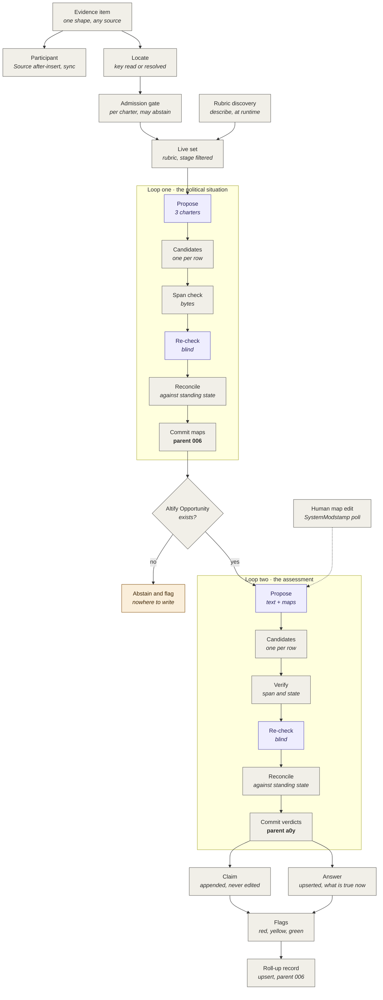
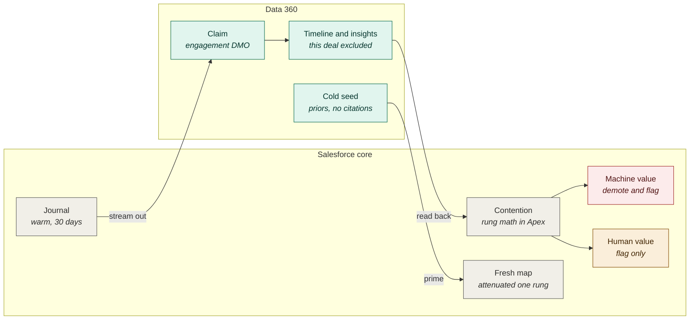
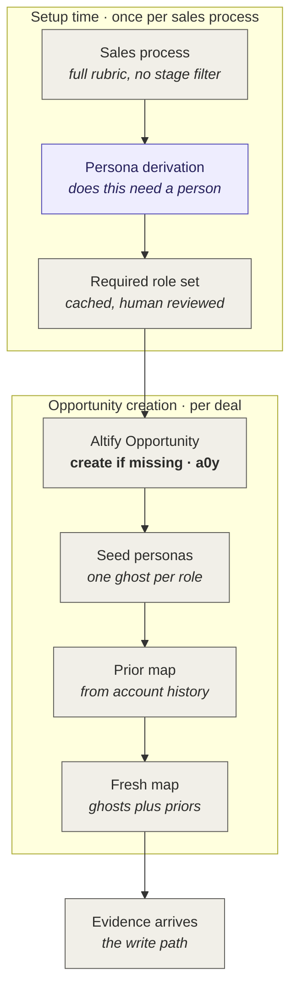

# AAO Model & Flow

> **The version lives on the stamp line below and nowhere else.**

**v1.5 · 8 August 2026 · THE LOOP ERA'S FIELDS AND ENTITIES, carried at the head as built and verified from runs a17 through a22 and the B&V run; the body's field tables absorb these at the next full rebuild. Everything below is BUILT LAW, deployed with FLS, exercised in live runs, recorded ruling-by-ruling in Architecture v4.2 through v4.12. (1) CLAIMS KEY THE PARTICIPANT: `AAO_Claim__c.AAO_Participant__c` is the key; `AAO_Subject_Contact__c` remains for pre-ruling rows and the resolved Contact, never the key. A Contact is a resolution outcome of a person; the native ECI participant record is one input to ours, never the identity. (2) THE COUNTER'S FIELD HOME: `AAO_Answer__c.AAO_Support_Counter__c`, Number(2,0), the standing value only; clamp and voiced-state ceiling stay in code; rebuildable from claims in evidence-occurred order, so drift between field and ledger is a bug, never a tie-break. (3) CLAIM RETIREMENT: three fields on `AAO_Claim__c` (retired flag, reason, stamp), a one-way describe-checked trigger exception so only those three may move; replays exclude retired claims; retraction clears what a retired claim carried. Nothing is ever deleted. (4) `AAO_Criterion__c` IS OURS: the fifth subject type; one Answer row per criterion, subject the criterion, owned by its voicer; `ALTF__Decision_Criteria__c` is its projection; criteria contracts join by byte-range overlap. (5) `AAO_Shadow_Person__c` is a real object, keyed per account, permanent for toggle-off customers, `Toggle_Off` and `Create_Failed` separated because they are different facts; shadows never reach the vendor map (`ALTF__Contact__c` is `nillable=false`, verified from the runtime). (6) `AAO_Setting__mdt` carries the Contact-creation toggle, DEFAULT ON by Matthew's ruling; the override is a picklist because a checkbox cannot express untouched. (7) OCCASION IDENTITY: `AAO_Source__c.AAO_System_Ref__c` (new) with the prefix-honest fallback (`sys:` against `acct:`); the occasion is the conversation, system ref plus occurred time; the artifact hash stays the byte-provenance key for spans; coverage counts conversations. (8) THE COMPOSED NORMALIZER STAMP: `AAO_Source__c.AAO_Raw_SHA256__c` (new); the stamp is `NF1+raw:` composing normalizer version with the raw input hash; `NF1+out:` is the fallback; rows before 8 August keep uncomposed stamps PERMANENTLY because the immutability rule on `AAO_Normalizer_Version__c` rightly refused the restamp: every stored span was verified against those records, and provenance a later process can rewrite is not provenance. (9) COVERAGE is computed, never extracted: derived from distinct conversations per person per deal, `In-depth` deliberately underivable, zero occasions writes nothing; the identity ALIAS joins a person's unlinked and linked participation at read time on the resolved Contact, never by row merge, because a merge rewrites what claims point at. (10) PROJECTION carries retraction: the writer projects the current derivation including null where the watermark proves the value ours and unmodified, and a retraction stamps its watermark like any write, because a correction that cannot stamp its consequence freezes the dimension it corrects. The run receipt object remains the oldest owed entity, still unbuilt.**

**v1.4 · 5 August 2026 · Amendment at the head, owed to the body at its next bump; Charters v3.0 §P8 is the pass text this document models. (1) THE PAIR LEDGER AS BUILT, closing the entity ruling the v1.3 head owed: `AAO_Pair__c` carries both rows of the pair-ledger law — the initial row from call 1 and the identified row from call 2 — discriminated by an explicit `Located`/`Identified` stage picklist, with an occurrence ordinal and count for quotes whose bytes match more than once in the artifact, and a unique index on `run|ref|stage`. THE INDEX REFUSES MORE THAN ONE AND CANNOT DETECT ZERO, so both mechanisms ship: the index, plus `assertOneForOne` returning HELD / INCOMPLETE / BROKEN between the stage row sets, INCOMPLETE reporting its counts and scored as neither. The initial row's byte-located verbatim string is the anchor; there is no separate anchor entity, per Charters §P8.0. (2) `AAO_Person__c` POINTS AT `AAO_Participant__c`, AND WHY: a Contact is a RESOLUTION OUTCOME of a person, never their identity. A participant exists from the roster the moment evidence arrives, whether or not any Contact ever resolves; identity attaches at the participant grain and Contact linkage is one possible outcome of the ladder. The Emerson fixture's no-Contact participants are the standing specimens — identified at the participant grain, gradeable, real. (3) ABSTENTION MACHINERY LEAVES THE FIELD TABLES for the pass: the pass writes no abstention value at any grain (Charters §P8.0, no-abstention-rows); `AAO_Abstention_Reason__c` and the status-mapping rows are marked in place below as pre-pass history, retained because rows carrying them exist, written by nothing the pass runs. Completeness is the run receipt (owed, CODE's — its load rises under the family sweep, since four reads make a partial pass expressible) plus one-for-one-for-one arithmetic. (4) `Span.verification` IS BUILT LAW: verification status is carried on every span and every reader filters to upheld — which repairs the v1.3 head's D2 (citation() reading spans[0] regardless of status) by construction and settles D1's lean (a refused span survives on the row, marked, never deleted, and no reader shows it as a citation). (5) THE COUNTER'S FIELD HOME REMAINS OWED from CODE's proposal, mechanism-first like the pair ledger was: the arithmetic is ruled (§P8.4, clamped ±3, replay reconstructs from claims in evidence-occurred order); where the integer lives lands in the Field Tables from BUILD_JOURNAL when proposed. (6) THE FLOW UNDER THE SWEEP: call 1 in every diagram and stage note is now four bounded family reads per pass, per Charters v3.0; nothing downstream of the pair ledger moves, and partial decision-criteria pairs accrue as open findings and PROJECT NOTHING until elements complete, per §P8.5's amendment.**

**v1.3 · 4 August 2026 · Amendment at the head, owed to the body at its next bump. (1) NF1 BECOMES WRITTEN LAW, closing the gap the 3 August span-gate defect exposed: the Attributed normal form is one line per turn, SpeakerKey, one tab, utterance; a line without a tab contributes no turn; Diarization=Attributed asserts exactly this form, and stamping it on bytes in any other layout is the internally contradictory Source that made every span fail contiguity for three sessions while byte compare passed. Timestamps live in a sidecar, never in the frozen bytes. MACHINE LABELS NEVER ENTER THE FROZEN BYTES: ECI signal tags and any other machine inference travel in the sidecar, because left inline a reader can quote a machine's label as a person's sentence and pass byte verification doing it. (2) TWO SPAN DEFECTS RECORDED, CODE's to fix, disposition leaned but not ruled: D1, a span the blind reader refused survives on the standing Answer's span set as a citation, so a reader checking why is shown a quote the verifier judged insufficient; D2, AAO_Project.citation() reads spans[0] with no regard to verification status; the lean is verification status carried on every span with every reader filtering to upheld, wrong text marked wrong rather than deleted, which repairs D2 by construction. (3) THE FLOW CHANGES SHAPE at the next bump with the three-call pass (Charters v2.5): call 1 locates and resolves, call 2 creates Candidates and promotes Claims against resolved IDs, call 3 verifies before any Claim writes; everything downstream of Claim stands untouched, again. (4) The first adjudicated UNDER (S2, Adam Meloan, B&V) is recorded beside the abstention rows it implicates: nobody_said as written overstates what a read establishes; vocabulary open at Charters v2.5.**

**v1.2 · 3 August 2026 · Amendment at the head, owed to the body at its next bump. The Extract-Bind-Verify pass (Charters §P7.3) costs NO schema: the inventory of potential claims IS the Candidate layer doing what its name always implied — Candidate proposes, Claim records, Answer is what is true now — and binding is the promotion step. Everything downstream of Claim stands untouched: accumulation, `AAO_Project`, watermarks, Option C notes, quotes on Answer rows only. Two flow additions: after binding, Apex writes the complete ledger's abstention rows per proposition per roster person with zero model cost; `model_missed` is a reported per-run rate. One confirmation from the build: the coverage family was never extracted (P route by construction), so the coverage-is-computed ruling was already true in code. Fixture law from Matthew: seed open plus recently closed deals only; extract format ships FirstName/LastName as read, never Name-only (the final-space split broke on `St. Clair` and breaks identically on `van`, `de`, `bin`).**

**v1.1 · 3 August 2026 · Recorded from the build, field-table consolidation owed at the next Field Tables pass: Evidence Contract gains `AAO_Charter_Designation__c` (restricted picklist; written by the contract seeder and the coming reconciler; read by the applicable-set resolver and by no charter ever; 48 rows stamped People, 12 legacy rows null and deliberately admitted by the Process resolve). Projection write semantics recorded as law: Unset leaves the target picklist null and never writes `Unknown`, because `Unknown` is a claim and null is the absence of one. The writer class `AAO_Project` exists at 18 tests; its shape is Charters §P7.2.1's.**

**v1.0 · 2 August 2026 · Formed in the consolidation: Object Model v2.1, Data Flow v2.4 and the Field Tables v0.13 merged into one document. Each part keeps its stamped headings; entities and keys read from the Object Model part, the evidence path from the Data Flow part, field-level truth from the Field Tables part, and the Field Tables win where they disagree because they are built law.**

> **Authoritative for:** entities, keys, merges, fields, and what happens to one piece of evidence. **Defers to:** Glossary for vocabulary, Architecture for placement and rulings.

**Amendments carried at the head, owed to the body at its next bump:** the **scope stamp law** generalizes the opportunity stamp (every machine-written row carries exactly one scope, deal or account, from the evidence's resolved scope; Source's opportunity lookup goes nullable under a scope family law, account always required; account streams get their own engagement category). The **Surface** is proposed as the seventeenth entity: the per-opportunity focus digest, derived, rebuild-on-change, the Roll-Up's class, no citations of its own; whether it hosts the reconciliation destination is open. The **stand-in (Shadow Person)** narrows to one job with a per-scope grain, values cached and rebuildable, quotes never duplicated off Answer rows; field table owed. The **known Object Model staleness** flagged in the corporate reconciliation stands until its part's next bump: memory tables read seven (not six), the decision criterion is the fifth Claim subject in both places it is counted, and `ALTF__Sales_Process_Mapping__c` was read (eleven rows, plan-type strings to processes) — the "unexamined and suggestive" sentence is wrong.

---

*The absorbed documents follow, stamps intact.*

---

# PART I · Object Model (absorbed; stamps intact)

# AAO Object Model

> **The version lives on the stamp line below and nowhere else.**

**v2.1 · 2 August 2026 · Matthew Weisberg**
*Formerly the AltifyOS Object Model — title migrated under the ruling that file titles move at each document's next natural bump.*
**Companion to:** AAO Glossary, Architecture, Data Flow, Theory. Every term used here is defined in the glossary.

> **Authoritative for:** why each entity is an object rather than metadata, every merge argument, and Answer's key — *named Claim's key until this version; the corrections record moved the key with the rename and every word of its reasoning holds.*
> **Defers to:** Architecture for the entity inventory; Glossary for vocabulary.
> **Retrieval warning:** project knowledge returns chunks by relevance and a chunk may not carry its source. Every heading in this file is stamped with the version it last changed at, `objmodel v2.1` for this bump. **If a retrieved passage carries no stamp, do not trust it — open the file.**

**Changed in v2.1.** **The Answer / Claim correction is absorbed, and the sprint's entity work lands — the count moves from fourteen to sixteen.** From the corrections record of 31 July, authoritative over this document until this bump: **the word Claim moves from the upserted row to the immutable one.** The upserted current-state row is the **Answer**; a **Claim** is one establishment from one piece of evidence, never edited; and **Journal Event is retired as an entity** — its four keys, two clocks and subject identity move onto Claim unchanged, and the merge is recorded in section 3 with its overturn condition. **Section 4's key is Answer's key** — retitled, with every word of the reasoning intact: typed lookups plus discriminator plus one derived unique text field, null-and-flag on delete, `DUPLICATE_VALUE` as a merge path, the composer frozen, versioned and single-writer. **A new section carries the three layers and Claim Basis**: Candidate proposes, Claim records, Answer is what is true now; Claim Basis is the junction naming what a claim rests on beyond its own quotes, half frozen, half live, **eight declared cited types with four built** — `Answer`, `Map_Row`, `Source`, `Line_Item` — and `Product2` deliberately not among them. Publication state's home is corrected in place: **a field on Answer and on Candidate, never on Claim.** From this sprint: **`AAO_Participant__c` is the sixteenth entity** — one row per Source per person, written in the Source after-insert, synchronously and outside the adjudication path, counting distinct artifact hashes rather than rows, its `Restrict` constraint having broken three purge paths, which is the constraint doing its job. **The speaker requirement gains `Subject_Person`** — every existing value names a class of speaker, and the Support questions that say *told you* name a subject. **The persona write path is recorded**: subject is the Contact, an existing subject type; target is `ALTF__Contact__c.ALTF__Altify_Personas__c`, reachable by traversal; no new key. **The two-tier person model is named at last** — `ALTF__Contact__c` person-durable and account-scoped, `ALTF__Contact_Map_Details__c` deal-scoped, and only the deal tier has been designed for. Section 7 gains the seventh memory table, the decision log. The end line drops its version; the stamp line above is now the version's only home.

**Changed in v2.0.** **Three build decisions from the 30 July session land, the sandbox amendment is recorded, and the project is renamed.** The project is now **Altify Always On** (AAOS in outward pages); file titles migrate at each document's next natural bump rather than in one churn. **The build begins in `altify--aossb1` now, under the amended ordering ruled 30 July by Matthew**: schema and deterministic plumbing build immediately; anything a charter writes remains governed by Gate 1's bar; production stays read-only unconditionally. The three decisions: **(1) API prefix `AAO_` now, `ALTF` later** — the endgame is a 2GP sharing the ALTF namespace so our Apex can call Altify's non-global classes directly; AAO-now is the prove-it-first choice and a rename/redeploy is the accepted future cost, recorded here so nobody optimizes against it. **(2) Spans and element lists are JSON long-text fields at PoC — with a direct Source lookup on Claim** — argued in the new section 4 subsection: claim-grain analysis is on the memory plane from day one because receipts stream as rows; span-grain rows are a later stream-shape choice, never a schema migration; promotion to child objects remains open and contained. **(3) The mirror holds only `TRUE` / `FALSE` / `UNVERIFIED`** — abstention writes no Claim and persists as a Candidate row with its enum reason, which is the abstention-rate detector; optional counters on Roll-Up are noted, not required. **One open item added to section 8: the per-org charter overlay** — injectable natural-language sections for orgs whose ontology drifts from what charters read; rule-data family, sibling of Evidence Contract, to be designed as its own decision when charter config is designed, never improvised mid-build. No merge argument changed; Claim's key is untouched.

**Changed in v1.9.** **Cross-references drop their version numbers** — nine of them, five pointing at Architecture. **A cross-reference now names the document, never its version.** There is exactly one live copy of each document, so the name is unambiguous; a version number in a pointer could only ever be right or wrong, never openable, because the version it names is deleted the moment it is superseded. Re-numbering instead of stripping would have cascaded — bumping any one document invalidates the pointers to it in the other five, and fixing those invalidates the pointers back. **Heading stamps are untouched and still carry the version**, because a stamp says which chunk you are holding, and that is the thing retrieval actually loses. **The end line was stale at v1.7 and is corrected.** **Two historical references are deliberately preserved**: the note recording that Glossary v1.2 described a journal row as carrying three keys and no subject identity, corrected in Glossary v1.3, is a record of a past error and stripping its versions would have made it unreadable. **No entity, no key and no merge argument changed.**

**Changed in v1.8.** **Two memory-plane tables enter the model — the proposition-state snapshot and the rubric snapshot** — in a new section 7, with the DMO category rule verified 28 July 2026 and stricter than review carried: a stream's category and its Engagement event-date choice lock at creation. All six memory tables are Engagement; we own no Profile — Individual is Salesforce's, and the only candidate, the shadow person, stays parked. The snapshot is derived from the journal and never written beside it, keyed deal × proposition × change; the rubric table is keyed org Id × question record Id × content hash and carries the resolution route from Computable Share v1.0. The route classification itself is rule data on core, because no field is ever added to a 1GP-managed object. The unresolved Data 360 mapping item narrows: categories settled, columns not.

**Changed in v1.7.** **A question-text fingerprint field on Claim — low priority, off the critical path** — with the reasoning that determinism was never holed by a rubric edit. **The predicate rule amended: a state-established predicate counts live claims, never held and never projected**, which falls out of what a citation is rather than out of policy, and means the verdict correctly moves with the autonomy level. Decision criteria bypass ratification by ruling, which makes the *Formal Decision Criteria* predicate read identically at every level anyway. **Publication state's scope settled as one axis**, closing the question this document deliberately refused to settle inside a field table. Where the truth-decay value lives is left with the field tables, stated so nobody settles it there by accident.

**Changed in v1.6.** **Publication state is a field on Claim and requires no new entity — fourteen stays fourteen.** The ratification design note is absorbed and retired. The outcome comparison it enables needs no object either. The Evidence Contract gains `requires-ratification`. Plus the assessment read of 26–27 July: **decision criteria establish two assessment propositions**, by a title string match we cannot depend on, and the two questions are not the same shape.

**Changed in v1.5.** **A fifth Claim subject type: the decision criterion.** Altify's four decision-criteria objects read in full on 26 July 2026, and the write recipe derived from a natural experiment in the org rather than reasoned. Two field conventions found that are invisible from the schema alone and would each have produced a silently broken record. The insight-versus-criterion boundary stated, with the seed rule that keeps a model from manufacturing criteria out of goals. **No new entity** — this is a subject type on Claim and a projection target, which is why locking the key first mattered.

**Changed in v1.4.** **Claim's key is settled: C, with null-and-flag on delete.** The justification recorded in v1.3 was correct in its conclusion and weak in its reasoning, and is replaced rather than kept. Two obligations named that no prior version carried. The lock-contention measurement is withdrawn as mis-aimed and replaced with a concurrency control that belongs elsewhere. Orphan handling resolved without a new flag type — an earlier draft of this decision routed it through flags and that was wrong. A fourteenth entity added, **Note Evidence**, with its consolidation deliberately left open.

**Changed in v1.3.** A position taken on Claim's key and recorded with its counter-argument — still not settled at that version. Option A's DML cost corrected: it was overstated in v1.1 and is not a cost at all. Two questions moved from assertion to pending measurement.

**Changed in v1.2.** Format only — every heading now carries a `objmodel v1.8` provenance stamp and the file states what it is authoritative for. **No content changed.**

**Changed in v1.1.** Claim's uniqueness key surfaced as **the first decision** — options costed, deliberately not settled, because everything at field level falls out of it. The compare-and-swap exclusion list marked pending measurement and closed to speculation.

**Changed in v1.0.** The structural decision this document once argued for is settled and has moved to *Rulings* in the architecture, so the old Section 2 is deleted rather than revised. The entity list is completed to thirteen and every merge is argued. Section 1 stands unchanged — it is measured, not reasoned.

**What this document is for.** The architecture names the entities. This one says **why each is an object rather than metadata, why merges were made or refused, and what would prove each choice wrong.** When the two disagree, the architecture is the inventory and this is the reasoning.

---

## 1 · The reconciliation

Altify holds **82 custom objects** in the `ALTF` namespace. Read before proposing anything, because the fastest way to lose credibility with Toby and Bill is to ship an object that already exists.

### What already exists and we therefore do not build · objmodel v2.0

| We would have built | Altify already has | Verdict |
|---|---|---|
| Person-to-person influence and conflict | `ALTF__Contact_Influence__c` — Influencing Contact, Influenced Contact, Type of `Influence` or `Conflict`. **1,950 rows, all populated** | Semantics exist and are adopted. **Not reusable as the record** — see below |
| Person-to-insight link | `ALTF__Insight_Card_Contact__c` — Type of `Informer` or `Owner` | Same |
| Machine-authorship marker | `ALTF__Generated_By_Max__c` on Insight Card | Reuse the concept, not the field |
| Confirmation trichotomy | `ALTF__Confirmed__c` with `ConfirmedBy` and `ConfirmedOn` | Absent, present-unconfirmed, confirmed-by-a-named-human, with actor. Already exact |
| Rubric version stamp | `ALTF__Qualification_Sales_Process_Ver_Stamp__c` | The migration mechanism, already shipping |
| Pillar scores, freshness, action throughput | 109 fields on `ALTF__Opportunity__c` | Never duplicate. Roll-up carries only the complement |
| Adoption telemetry | `ALTF__Log__c` — 987,962 rows since June 2025 | Not our decision log. Page attention only |
| Insight-to-objective linkage | `ALTF__Object_Relationship__c` | **3 rows.** Account planning, out of scope for v1 |
| Person-to-criterion attribution | `ALTF__Decision_Criteria__c` and its three junctions — **402 criteria, 159 person links, 20 informal criteria with a named person** | **Adopted as a projection target.** Deal-scoped, so unlike Contact Influence we can write to it. No citation field, so the proof stays ours. See section 6 |

**The two link objects are the important find, and they do not survive contact with the philosophy.**

`ALTF__Contact_Influence__c` has the right enum and real adoption. It has **no Opportunity field and no note field.** No opportunity means it is not deal-scoped, so an influence edge established from evidence on deal A renders on deal B's map — which is **Citations Do Not Cross Deals** violated by the schema itself. No note field means there is nowhere to put a citation, so an establishment could not carry one.

Altify models influence as a durable fact about two people. We model it as a cited claim about one deal. Both are defensible and they are not the same object.

### The pattern, now confirmed three times · objmodel v2.0

| Altify's record | Ours | What Altify's record cannot hold |
|---|---|---|
| Task | Flag | A cause, a watermark, a lifecycle. Anyone can tick Completed |
| Persona ghost | Fulfilment | That the gap existed, or when it closed. Graduation writes nothing |
| Contact Influence | Link | An opportunity, or a citation |

Three unrelated objects, one shape. **Altify's object is the surface. Ours is the ledger.** That is not a workaround, it is the reconciliation, and it is now a ruling — see *Where the truth lives* and *Rulings* in the architecture.

### Still unexamined · objmodel v2.0

*The four decision-criteria objects came off this list in v1.5 — see section 6. Added: `ALTF__Assessment_Competitor_Answer__c` and `ALTF__Insight_Card_Edge__c`, both seen in the org's object list and never read.*

`ALTF__Customization__c` (prefix `a3J`, well outside the original block, so added late). `ALTF__Template_Qualifier__c` and `_Details__c`. `ALTF__Sales_Process_Mapping__c` — now load-bearing, because guidance depends on knowing which qualifier gates which methodological condition, and this object's name suggests it may hold that link. Eight settings objects whose pattern our own configurable surface should follow rather than invent.

---

## 2 · Object, metadata, or neither · objmodel v2.0

Three homes, and choosing wrong is expensive in different ways each time.

| Home | Written when | Costs | Use for |
|---|---|---|---|
| **Custom object** | Runtime | Storage, SOQL limits | Anything derived in the customer's org, or written by the system |
| **Custom Metadata Type** | Package time | Cannot be written at runtime by Apex | Shipped defaults, charters, cardinality bounds |
| **Platform Cache** | Runtime, volatile | Evicted without warning | Anything re-derivable, where a stale copy is worse than a rebuild |

**The rule that decides most cases: if it is derived from the customer's own methodology, it cannot be metadata.** Metadata ships from us. Anything discovered by reading their org and ratified by a human in their org has to be written where they are, at runtime, which means an object.

This is why three entities that look like configuration are objects:

**Evidence Contract.** Assembled at runtime from the customer's own `Help` and `Tip` text plus our shipped defaults, then versioned against the rubric that produced it. Only the defaults are metadata. **The assembled contract is per-org and cannot exist at package time.**

**Non-Establishment Rule.** Seed patterns ship as metadata. Learned ones accumulate from observed false positives in that org, are promoted by a human from the weekly rule-discovery pass, and are **versioned and never deleted** — a rule that stops applying is superseded, not removed, because the journal entries it governed still need it to be interpretable.

**Required Role Set.** The Role charter's output. Derived once per sales process, ratified by a human, cached indefinitely. Nothing about it is knowable when we build the package.

**The discovered proposition corpus is the one thing that goes in cache rather than an object.** It is re-derivable from describe by construction, so persisting it buys nothing and risks a stale copy outliving a rubric change — the exact failure the corpus exists to prevent.

**Not a Big Object**, for the journal: warm-window-then-retire is already the design, and Big Object query constraints would make the warm window unreadable. **Not a Platform Event**, for the journal: nothing subscribes to it. It is written history, not a bus.

---

## 3 · The merges

Stated so they can be overturned, and each with the condition that would prove it wrong.

### Kept · objmodel v2.1

**Candidate absorbs the decision log.** The glossary already says the candidate ledger is the decision log's source. One object with a state field; rejected and abstained rows *are* the decision log, and both retire to the library along different paths.

This satisfies the glossary's requirement that the decision log stay **separate from the journal** — which it does, entirely. The separation that matters is decision-log-from-journal, not decision-log-from-candidate.
*Wrong if* rejected-row volume makes the object too slow for the live path, which is measurable rather than arguable.

**Claim absorbs map dimensions.** A categorical dimension is already an assertion proposition and an ordinal is a cited delta, so both are claims with different subjects. One object keeps the journal uniform. *Under the v2.1 rename this merge reads onto Answer — the upserted row per subject — and the claims record each establishment against it; the argument is unchanged.*
*Wrong if* the value shapes diverge far enough that the discriminator field starts carrying real logic — a verdict is `TRUE`/`FALSE`/`UNVERIFIED`, a delta is −1/0/+1.

**Journal Event absorbs into Claim.** *Added in v2.1, from the corrections record.* Journal Event existed only because the word Claim was busy naming the mirror row — two immutable accounts of one fact with no mechanism to say which had drifted, the same defect the proposition snapshot is explicitly forbidden from creating. Its four keys, two clocks and subject identity move onto Claim unchanged. Nothing it carried is lost; what disappears is the second row.
*Wrong if* a non-establishment change ever needs an append-only home that Candidate cannot serve.

**Required Role Set absorbed into Evidence Contract.** *Proposed in v1.0.* Both are per-proposition configuration derived once from the rubric and ratified by a human. The Evidence Contract already carries a **speaker requirement** — who must have said something for it to count — and required-role is its structural sibling: which person must exist for the proposition to be satisfiable.
*Wrong if* required-role turns out to vary by stage while the rest of the contract does not, in which case it needs its own versioning and its own row.

### Withdrawn · objmodel v2.0

**Fulfilment must not fold into Flag.** *Reversed in v1.0. The v0.1 proposal was wrong and the glossary already contained the refutation.*

The argument was that a missing persona raises a flag, and a flag's open-and-close timestamps are the gap history. But **personas seed from the full rubric while flags fire by stage.** A persona gap therefore exists from the moment the deal is created and does not flag until its stage threshold arrives.

Folding fulfilment into Flag would lose every gap that has not yet flagged — which is most of them at any given moment, and precisely the early window where knowing about the gap is worth the most. **A gap is not a flag. A flag is what a gap becomes when time runs out on it.**

### Refused outright · objmodel v2.0

**Surfacing into Journal Event.** The journal holds accepted changes and is the audit trail a security team reads to answer *why does this record say this*. A guidance item being displayed is not a change. Diluting the journal with display events breaks exactly the property that already forced the decision log out of it.

**Surfacing into Flag.** Guidance is deliberately not a flag. Giving it a flag record imports the lifecycle — raised, aged, escalated — and that lifecycle is the machinery that nags.

---

## 4 · The first decision, now settled · objmodel v2.1

**Answer's key is C: typed lookups as the authoritative identity, plus one derived text field carrying a unique index. On delete, null-and-flag.** *Ruled in v1.4 as Claim's key; **the key moved to Answer with the v2.1 rename and every word of the reasoning below holds unchanged** — read Claim as Answer throughout this section where it names the upserted row, per the corrections record. The Claim, as the immutable row, carries the same subject identity in the same form, composed by the same frozen function. Field work is unblocked.*

The options are kept below because the reasoning has to remain inspectable, and because two of them are the shapes a future reader will propose again.

### Why it is first · objmodel v2.0

Claim absorbs map dimensions, assessment answers, qualifier statuses and insight attributes. Their natural keys are different shapes:

| Subject | Natural key |
|---|---|
| Map dimension | opportunity + contact + dimension |
| Assessment answer | opportunity + proposition |
| Qualifier status | opportunity + qualifier |
| Insight attribute | opportunity + card + attribute |

The key is not a storage detail. It is doing four jobs at once:

1. **The upsert target.** Every write resolves through it.
2. **The human-precedence lookup, on the hot path of every projection write.** Read-before-write happens per claim, per pass, across the org.
3. **The grain the journal's four keys must reproduce.**
4. **What the replay invariant is tested against** — *replaying the journal must reconstruct the mirror exactly.*

**Link has the same problem in miniature** — person-to-person against person-to-insight — so whatever is chosen here should be chosen for both, or the reason for diverging should be written down.

### The options · objmodel v2.0

**A — Typed lookups, one per subject type.** Opportunity, Contact, Insight Card, Proposition; only the relevant ones populated.

*Buys:* referential integrity, traversal in relationship queries, reporting by related record, correct behaviour when a parent is deleted.
*Costs:* **native upsert is unavailable.** A Salesforce External ID cannot be a lookup, so every write becomes query-then-insert-or-update — a SOQL on the hot path rather than a single DML. Rows are sparse, most lookups null. A new subject type is a new field and a package version.

**B — One composed text key**, unique External ID, of the form `opportunityId·contactId·dimension`.

*Buys:* native upsert against a single indexed field. Any new subject type without schema change. Trivially unique.
*Costs:* **no referential integrity** — delete a Contact and its claims orphan silently. No traversal, no relationship queries, no reporting by related record, no lookup filters. And the key's format becomes an undeclared second schema that every reader must parse correctly forever.

**C — Hybrid.** Composed text External ID for upsert, plus typed lookups for traversal.

*Buys:* both of the above.
*Costs:* two representations of one fact, which can disagree. They must be written atomically and validated, and the object is widest.

**D — Un-merge Claim into one object per subject type.**

*Buys:* every key is natural and enforced; no polymorphism anywhere.
*Costs:* the journal stops being uniform, which was the stated reason for the merge. More objects. The replay invariant becomes per-object rather than one property of the system.

### What binds regardless of which is chosen · objmodel v2.0

> **The journal must carry the subject identity, whatever form it takes.** The four keys — opportunity, account, external person, internal person — **do not include dimension, proposition, card or attribute.** So a journal row today cannot identify which claim it belongs to, and **replay cannot reconstruct the mirror.** This is a constraint on Journal Event that falls out of Claim's key and appears in no document before this one.

**The key's grain must be at least as fine as a dimension**, because human precedence operates per dimension. Anything coarser — opportunity plus contact — cannot express *this human set Support and the machine may still write Coverage*.

**Decide this before any field work.** Choose, and the field tables write themselves. Assume, and they are rework.

### Why C, on narrower grounds than v1.3 recorded · objmodel v2.0

*The v1.3 justification reached the right answer for a weak reason and is replaced here.*

**v1.3 argued that a unique text field gives platform-enforced uniqueness where A gives a trigger check and therefore only *usually unique*.** True, and not the reason. The reason is what uniqueness is protecting.

Under A and under C, identity resolution happens in the **read-before-write**. You query the existing claims for this opportunity, stamp `Id` onto the rows that exist, leave it null on the rest, and issue one `Database.upsert`, which resolves on `Id` when no external ID field is named. One SOQL, one DML, identical to B. **Human precedence depends entirely on that read having happened**, because it is the read that tells you a value is human-authored.

**So the question is what happens when the read misses a row.** Under A you get a second Claim for one subject and one dimension, written silently. Precedence now has two rows to consult and no rule saying which one wins, on the record whose whole purpose is deciding whether a human's judgment survives. Under C the platform raises `DUPLICATE_VALUE`.

> **The unique index is not a schema nicety. It is the failure detector for the one read the write law rests on.** That is sufficient reason on its own, and it is a different reason from tidiness.

**Everything v1.3 said against B still holds**, and is why C is not B with extra steps. A composed text key *alone* is invisible to report builder, list views, related lists, roll-up summaries, lookup filters and relationship queries — the ledger that proves the system works would be unqueryable without writing a parser first. That contradicts the stated goal of a schema that makes value self-evident when read back. Under C nothing reads the derived field; the lookups carry every query.

**A's remaining virtue is retained in full.** Referential integrity, traversal, reporting by related record, and a delete behaviour chosen at design time rather than discovered.

**And the subject-type discriminator is part of the ruling.** A row carrying opportunity plus proposition and a row carrying opportunity plus contact plus dimension are indistinguishable to any query that does not already know what it is hunting. One picklist, declared now. It also feeds the composition function below, which is the second reason it cannot be an afterthought.

### Two obligations C carries, and no prior version wrote down · objmodel v2.0

**One. `DUPLICATE_VALUE` is a merge path, not an error path.**

A unique index converts a missed read into an exception rather than into correct behaviour. If that exception is logged and the row dropped, **C is worse than A** — a lost claim and a lost receipt against a duplicated one. Both are defects; only one is loud, and only if it is handled. The write path must catch it, re-read the colliding row, apply precedence, and proceed. Under partial-success DML the same obligation applies per `SaveResult` rather than per transaction.

**Two. The composition function is frozen, versioned, and has exactly one writer.**

B was rejected partly because a delimited format becomes an undeclared second schema every reader must parse correctly forever. Under C nobody parses it — but somebody must **compose** it identically forever, including the first time a subject type is added and including how an unpopulated lookup renders. Empty against a literal, and the same two claims stop colliding.

> **This is the same class of hazard as source normalisation, and it is written down here in the same words: deterministic, frozen, one writer, versioned.** It is maintained by the trigger that already enforces the write law and by nothing else. **It is not a formula field**, because a formula recomputes on read and would silently change meaning under a schema change.

**Case sensitivity must be declared rather than defaulted**, since the guarantee is the index. *Unverified: whether an 18-character Id pair can collide under case-insensitive uniqueness. Specify case-sensitive and the question does not arise.*

**Rubric version is an attribute of a Claim, not part of its identity.** Put it in the key and one dimension carries two live rows, and precedence has no rule for which to read — the exact failure the index exists to prevent. The mirror upserts the present; prior versions survive in the journal.

### Delete behaviour: null-and-flag, and it needs no new flag type · objmodel v2.0

**Ruled in v1.4.** Cascade destroys proof. Restrict blocks an admin from deleting a Contact, which some orgs will not accept. **Null-and-flag** preserves the claim, empties the subject lookup, and makes the orphan visible to operations.

**An earlier draft of this decision routed the orphan through flags, and that was wrong.** A flag is about a condition on a deal. A Claim is a row. The correct chain needs no new machinery: the claim stops supporting the condition, the condition reverts to `UNVERIFIED`, and the ordinary flag machinery raises the ordinary flag. **No third clearance rule and no fourth flag type.**

Three things narrow it further. Only the subject types that point at a person can orphan at all — an opportunity-plus-proposition claim has nothing to lose. The journal has already streamed to memory carrying the person key as a plain string, so **the proof survives on the memory plane whatever happens to the Contact on core.** And a deletion is a data-cleanup act by someone who has decided they no longer need the person's data.

> **One thing that does not follow, and must be stated because it looks like it does.** A deletion never clears a flag. Deleting a Contact is not a judgment that the condition stopped mattering, and if the deleted person was the wrongly-mapped budget holder the condition is now *less* satisfied. **A dismissal reached by deleting the subject is the third costume of the dismiss button**, after the Task checkbox and the note text field. Flags clear when their cause goes.

**Visible to operations, and it does not nag.** The orphan surfaces where data operations already work. It is not pushed at a seller.

### Amendment to a settled item · objmodel v2.1

**Journal events carry four keys, two clocks, and subject identity.** This follows from this document's own finding and belongs here rather than in a chat. *Renamed in v2.1: the rows are Claims — Journal Event is retired and everything this passage requires moved onto Claim unchanged. The constraint below reads identically under the new noun.*

The four keys — opportunity, account, external person, internal person — cannot identify *which claim* a row belongs to, so replay cannot reconstruct the mirror. **Claim's identity appears on Journal Event in the same form**, which as of v1.4 means the typed subject references plus the discriminator, composed by the same frozen function. Solve the two separately and you have built two mechanisms for one problem and made the replay invariant untestable.

*Glossary v1.2 still described a journal row as carrying an opportunity key, an account key and optionally a person key. That was three keys and no subject identity, and it was wrong. Corrected in Glossary v1.3.*

**One consequence that survives either option.** Typed lookups buy traversal on core and nothing on the memory plane — a lookup crosses as an ID string, and a relationship between DMOs must be mapped explicitly regardless. **A's advantage is entirely core-side**, which is where the precedence check and the reporting live, so the advantage is real. It just does not extend.

### The question-text fingerprint, and why it is low priority · objmodel v2.0

**One field on Claim: a fingerprint of the proposition text the claim answered, compared on read.** *Added in v1.7. Low priority, deliberately off the critical path, and recorded here so the field table inherits the reasoning rather than the panic.*

**Determinism was never holed by a rubric edit, and an earlier framing of this problem was overstated.** Determinism promises that the same evidence under the same stated rubric produces the same answer, and that the claim carries the version it was written under. It never promised that an answer survives a change to the question, and a rubric edit is therefore not a determinism failure.

**The well-behaved path already produces the right outcome with no new machinery.** An admin deactivates the old question and creates a new one. Claims under the deactivated question stop being read, because the live set is built from active questions only — the Active Question Filter doing its ordinary job. The new question sits null until evidence answers it, which is honest, and the ordinary day-one-red machinery surfaces it on the next pass.

**The residual case is narrow and is not bad administration.** An admin *tightens* a question in place — appending *and signed off by the economic buyer* — reasonably believing they are sharpening one criterion rather than replacing it. The stored claim then answers a question that no longer exists.

**Its true cost is smaller than it appears**, because almost every proposition is re-asked on every pass. A tightened question over a stale claim is wrong only until the next evidence arrives — days, on a live deal. **It is indefinite on a stalled deal, which is precisely where the flag most needs to be right**, and that is the entire case for the field.

**Why a fingerprint compared on read, rather than a global version filter:** local, so it invalidates exactly what changed; and it cannot be forgotten the way a filter can — a mismatch reads as the claim not counting, which is the failure direction we accept. **Rubric version stays an attribute rather than part of the key**, exactly as ruled above; the fingerprint is a second attribute, never identity.

---

### Span shape at PoC: JSON with a Source lookup · objmodel v2.0

**Ruled 30 July.** A Claim's one-to-five spans, and an Evidence Contract's frozen element list, are **JSON in long-text fields** for the proof of concept — not child objects. What JSON costs is span-grain SOQL; what protects the important cross-question is a **direct `Source` lookup on Claim**, so *which claims rest on this transcript* stays a one-hop query. The incrementalism argument makes the cost smaller than it looks: **receipts stream to the memory plane as individual rows from day one**, so claim-grain analysis is queryable there immediately; span-grain rows on the plane are a stream-shape choice made later, and a stream shape is routing, never a schema migration. Promotion to child objects on core stays open and contained — the JSON is versioned with the charter that wrote it, so a migration reads one field shape.
*Wrong if* span-level state (per-span verification, per-span disputes) becomes a live-path need rather than an analytics need — that is the signal to promote. **[v1.4 note: `Span.verification` arrived as exactly that need and is carried INSIDE the JSON — verification status per span, every reader filtering to upheld — which answers the need without promoting to child objects; the promotion trigger above otherwise stands.]**

## 4a · The three layers, and Claim Basis · objmodel v2.1

*Added in v2.1, absorbing the corrections record. Confusion among these three caused the naming defect, so they are written plainly here, once.*

**Candidate — the proposal.** *I claim this, because of that.* One row per proposition considered per pass, carrying the proposed verdict, the spans, the interpretation used, how far it got, and what happened to it. Rejected, abstained and declined rows are the decision log. **A decline lives here and nowhere else**, because a decline establishes nothing and writes no claim.

**Claim — what was accepted.** Immutable. Carries what the answer was before and what it became, the quotes, the coverage, the actor, the charter and rubric version, and both clocks. **Replaying claims in evidence-occurred order must reconstruct every answer exactly.** That is the exit test.

**Answer — what is true now.** Upserted, uniquely keyed per section 4, the target of human precedence and the source of every projection. Carries the accumulated quotes, so reconciliation months later reads a hot row with the words on it rather than replaying history.

**No claim-to-claim parentage.** Claims that bear on the same question relate by sharing an answer, which is a subquery, not a hierarchy. A first-claim-as-parent structure was considered and rejected: it adds a traversal the shared key already provides, and it invites a tree where there is only a sequence.

### Claim Basis, and why it is not a plain junction · objmodel v2.1

**A claim resting on state must name the row and quote its value.** That rule already existed — a cited row will be edited afterwards, and a citation that only points is a citation that rots — and it had no home. Claim Basis is the home. **Half frozen, half live**: the snapshot of what the row said sits in immutable fields on the junction; the live record comes through the lookup; one subquery returns both, so a claim can show that a qualifier read *unknown* when the claim was written and reads *known* today. **Each row names which part of the proposition it covers**, which is what makes partial coverage queryable rather than buried in JSON, and what a flag reads to say *here is what already stands, and here is the piece still missing*. Its parent is polymorphic by the flags record's ruling — a basis row hangs off a claim or off a contention flag, one mechanism, one place to look.

> **The discipline this object needs, recorded because it will decide whether the object stays useful. It records what was cited, not what was available.** A junction pointing at several types and freezing state is exactly the object that becomes a general-purpose context dump, and a claim listing everything on the deal reads as far better supported than it was. **If a row cannot name which part of the proposition it covers, it does not belong on the claim.** Reconciliation's reads stay bounded to the proposition at hand; this junction records what was cited and does not authorise scanning the deal.

**Eight declared cited types, four built.** *Recorded 2 August.* Built: `Answer`, `Map_Row`, `Source`, `Line_Item`. **Still enum values pointing at nothing: `Insight_Card`, `Decision_Criterion`, `Qualifier_Status`, `Shadow_Person`.** `Source` exists because a Coverage claim cites the Sources it counted, and it is a **cited row rather than a Source lookup on the claim** — the latter would make a state claim look like a transcript claim to the family check. **`Product2` is deliberately not added**: reachable by traversal from the line item, so citing it would cite a classification rather than a fact about this deal. The governing rule is Architecture's cited-type ruling — **a type earns a lookup when its live state will be compared against the frozen snapshot**, which a text Id cannot serve.

### The speaker requirement gains `Subject_Person` · objmodel v2.1

*Added 2 August.* Every existing speaker-requirement value — Seller, Any Participant, Buyer Side, Decision Maker or Influencer — **names a class of speaker. The Support questions that say *told you* name a subject.** `Subject_Person` is cheap here and nowhere else, because the People charter's handed unit is person crossed with dimension, so the gate already knows who the finding is about. **It refuses when no subject is supplied** — a check that cannot run has not been met.

### Persona's write path — an existing subject, no new key · objmodel v2.1

*Added 2 August.* The subject is the **Contact**, an existing subject type. The write target is `ALTF__Contact__c.ALTF__Altify_Personas__c`, **reachable by traversal because Contact is the hub and both objects carry a required lookup to it. No new key.** The field is additive — the machine only ever adds and never removes — which is why projection resolves a detected divergence there **by union rather than by contention**, the only target where that is true; the projection rule is Architecture's.

**The two-tier person model, named at last.** `ALTF__Contact__c` is **person-durable and account-scoped** — Personas, Adaptability, Owner. `ALTF__Contact_Map_Details__c` is **deal-scoped** — Support, Political, Coverage, Buyer Role, Decision Orientation. **Only the deal tier has been designed for**, and every dimension argument in the glossary's Section I is a deal-tier argument. The person tier has exactly one designed write, the persona union above.

### `AAO_Participant__c`, the sixteenth entity · objmodel v2.1

*Added 2 August.* **One row per Source per person, written in the Source after-insert, synchronously and outside the adjudication path** — because **participation is a fact about evidence arriving rather than a product of judging it**, and a deal that never runs a pass still knows who was on its calls. The after-insert law applies in full: a failure here must never destroy the Source that caused it. **It counts distinct artifact hashes rather than rows**, so a ninety-minute call arriving as three Source rows reads as one occasion, reusing the same source-event definition. **Its `Restrict` constraint broke three purge paths, which is the constraint doing its job** — a purge that would orphan participation is a purge deleting evidence someone still counts on. Its memory home is open — participation either streams as an eighth table or its counts roll up before their Sources retire; Data Flow names the gap. **[v1.4 note: the pass identifies people AT THIS GRAIN — `AAO_Person__c` points at `AAO_Participant__c`, because a Contact is a resolution outcome of a person, never their identity; see the v1.4 head.]**

## 5 · Note Evidence, the fourteenth entity · objmodel v2.1

*The ordinal in this title is historical — Note Evidence was the fourteenth when added in v1.4, and the inventory stands at sixteen as of v2.1. Kept because renaming a historical fact would erase when the entity arrived.*

*Added in v1.4. The entity is agreed. **Whether it stays its own object is deliberately open**, and the tiebreaker is written down so the decision is not made by whoever writes the field table first.*

**What it is.** One row per note offered as evidence. It carries the note's text at the moment it arrived, its author, its arrival time, the opportunity, and — where the seller was answering something — the flag and proposition they were answering.

**Why it exists as a row rather than a field.** *This is the whole reason notes became tractable.*

A narrative field on a record accumulates. Polling one returns every sentence ever typed, so either we re-read everything on every pass or we own a diffing step whose output must be byte-stable, because spans are verified against it. **A note is a row, so there is nothing to diff.** New rows since the watermark, and the byte-stability problem never arises. Notes are also small enough that an edited note is re-read whole as a new version rather than reconciled.

**Many notes to one flag.** A condition can be argued incrementally, and each attempt is its own row. The lookup to the flag is therefore many-to-one, and it is also what makes the effort reporting possible: how many attempts a seller made against one flag, and against which proposition.

> **The lookup to the flag is an address, not a cause.** It records what the seller was answering. **It must never be what clears the flag.** A note written at the budget-holder flag can establish that somebody else is the real decision maker, which clears a different flag entirely — and if progress were counted on the address, one flag would show an attempt that went nowhere while the other showed progress arriving from nowhere. **Attempts key on the address; whether it worked keys on the journal.** The reporting survives that intact.

**Open: whether this consolidates into Source.** *Left open deliberately.*

Source is *evidence normalised to one shape, versioned, immutable*, and a note already fits it without modification. Source also already carries the optional in-response-to pointer. So the case for consolidating is real, and package-object count is a live constraint — an org reviewing a package with fourteen or more objects will remark on it.

**The tiebreaker.** If empty flag and proposition lookups on every transcript and email row are the only cost of consolidating, **consolidate.** If the attempt reporting needs a row of its own to be queryable without filtering an evidence table by type on every report, **keep it separate.** Decide with the field tables, not before them.

**Naming.** *Shadow* is taken — it means a call participant who is not a Contact. This entity needs its own name, and reusing *shadow* for the note destination will confuse the two inside a month.

---

## 6 · The decision criterion, a fifth Claim subject · objmodel v2.0

*Added in v1.5. **Read from the org on 26 July 2026** — all four objects described, 402 criteria and 159 person links counted, and the write path established by creating records two ways and comparing them.*

### Why it is a Claim subject and not a new entity · objmodel v2.0

A criterion attributed to a person is a fourth subject shape: **opportunity + criterion + person.** It adds one discriminator value and one lookup. **This is the ruling in section 4 doing its job** — the key was designed to absorb a new subject type at the cost of a field and a package version, and the first real test of that arrived within days. Discovered before the ruling, it would have been rework.

**Nothing about it needs a new object of ours.** The criterion text and the person link project into Altify. The proof stays on Claim, where all proof stays.

### What Altify already has, and what it cannot hold · objmodel v2.0

| Object | Carries | Verdict |
|---|---|---|
| `ALTF__Decision_Criteria__c` | Account **required**, Opportunity optional, Formal/Informal type, 255-char Subject, Required boolean, free-text Milestone | **Adopted as a projection target** |
| `ALTF__Decision_Criteria_Contact__c` | Criterion and Contact, both required. **Nothing else** | Adopted. **No Type field** — see below |
| `ALTF__Decision_Criteria_Position__c` | Better/Same/Worse per criterion per competitor | **Out of scope.** A judgment about our product against a rival, which no buyer utterance establishes |
| `ALTF__Decision_Criteria_Insight_Card__c` | Criterion and Insight Card, both required | Links an **existing** obstacle. Creates nothing |

**It passes the test `ALTF__Contact_Influence__c` failed.** Influence has no opportunity field anywhere, so an edge established on deal A renders on deal B — the schema itself violating *Citations Do Not Cross Deals*. **The criterion carries an opportunity**, and it is populated on all 402 rows despite being optional. So criterion-to-person-to-deal is genuinely deal-scoped and we can project into it. Influence we can hold and cannot project. That is the whole difference between the two.

**It fails on the same thing.** Sixteen fields including system ones, and **no note, comment or long text anywhere in the family.** The 255-char Subject is the criterion itself. There is nowhere to put a span, which is the existing ruling arriving again: Altify's fields hold the answer, ours hold the proof.

> **A row in the org is the argument for this feature.** One criterion reads *Easy to use. Marc says feedback "too much stuff?"* — a seller hand-cramming an attributed quote into a field with no room for it, because the schema gave them nowhere else. That is the job being done manually and badly.

**No machine-authorship marker.** Insight Card carries `ALTF__Generated_By_Max__c`. The criterion family has no equivalent, so a seller cannot distinguish our criteria from their own in Altify's interface. Actor attribution is intact on our side and invisible on theirs.

**Adoption, and it is the thinnest in the schema.** 402 criteria across six years and fourteen creators, most recent this week. **Formal 329, Informal 73.** Only 104 carry any person — and **twenty informal criteria carry a named person, in the entire org.** The text is usually a label rather than a sentence: *TAS*, *ease of Use*, *win new logos*.

### Informer and holder, and why only one of them projects · objmodel v2.0

*This is the part that is easy to get backwards, so it is stated at length.*

Two different people can be attached to one criterion, and they are doing different jobs.

**The holder** is the person the criterion belongs to — whose decision it bears on, who has to be satisfied. **The informer** is whoever told us the criterion exists.

Usually they are the same person: Sarah says *we need to see 200% ROI*, so Sarah is both. Sometimes they are not: Sarah says *my boss John will not take a call until he has ROI documentation.* **John is the holder. Sarah is the informer.**

**Altify's criterion junction is the holder, and only the holder.** Its interface question is *who is this decision criteria important to* — importance, not authorship. And the junction has **no Type field**, so it cannot express anything else. Verified by describe.

**Altify solved this on the insight side and not here.** `ALTF__Insight_Card_Contact__c` carries a **required** Type of `Informer` or `Owner`. The criterion junction carries no Type at all. So the distinction exists in their schema, one object over, and is unavailable on this one.

> **Therefore: the holder projects and the informer does not.** John gets the junction row. Sarah's identity lives on our Claim as the speaker of the citation — which is where it belongs anyway, because provenance is the thing Altify's fields were never built to hold. **Do not encode the informer's name inside the Subject text.** A name in free text cannot be joined, reported, merged or renamed, and — the failure that would actually bite — **John's own call preparation would show nothing**, because his criterion would be sitting as a string on Sarah's row.

**And Sarah reporting John is strong evidence, not weak.** She is a buyer describing her own company's decision process. Compare a *seller's* note claiming the same thing, which establishes nothing about John at all.

### The write recipe, derived by experiment · objmodel v2.0

**Two field conventions are invisible from the schema and each one silently breaks a record.** Both were found by creating a criterion through Altify's own panel and another through the standard Salesforce create screen, thirteen minutes apart, and comparing the rows.

| Field | Convention | Consequence of missing it |
|---|---|---|
| `Name` | **The record's own 15-character Id**, on every row. Not a label | Human text here is a record that looks wrong wherever Altify renders Name |
| `ALTF__Subject__c` | **The criterion text.** This is what the interface displays | Null Subject renders blank even when everything else is right |
| `ALTF__Opportunity__c` | Set on all 402 rows. **The deal scope lives here, on the parent** | Null Opportunity means the criterion is account-level and never appears on the deal's map |

**The standard create screen exposes only Account and Name**, so a record made that way is invisible for two independent reasons and cosmetically wrong for a third.

**`ALTF__AltifyId__c` is populated automatically and we do not write it.** *Observed: it appeared on a record created through the standard screen with nothing typed into it.* Its value on rows created now is the org Id plus the record's own Id. On rows migrated in 2020 it is an 18-character Id carrying a foreign object prefix — the Id those records held in the org they came from. **So it is a self-reference that survives migration, not an external system's key, and there is no round-trip sync to fear.** That was the blocking question against using this object at all, and it is closed.

**Three DML per pass, not per criterion.** Insert every criterion found in the pass, one statement. Update them to stamp `Name` from the returned Ids, one statement. Insert every junction row, one statement. Bulkified, the count does not grow with the number of criteria. *Whether `Name` is load-bearing in Altify's own interface or merely conventional is unverified; matching the convention costs one DML and removes the question.*

**Nothing prevents duplicate junction rows.** Two rows for the same criterion and the same person were created eight minutes apart with no error — there is no unique constraint on that pair. **Deduplication is ours**, and this is a small confirmation of why our own uniqueness is enforced at the database rather than in a trigger.

**The account-level reuse the create screen implies does not exist in the data.** All 402 rows carry an opportunity, so each deal gets its own criterion row even where the text repeats. **Which means duplication is a within-deal problem**, and it inherits insight-card deduplication rather than needing a new mechanism. It also needs a cardinality bound like every other creation path — a long discovery call must not produce thirty criteria.

### What the machine does not touch · objmodel v2.0

**`ALTF__Required__c`, labelled *Mandatory* in the interface, is the human promotion lever** — and it already exists, which is better than inventing one. A criterion is discovered from evidence rather than declared in the rubric, so **letting one raise a flag would be the machine deciding what is do-or-die.** A human flips Mandatory; only a mandatory criterion may flag. *Whether Mandatory feeds Altify's own probability is unverified and must be read before we ever write it.*

**`ALTF__Milestone__c`** is free text, filled on 7 of 402. Using it as a gate would mean matching a string against a process milestone, which is fuzzy matching. Human only.

**Competitor position** is out of scope as above.

### The boundary against insight cards · objmodel v2.0

The two blur in human hands, which is why the rule must be shipped rather than learned. *Exec Sponsor who purchased still there and now Head of Americas* is filed as a criterion in the org and is plainly an insight.

**An insight states something about the buyer's world** — their goals, obstacles, pressures, and the initiative behind the deal. **A criterion states a condition our solution must meet.** *They run a security review* is an insight. *Must pass InfoSec* is a criterion.

> **The asymmetry is the load-bearing part: a stated goal does not create a criterion.** A company goal of 3% revenue uplift is an insight. It becomes a criterion only when someone says we must prove it. **This ships as a seed non-establishment rule**, not as something learned from observed false positives — a model handed both taxonomies will manufacture criteria out of goals, and it will look reasonable every single time.

**One charter, not two.** Criteria are unbounded text, which is the insight charter's shape rather than the relationship charter's enumerated values. Two charters reading the same transcript would both fire on one sentence with nothing to arbitrate; one charter holding the whole taxonomy must choose, and the choice is auditable. The person link is the link charter's existing job.

**Who said it is deterministic from the participant roster**, so the ordinary case needs no pair claim. The link charter is involved only when holder and informer differ.

### What the criteria establish, beyond guidance · objmodel v2.0

*Found in Altify's documentation on 27 July, not in the schema — which is why the earlier finding that no lookup exists was correct and incomplete.*

**Altify attaches criteria to two assessment questions by matching the criterion title.** Formal criteria to *Formal Decision Criteria* under "Can we compete?", informal to *Informal Decision Criteria* under "Can we win?". Both active. **So writing criteria is not a side feature: it feeds two of the twenty-five live propositions.**

**The two are not the same shape.** *Has the customer defined the formal decision criteria they will use to evaluate alternatives?* is a **predicate** — criteria records of type Formal exist on this opportunity or they do not. *Are there intangible, subjective factors we can leverage to influence the key players' decision?* is **not a count**; three recorded informal criteria do not establish that any is leverageable, so it needs a model reading the criteria we recorded.

> **We cannot key on the title string**, since a customer who renames the question breaks Altify's own attachment and our discovery rules forbid depending on their text. This is the qualifier-to-condition link in a second costume: **a setup-time mapping, proposed once, ratified, cached.**

> **The predicate counts live Claims — never held, never projected.** *Amended in v1.7. The v1.6 rule said committed claims and forbade the verdict varying with the autonomy level, and both halves are corrected.* Never projected, because projection toggles independently of ratification, and an org with projection off would read empty at every level — that half stands. **Never held, because a state-established proposition cites state, and a held claim is not state; it is a pending write.** Counting it would cite a row that is not there, and the two-hop chain from proposition to row to the words someone said would dead-end on its first hop. **So the verdict does move with the autonomy level, and that is correct rather than tolerated** — a level-1 customer bought a system in which nothing is true until they say so, and a predicate that ignored their gate would make approval theatre from the other side.
>
> **For this predicate the question then dissolves**, because decision criteria bypass ratification by ruling — see Architecture — so criterion claims are live on commit and *Formal Decision Criteria* reads identically at every level anyway. The rule is kept because the next predicate is not so lucky: *Decision Team* counts Buyer Role claims, which are map dimensions, which are ratifiable.

### Publication state, and why it is a field · objmodel v2.1

*Absorbed in v1.6 from the ratification note.*

**Fourteen stays fourteen.** Ratification adds a field to Claim, not an entity.

> **Two corrections in v2.1, per the corrections record.** The count sentence is historical — the inventory stands at sixteen, moved by the Journal Event retirement, Answer, Claim Basis and Participant, none of them ratification's doing; ratification still adds no entity, which was the sentence's point. And **publication state's home was wrong: it is a field on Answer and on Candidate, never on Claim** — a claim is one establishment and is never in a pending state; what waits at the gate is the held Candidate, and what a decline leaves behind is the Candidate row and nothing else. **Held candidates stay on the candidate ledger**, which already holds row-level proposals with citation and charter version and already retires to the library as the decision log — so nothing new is required to hold a write. They must not queue on the mirror, which upserts and would overwrite the first of two held writes for one subject, leaving nothing to sequence.

**The outcome comparison needs no object either.** A publication-state change appends an ordinary journal receipt, and *what happened on the deals where a human said no* is a calculated insight over those rows joined to the opportunity's own outcome.

**Sequencing is per subject and the scope is free** — it is already Claim's key grain, opportunity plus subject plus dimension. **The key ruling paid for this before we knew we needed it**, which is the second time that ruling has absorbed a requirement discovered after it.

**The Evidence Contract gains `requires-ratification`**, per-proposition, overriding the subject-type default.

**Settled in v1.7: publication generally — one axis.** Held is not live for anything: projection, condition satisfaction, a predicate's count, contention's historical aggregate, the roll-up, guidance. The architecture's open list argued it was already implied, and it was. The cost is stated there — one more filter every reader applies, silent when forgotten. What the field table inherits is one field and one law: **every reader filters on it.**

### Not resolved · objmodel v2.0

Whether Altify's assessment consumes criteria. **There is no lookup in either direction on any of the four objects** — verified. If a connection exists it is interface logic or a roll-up field among the 109 on `ALTF__Opportunity__c`, which have not been read. One describe settles it.

---

## 7 · The memory-plane tables · objmodel v2.1

*Added in v1.8, with the category rule verified 28 July 2026 — and stricter than review carried: a stream's category and its Engagement event-date choice lock at creation, and ingestion upserts on primary key regardless of category.*

**Seven tables, all Engagement, and none of ours is Profile.** *This read six and named Journal Event through v2.0; corrected in v2.1.* **Claim** — the journal side — **, Fulfilment, Surfacing and Roll-Up** cross from core and are categorised on what arrives — each arrival is an event even where core upserts. Two more materialise on the plane itself, and **the seventh is the decision log**: the Candidate's rejected, abstained and declined rows, designated for the library, Engagement category, evidence-occurred clock, both locked at stream creation — decided rather than discovered. **Participant is not among the seven and its memory question is open** — an eighth table or a roll-up before Source retirement; Data Flow names it.

**Proposition-State Snapshot.** Why it exists: the executive pattern query — the state of a proposition at day N across a quarter of deals — is the product, and answering it by journal replay is a windowed lookup per deal per proposition, expensive precisely when a leader asks. Shape: long — one row per deal per applicable proposition per change, with verdict, applicability and rubric version on every row. A question is a row value, never a column, so a rubric edit is never a schema migration; a retired question simply stops producing rows and a new one starts. Key: deal × proposition record Id × change event time, with a provenance pointer to the journal row that caused it. **Derived from the journal, never written beside it** — one account of the quarter, not two.

**Rubric Snapshot.** Why it exists: Altify versions the qualifier rubric only; assessment scope and question content change unversioned, and orgs demonstrably diverge on the plan-type source field itself. Key: org Id × question record Id × content hash — a code is org-local vocabulary that recycles across generations, so it is never an identity. Carries text, heading, scores, applicable plan types, and the resolution route. Event time is the config read; the hash delta against the prior snapshot is the change detector, because custom settings admit neither triggers nor Change Data Capture.

**The route classification is not a field on anything Altify owns.** No field is ever added to a 1GP-managed object. Classification is rule data on core, keyed by question Id plus content hash, human-ratifiable, re-derived on hash change — and it routes, never establishes: evidence can always arrive through loop one regardless of route.

## 8 · Open, and what to prove first · objmodel v2.1

**The riskiest unvalidated assumption is the compare-and-swap watermark.** Projection reads Altify's current value and treats any difference from our last write as a human edit. Altify recalculates its own derived fields on its own schedule — `ALTF__Is_Key_Player__c` moving because `ALTF__Political__c` moved is not a human edit, and a watermark that reads it as one raises contention on nothing and teaches sellers the flags are noise.

**Prove first:** project a value, let Altify's recalculation run, re-read. Whatever comes back defines the exclusion list.

> **This space is left deliberately empty and is closed to speculation.** The exclusion list is an org experiment, not a reasoning exercise. No document should contain a guess at which fields Altify recalculates — a plausible-looking list would be believed, and being wrong here means raising contention on nothing and teaching sellers the flags are noise. **Pending measurement.**

**Note also that the watermark is a pair**, per Architecture: our last written value *and* that dimension's `_Last_Modified__c` as it read at the instant we wrote, captured outbound. Value alone cannot detect a human who set a dimension to the value it already held. That implies fields on the upserted row — **Answer, since the v2.1 rename** — and those fields are unblocked by the key ruling above.

**One measurement withdrawn as mis-aimed.** *v1.3 named lock contention from a unique index when one opportunity's claims land in a single transaction.* Those keys are distinct by construction, so they cannot collide with each other. **The real collision case is two passes running against the same opportunity at once** — an express-lane answer and a nightly sweep — and the fix is a per-opportunity lease in the Run ledger, not a property of the key. It belongs with the three doors and it is an operational decision, not a schema one.

*Separately, and unverified: the skew Salesforce documents is **lookup skew** — many rows pointing at one parent through a lookup — which at our volumes would land on a heavily-referenced Contact rather than on an opportunity. Current lookup-locking semantics should be read from the platform documentation before either sentence is built on. They have not been.*

**Two questions that must be measured, not reasoned.**

**Does backfill write Claim rows at all?** The reasoning suggests not: contention and cold-seed read history from the memory plane, never the mirror, and mirror rows on a closed deal would misrepresent a dead deal as current state. **But the journal is born on core**, so the same DML volume question simply moves objects. Count what one transaction produces at scope one before concluding either way.

**Do typed lookups complicate Claim's data lake mapping?** *The question named Journal Event through v2.0.* Expected non-issue — a lookup ingests as an ID string and a DMO field is text either way. **Not asserted here**, because it is one check and being wrong about it would be discovered late.

**The per-org charter overlay, added v2.0.** Charters ship as metadata, but an org whose ontology drifts from what a charter can read will need injectable natural-language sections — per-org, human-authored, versioned. Rule-data family, sibling of Evidence Contract. Named here so it is designed as its own decision when charter configuration is designed, and never improvised mid-build.

**Not resolved here.** Field-level detail on all sixteen — *this read fourteen through v2.0; the AAO Field Tables carry the closed objects.* The field-level Data 360 mapping for the six memory tables — categories are settled in section 7; columns are not. The shadow-person object's promotion path. Note capture's mechanism is settled in Architecture and its entity is below.

---

**Where the truth-decay value lives is left with the field tables, stated so nobody settles it there by accident.** *Added in v1.7.* The class — Event, Standing, Decaying — is an attribute of the evidence contract, defaulted by proposition source and proposed per org by the computability classifier. Whether the classifier's output is cached as a field or derived on read is a field-table decision. A proposed event-versus-state term pair was absorbed into this attribute; the glossary carries the merge.

---

*End of object model. The project is Altify Always On and the sandbox build is live under the 30 July amendment. Section 1 is measured. Sections 2 and 3 are reasoned and reversible, and section 3 now carries the Journal Event absorption with its overturn condition. **Section 4 is Answer's key, ruled, with field work unblocked; section 4a carries the three layers, Claim Basis, and the sprint's entities.** Section 5 is agreed with one consolidation left open. **Section 6 is read from the org rather than reasoned, its predicate rule corrected, and publication state's home corrected.** Section 7 stands at seven tables with participation's home open. The version lives on the stamp line at the top and nowhere else.*

---

# PART II · Data Flow (absorbed)

# AAO Data Flow

> **The version lives on the stamp line below and nowhere else.**

**v2.4 · 2 August 2026 · Matthew Weisberg**
*Formerly the AltifyOS Data Flow — title migrated under the ruling that file titles move at each document's next natural bump.*
**Companion to:** AAO Glossary, Architecture, Object Model, Theory. Every term used here is defined in the glossary.

> **Authoritative for:** what happens to one piece of evidence, in three diagrams.
> **Defers to:** Architecture for placement; Glossary for vocabulary.
> **Retrieval warning:** project knowledge returns chunks by relevance and a chunk may not carry its source. Every heading in this file is stamped with the version it last changed at, `flow v2.4` for this bump. **If a retrieved passage carries no stamp, do not trust it — open the file.**

**Changed in v2.4.** **The Answer / Claim correction is absorbed, the diagrams take the revision v2.3 promised, and the sprint's flow changes land.** All three diagrams move at once: **the Journal box becomes Claim, and Commit forks into a claim written and an answer upserted** — the fork is the correction made visible, one immutable row and one upserted row from every accepted verdict; **the reconciliation stage joins the write-path diagram**, as v2.3 said it would at the next diagram revision; and **the Participant writer joins the write path at its head**, in the Source after-insert, synchronous, outside the adjudication path, with the after-insert law attached — lose the derived thing, never the evidence. The reconciliation reads table and outcomes take the corrected nouns, and reinforcement gains the distinction the corrections record demanded: the same evidence twice writes nothing, because the watermark stops it being read again; new evidence confirming what stands writes a claim with outcome `Reinforced` and moves no answer. **Loop one is three charters and Politics is the third peer, not a sequel** — already drawn correctly, now stated: loop one is incomplete until the link charter exists, and every assessment verdict computed today reads a map with no influence or conflict edges in it. **Cold seed changes shape, per dimension**: the memory-path crossing survives but seeds less, and Support is not among what it seeds. **A gap with no home is named**: Coverage's third question asks about *regularly and routinely*, a window far longer than the thirty-day warm window, and Participant is not among the seven memory tables — an eighth table or a roll-up before Source retirement, not designed either way. **Invariant 9 is applied to the People fan-out** — person crossed with dimension means a nine-person deal produces fifty-four findings in one pass, and only the output-token ceiling had been named. The cold-start diagram's Role charter becomes Persona Derivation, per the glossary's retirement. The end line drops its version; the stamp line above is now the version's only home.

**Changed in v2.3.** **Reconciliation enters the write path as a named stage, ruled 30 July from Gate 1.** A call verdict is a proposal; before anything writes, it is reconciled against what already stands. The stage's reads are **bounded per proposition** — never a whole-opportunity scan — and are listed in the new section after the write path. Element coverage routes the outcome: full coverage writes the verdict, partial coverage writes `UNVERIFIED` carrying the span set that exists, contradiction with standing state raises a contention flag instead of writing, and reinforcement of a standing establishment appends a receipt. One invariant added: **extraction proposes, reconciliation disposes** — no candidate reaches the mirror without passing reconciliation. The six-month worry this stage raised is answered by existing structure and recorded here so it stops recurring: the Claim mirror does not retire — it is the present-tense row on core and carries the quote itself, so reconciliation months later reads hot rows with the words on them; the cold library is consulted only for audit-grade questions where slow retrieval is acceptable. Diagrams unchanged; the reconciliation box joins the write-path diagram at the next diagram revision rather than being hand-patched now.

**Changed in v2.2.** **Cross-references drop their version numbers** — eight of them, four pointing at Architecture. **A cross-reference now names the document, never its version.** There is exactly one live copy of each document, so the name is unambiguous; a version number in a pointer could only ever be right or wrong, never openable, because the version it names is deleted the moment it is superseded. Re-numbering instead of stripping would have cascaded — bumping any one document invalidates the pointers to it in the other five, and fixing those invalidates the pointers back. **Heading stamps are untouched and still carry the version**, because a stamp says which chunk you are holding, and that is the thing retrieval actually loses. **The end line was stale at v1.9 through two versions and is corrected**, which this document has now had to fix at v1.4, at v1.6 and again here; the convention adopted above is what stops it recurring. **No diagram changed and no invariant was added or removed.**

**Changed in v2.1.** **The proposition-state snapshot added as a memory-side derivation, not a boundary crossing** — materialised from journal arrivals into one row per deal per applicable proposition per change, carrying verdict, applicability and rubric version. Invariant 30 added: the snapshot is derived, never co-written. Companions bumped to Architecture v2.5, Glossary v1.8, Object Model v1.8. Diagrams unchanged.

**Changed in v2.0.** **Discovery gains the applicable-set resolution and the live set is corrected** — assessment questions narrow by the plan-type chain (source field → scoping row → codes), qualifiers by sales process and stage; the old sentence filtered both by sales process and was wrong for the first, and the reference-opportunity figure is restated against the right denominator. **A fourth boundary crossing added to the memory path: the rubric snapshot** — source field name, scoping rows, active question content, keyed by org Id, re-read and hashed every run; the hash delta is the change detector, because custom settings admit neither triggers nor Change Data Capture. One invariant added: a verdict lands only on the applicable set. Diagrams unchanged.

**Changed in v1.9.** **Null, `UNVERIFIED` and abstention distinguished at the propose stage on both loops** — an `UNVERIFIED` verdict now carries a span, and abstention writes nothing. **The human-edit poll drawn as a second entry into loop two**, re-verifying standing propositions with no new mechanism and no trigger. The ratification gate narrowed: state-established claims and decision criteria pass it at every level, and a held claim is live for nothing. **The Flags stage note rewritten — it still carried the completeness yellow that v1.8's own changelog struck** — and it now carries day-one red. The Task invariant generalised to renderings, because whether a standard Task ships at all is reopened. Four invariants added.

**Changed in v1.8.** **The ratification gate enters the write path between commit and project, on both loops.** *Yellow for non-gating completeness items* is struck. Three invariants added, and one of them is a sentence this document has now written three times about three different mechanisms.

**Changed in v1.7.** Decision criteria added to loop one, emitted by the insight charter. Two invariants added: a criterion never flags unless a human promoted it, and a criterion's holder projects while its informer does not.

**Changed in v1.6.** The companion line was stale — it deferred to Architecture v1.8 and Glossary v1.2 while both had moved, which is the one defect a version-stamped set cannot afford. **Two note collectors added at the head of the write path**, on two clocks. Three invariants added: an address is not a cause, a deletion never clears a flag, and a flag shows the last evidence it considered.

**Changed in v1.5.** Format only — every heading now carries a provenance stamp and the file states what it is authoritative for. **No content changed.**

**Changed in v1.4.** Companion reference corrected — this document previously cited Glossary v0.9 while the glossary had moved to v1.0. **No content changed.** The v1.0 corrections concerned dimension labels (*Support*, *Political Status*) and map denominators (18,577 opportunity-scoped rows of 40,259); this document names no dimension by label and quotes no map denominator, so nothing propagated. Verified by search rather than assumed.

**Changed in v1.3.** The parent split drawn explicitly: loop one commits to the standard Opportunity, loop two commits to the Altify Opportunity. Altify Opportunity creation added as the first cold-start step, before personas. Roll-up record added as the terminal step after flags.

**Changed in v1.2.** Added the cold-start path as a third diagram: rubric-time persona derivation and map seeding. Personas seed from the **full rubric**, never the stage-filtered live set.

**Changed in v1.1.** Added the admission gate as a stage, with per-charter abstention. Locate now derives buyer and seller from email domain rather than platform labels. Invariants extended with the opportunity stamp, cardinality guards, and citation root.

One piece of evidence, from arrival to incremental progress to the next question set. Two diagrams: the write path, which runs entirely on Salesforce core, and the memory path, which crosses into Data 360 and back.

**How to read the write path.** *Seventeen stages* stood here through v2.3; the v2.4 diagram revision adds reconciliation on both loops, the participant writer, and the commit fork, and the count that matters is unchanged: **four stages involve a model. Everything else is deterministic Apex with no error rate.** That ratio is the architecture's central claim, and it is the reason a competitor building on retrieval cannot match the reliability at the same cost. As of v1.9 one additional entry joins the diagram: the human-edit poll wakes loop two directly, carrying no evidence — it is an entry, not a stage.

---

## 1 · The write path

> **[RETIRED, 15 August 2026, ninety-third stamp item 3(c). MARKED IN PLACE, NEVER DELETED.]**
>
> **Everything in Part II below — loop one, loop two, the seventeen-stage write path, the
> propose/adjudicate split, span check and blind re-check per loop, and both diagrams — describes
> a pipeline that NO LONGER RUNS.** It was superseded on 8 August by the twenty-seventh stamp: the
> family sweep became two comprehensive reads, identification stopped being a model job and became
> the deterministic resolution stage, and the shape became call 0 / call 1 / call 2 / call 3 /
> join / projection.
>
> **The current flow, stage by stage with the object written at each stage, is
> `review/schema-reference/c-current-flow.md`.**
>
> This text stands unedited because a superseded statement is marked where it stands with a
> pointer forward, never removed: deleting it would destroy the record of what the system used to
> believe, which is the only way to read the stamps that changed it. Read it as history.

Purple is a model call. Grey is deterministic Apex.

### Stage notes · flow v2.4

**Evidence item.** Every source normalizes to the same five fields: text, source reference, timestamp, opportunity id, and author or speaker id. A transcript turn, an email, and a human note become indistinguishable downstream. This is what lets a Gong customer and an ECI customer run identical code.

**Notes arrive through two collectors, and the diagram deliberately does not fork for them.** *Added in v1.6.* A response written into our own reconciliation destination fires our own trigger and is queued immediately — seconds to a minute. A note already attached to an opportunity is picked up by a poll on the slow clock, and because a note is a row rather than a field there is nothing to diff. **Both become the same evidence item and nothing downstream of this stage can tell them apart.** Two clocks, one loop. Placement and the reasoning are in Architecture.

**Participant.** *Added in v2.4, at the head of the path.* One row per Source per person, written in the Source **after-insert, synchronously, outside the adjudication path** — participation is a fact about evidence arriving, not a product of judging it, so a deal that never runs a pass still knows who was on its calls. **The after-insert law attaches**: a failure here is caught and logged and the Source stands, because a throw in derived after-insert work rolls back the evidence that caused it, and the safe direction is always to lose the derived thing. It counts distinct artifact hashes rather than rows, so a call arriving as three Source rows reads as one occasion.

**Locate.** Core-native evidence already carries the opportunity foreign key, so this is a field read. External evidence arrives without one and the deal is resolved by narrowing: email address to contact, contact to account, account to open opportunities. If more than one candidate survives, the evidence is skipped and logged rather than guessed.

Buyer and seller are derived here, from the email domain on the participant. **Never from a platform-derived label.** Two confirmed failures: `speakerRole` classified a company's own chief revenue officer as `EndUser` because he held a Lead record rather than a User record, which would have ingested 41% of one transcript as customer evidence; and `MeetingType` classified a fifty-person all-hands with zero external attendees as `EXTERNAL`.

**Admission gate.** Three cheap deterministic checks before any charter reads the evidence: is it scoped to an opportunity rather than an account, is at least one participant on a non-internal domain, and is the participant and domain count inside the cardinality guard. Domain diversity is the strongest signal, because a genuine buying committee comes from one company and an event spans many.

**The gate is evaluated per charter, not per transcript.** On a town hall the relationship charter abstains while the insight charter proceeds, because an executive stating a real pressure on stage is genuine evidence even though the attendee list is not a buying committee. Abstain on the claim that cannot be supported, never on the whole document.

**Rubric discovery.** The proposition corpus is read from the customer's own metadata and records at runtime. The package ships no questions, no field names, no picklist values, and no help text. A dimension absent from a 2014 org produces no propositions rather than an error. *Extended in v2.0:* discovery includes the plan-type chain — the Opportunity Manager Settings row names the source field, the deal's value in that field matches a Plan Type List row by name, and the row's codes are the applicable set. Three reads, no model, mirrored from the package cell for cell: a matched row with a populated list restricts; empty, null and unmapped resolve to every active question.

**Live set.** *Corrected in v2.0 — the earlier sentence filtered both corpora by sales process, which was never the assessment mechanism.* Assessment questions narrow by the applicable set; qualifiers narrow by sales process and stage; both then filter by prerequisites and existing establishments. On the reference renewal opportunity the applicable set is thirteen of twenty-five before the stage and prerequisite filters — the fifteen-of-twenty-five previously quoted was computed against an org-global denominator that does not exist.

**Propose, loop one.** Relationship, insight, and link charters each read the whole transcript once, with their questions and permitted values injected from discovery. *Restated in v2.4 because it keeps getting read as two-plus-one:* **loop one is three charters and the link charter — Politics, in the working vocabulary, pending the naming ruling in the glossary — is the third peer, not a sequel. It is unbuilt, there is no authored ontology for influence or conflict, and loop one is incomplete until it exists: every assessment verdict computed today reads a map with no influence or conflict edges in it.* **Invariant 9 applies to the People fan-out**: the handed unit is person crossed with dimension, so a nine-person deal produces fifty-four findings in one pass, and the cardinality guard bounds it — the output-token ceiling alone was never the guard. **Per proposition the evidence bears on, each emits a verdict and a verbatim span — on `UNVERIFIED` too** *(changed in v1.9; the span asserting the answer is open is what distinguishes a cited `UNVERIFIED` from null)* — **or an abstention, which emits nothing.** Propositions the evidence does not bear on are simply not addressed, and the output schema keeps that distinct from abstention or the abstention rate measures nothing. Nothing is written.

**The ratification gate sits between commit and project.** *Added in v1.8, narrowed in v1.9.* The Claim commits either way; only its effect waits. **A held claim is live for nothing**: it journals and streams as data, but it does not satisfy its condition, does not project, is invisible to every predicate that counts claims, and is filtered from contention's historical aggregate, the roll-up and guidance — one publication-state filter, applied by every reader.

> **Corrected in v2.4, per the corrections record — nothing named Claim commits at a hold; the candidate holds.** Publication state lives on **Answer and on Candidate, never on Claim.** A held write is a **held Candidate** at the gate, streaming as decision-log data and live for nothing, exactly as above; **on approval the claim is written and the answer upserted**; a decline writes no claim and survives on the Candidate and nowhere else. The gate's placement and the live-for-nothing filter stand unchanged — what was wrong was which row does the waiting.

**Two classes pass the gate at every level, including level 1.** *v1.9.* State-established claims, because there is no inference for a human to check and the arithmetic is replayable by the customer themselves; and decision criteria, by ruling — an additive, cited, inspectable row whose worth is being visible on the person it belongs to. Bypassing the gate bypasses nothing else; every check still runs. Reasoning in Architecture.

**The same poll that detects human edits withdraws a held candidate whose value a human has since set by hand.** *v1.9, and human precedence forces it.* Silently where they wrote what was proposed; as contention where they wrote something else. Neither is recorded as an approval.

On approval: commit publication state, journal, project, recompute flags — pure Apex, no model, no callout. Batch approval journals every step and projects only the terminal value.

**Decision criteria are emitted here, by the insight charter.** *Added in v1.7.* A criterion is unbounded text, which is that charter's shape rather than the relationship charter's enumerated values — and one charter holding both taxonomies has to choose between an insight and a criterion on the same sentence, which is auditable, where two charters would both fire with nothing to arbitrate. The holder link is the link charter's job and only where the holder is not the speaker. Projection is three DML per pass: insert the criteria, stamp `Name` from the returned Ids, insert the holder rows.

**Human map edit.** *Added in v1.9 — the second entry into loop two, and it is the existing `SystemModstamp` poll wearing a third job.* A standing proposition — *at least one supporter at decision-maker level or above* — can flip with no new evidence arriving, because a human moved the map. **Nothing changes from nothing**: the map moves exactly two ways, our own cited write, which loop two reads in the same pass it was committed, and a human edit, which the poll already returns for human-precedence detection. Same query, same watermark, no new mechanism, and no trigger. Cost scales with edit volume rather than pipeline size, because the poll returns changed rows, never deals — nobody scans every deal every day. **Provenance changes who gets asked, never whether a flag fires.**

**Candidates.** A persisted object, not a variable. Model calls are callouts and cannot share a transaction with the write, so the pitch must survive between queueable links. Row-level state lets verification pass or fail individually, and a chain that dies resumes from survivors rather than paying for extraction again. Both loops share one ledger, discriminated by charter.

**Span check.** Apex asks whether the exact byte sequence the model quoted exists in the normalized source. Free, deterministic, no error rate. Catches fabrication and nothing else: a real quote that does not establish the claim passes here and is caught by the next stage.

**Re-check.** A second model receives the proposition and its cited evidence, and neither the first verdict nor any context. It adjudicates fresh. A second pass shown the first answer confirms it, and agreement then carries almost no information. This gates the write; it is not an auditor reviewing values that already landed.

**Commit, maps.** The write law runs in Apex triggers, so every writer is governed identically whether it is this system, an integration, an API call, or an assistant. Human-authored values are never overwritten. Relationship, insight, and link rows land here.

**These rows hang off the standard Opportunity, prefix `006`.** Contact Map Details, Insight Cards and Relationship Map Personas are all parented to the standard record, which means loop one can run against a bare opportunity with no Altify record on it at all.

**Altify Opportunity.** The parent split, and the reason it is drawn as a gate rather than assumed. Verdicts hang off `ALTF__Opportunity__c`, prefix `a0y`, and **without that record there is nowhere for a verdict to be written.** It is a hard prerequisite for loop two and no prerequisite whatsoever for loop one.

Cold start creates it, so on a deal the system has seen this gate always passes. It exists for the deal the system has not seen: evidence arriving on an opportunity created before install, or created by an integration that skipped Altify. The correct behaviour is to keep the maps loop one just committed, abstain from the assessment, and flag that the deal is not yet under methodology. Discarding good map work because a parent record is missing would be the wrong trade.

**Propose, loop two.** The assessment charter reads the transcript and the maps loop one just committed. This is why the loops are sequential rather than parallel: an assessment proposition can cite a map row, and the map must be current at the instant it is read. A stale map produces a verdict about a political situation that no longer holds.

**Verify.** Two deterministic comparisons. A candidate citing text gets byte comparison against the normalized source. A candidate citing a map row gets field-value comparison against that row. Both have zero error rate and neither involves a model.

**Commit, verdicts.** `TRUE`, `FALSE`, or `UNVERIFIED` lands on the assessment answer or the qualifier status, **both parented to the Altify Opportunity, prefix `a0y`.** The citation is written into the note field. The machine writes citations only, never prose, which is what makes the note safe to read on the next pass.

> **The two loops commit to different object graphs, and the sequencing invariant spans both.** This is not a detail of storage. Loop one writes to a graph rooted at `006` and loop two writes to a graph rooted at `a0y`, joined only by `ALTF__Opportunity__c.ALTF__Opportunity__c` pointing back at the standard record. Any implementation that treats the two loops as writing to one place will eventually order them by whatever the platform finds convenient, and a verdict will be computed against a map that has not landed.

**Claim, and the Answer beside it.** *The box read Journal through v2.3; the row is the Claim, and Commit now forks visibly — one claim appended, one answer upserted, from every accepted verdict.* Append-only, never updated, never deleted. Every row carries who, what changed, on which opportunity and account, the citation with its denormalized root, the timestamp, and the actor. The root travels with the verdict because the journal retires to the library after the warm window and the cited row may be edited in the meantime. Rejected candidates go to a separate decision log, so the journal remains readable as the audit trail a security team will actually inspect.

**Flags.** *Rewritten in v1.9 — the previous text still carried the completeness yellow that v1.8's own changelog had struck.* **Red stands on every gating proposition from the moment the opportunity is created.** Establishment of `TRUE` clears it; establishment of `FALSE` holds it with a cause attached; the escalation threshold governs when a standing red surfaces and starts ageing, never whether it exists. Yellow is ratification — a candidate that passed every check, waiting on a human. Green is positive contention. **The ceiling is set on day one and the only direction is down**: the number any surface reads is cleared against runway, never a completeness score.

**How a flag renders is reopened as of v1.9.** Earlier versions asserted standard Tasks, and that decision was never actually taken — a Task is a write to a native object we do not own, and it ships only once that write is designed toggleable per customer, the projection pattern. What binds regardless of rendering: **the flag is the record**, state flows from the flag to any rendering and never back, and no gesture on a rendering — completing, dismissing, deleting — clears anything.

**Roll-up record.** The terminal step, and the only one that is pure arithmetic. One record per opportunity, upserted, **parented to the standard Opportunity** because that is the only parent both halves of the methodology share — anchoring it to the Altify record would hide it for every deal not yet Altify-ised, which is exactly the population that matters most at baseline.

It carries only what Altify does not already carry: flag counts by colour, contention count, missing persona count, the since-last-seen bookmark, and the age of the oldest unaddressed red flag. The 109 fields on `ALTF__Opportunity__c` already hold pillar scores, freshness stamps and action throughput, and duplicating any of them produces two numbers that disagree by the end of the quarter.

Derived, so it sits outside the write law: no citation, no actor, no precedence, no demotion. Rebuilding it from the mirror and the journal must always yield the same values. It is not a snapshot — it is upserted, and trend comes from streaming it, where each arrival is the event.

---

## 1a · Reconciliation — between adjudication and the write · flow v2.4

**Ruled 30 July 2026. Extraction proposes; reconciliation disposes. Placement: after blind adjudication upholds a candidate, before anything touches the mirror.**

**The reads are bounded, and the bound is the point.** Checking "the state of the entire opportunity against each answer" would be dangerous — unbounded reads, unbounded latency, and a model invited to re-litigate the whole deal on every claim. Reconciliation reads exactly three things, all keyed by the proposition or the speaker at hand:

| Read | What it answers | Where it lives |
|---|---|---|
| The standing value and note for **this proposition** | Does something already stand? Written by whom? | Mirror (**Answer** — *named Claim through v2.3*) — hot, on core, quote included |
| Prior journal claims for **this proposition** | How did it come to stand? Has it moved? | Journal, warm window; library via the scheduled memory path where older history matters |
| The establishing **speaker's map row** | Rank and coverage — may this mouth establish this kind of claim? | Contact Map Details, current |

**Outcomes, routed by what stands and what the new evidence covers:**

- **Nothing stands, full element coverage** → verdict written, receipt appended. The ordinary case.
- **Nothing stands, partial coverage** → `UNVERIFIED` written, carrying the span set that exists. This is what lets truth climb across calls — the next pass inherits receipts instead of blankness.
- **Same verdict already stands** → reinforcement: **a claim with outcome `Reinforced` is written; the answer is untouched.** *Corrected in v2.4 with the distinction the corrections record demanded:* this is the **new-evidence** case — new evidence confirming what stands must write, because guidance orders a person's criteria by what they have pressed most recently and most often, and that ordering is a count of exactly these rows. **The same evidence arriving twice produces nothing**, because the watermark stops it being read again; that case never reaches this stage.
- **Contradicting value stands, human-authored** → contention flag, never a write. Human precedence is absolute and this stage is where it is enforced against call evidence.
- **Contradicting value stands, machine-authored** → demote-and-flag per the existing write law; the new candidate enters on its own receipts.
- **Speaker rank insufficient for a dispositional claim** → the verdict is downgraded to `UNVERIFIED` with receipts before any of the above routing, per the Architecture ruling.

**What this stage is not.** It is not a second extraction — it reads no transcript. It is not the memory path — historical contention across deals still runs after the write, on a schedule, exactly as section 2 draws it. Reconciliation is same-proposition, same-deal, present-tense, and cheap.

The boundary is crossed three times, and each crossing behaves differently.

| Crossing | Direction | Cost |
|---|---|---|
| Journal streams out | Core to Data 360 | Free, asynchronous, Salesforce-source ingestion |
| Timeline read back | Data 360 to core | Consumes Data Services credits. Meter from day one |
| Cold seed | Data 360 to core | Once per opportunity, not once per transcript |
| Rubric snapshot | Core to Data 360 | Once per run, small — the hash comparison is the change detector |

### Stage notes · flow v2.4

**Claim.** *The box and this note read Journal event through v2.3.* The journal side streams out as an Engagement DMO — each Claim is one arrival. Engagement accumulates; a Profile DMO would overwrite, which is why a timeline cannot be fields on a person record. Each row carries an opportunity key, an account key, and optionally a person key, so one stream rolls up three ways: person history, deal history, and account-level win and loss pattern analysis.

**Timeline and insights.** A point lookup by person key rather than a scan, plus Calculated Insights that precompute aggregates nightly. The current opportunity is filtered out of every read. Without that exclusion the system finds its own output sitting in history and treats it as corroboration, and confidence rises with no new evidence.

**Contention.** Ordinal dimensions form ladders, so contention is integer subtraction across a threshold. Supporter today against enemy historically is a delta of three rungs. No model, replayable, free. Insight-level contention is genuinely semantic and does require a model, which is why it runs on a schedule rather than in the write path. *A third kind is ruled in Architecture:* **pattern contention** — authored queries over the memory plane at grains beyond sentiment, written once by a model at setup, frozen, executed by Apex.

**Participation's memory home — open, and named here because this is where it would live.** *Added in v2.4.* Coverage's third question asks about *regularly and routinely*, a window far longer than the thirty-day warm window, and **Participant is not among the seven memory tables.** Either participation streams as an eighth table or the counts roll up before their Sources retire. **Not designed either way.**

**Machine-written value.** The verdict reverts to `UNVERIFIED`, its citations stay in place, and a contention flag attaches carrying the proposition and answer record ids so a human lands on the record itself rather than a description of it. An evidence watermark prevents the same evidence re-establishing it on the next pass.

**Human-written value.** Nothing is demoted. Human precedence is absolute and channel-agnostic: a judgment entered in Salesforce, through a headless assistant, or through the API is a human judgment. The system raises a contention flag and stops, because disagreeing in writing is the strongest thing it is entitled to do.

**Rubric snapshot.** *Added in v2.0.* Every run reads the plan-type source field name, the scoping rows, and active question content, hashes them, and compares against the last snapshot — keyed by org Id, because orgs demonstrably diverge. A delta bumps the rubric version that verdicts already stamp. Custom settings admit neither triggers nor Change Data Capture, so re-read-and-hash is not a fallback; it is the only detector, and it catches a deployment's configuration changes on the first run after they land.

**Proposition-state snapshot.** *Added in v2.1.* A memory-side derivation, not a crossing: materialised from journal arrivals into one row per deal per applicable proposition per change, carrying verdict, applicability and rubric version, with a provenance pointer to the journal row that caused it. Derived from the journal, never written beside it — one account of the quarter, not two.

**Cold seed and fresh map.** A new opportunity has no evidence, so the map is primed from Calculated Insights over the account's own history. Seeded ordinal values regress one rung toward neutral: a historical mentor arrives as a supporter. A seeded value is a **prior, not an establishment**, because it has no citation on this deal and citations never cross deals. Categorical dimensions such as buyer role are never seeded at all.

> **The one-rung regression is marked wrong as a universal in v2.4 — seeding is now per dimension, and the crossing survives but seeds less.** **Support resets to Neutral** rather than attenuating, because its questions are about *this deal's solution* — Altify proves the point by authoring a separate account-map set that asks about the provider — **so Support is not among what cold seed seeds.** **Political carries under a one-year recency bound**, configurable, inheriting from the Evidence Contract. **Buyer Role never seeds**, unchanged. **Coverage needs no seed**, because it is answered by counting every conversation regardless of deal.

---

## 3 · The cold-start path

Runs before any evidence exists. Two motions with different lifecycles: one per sales process at setup, one per opportunity at creation.

### Stage notes · flow v2.4

**Sales process.** Stage is not a field on a qualifier. It lives on a junction: `Sales_Process` to `Sales_Process_Stage` to `Sales_Process_Stage_Qualifier` to `Sales_Process_Qualifier`. Reading the **full rubric** means walking that chain and ignoring stage. Reading the **live set** means adding the stage filter. Same data, two reads.

**Persona derivation.** *Named the Role charter until v2.4 — the glossary retires the name and keeps the mechanism: it writes one field, `AAO_Required_Map_Role__c` on the Evidence Contract, whose sole reader is the ghost seeding two boxes on, answering from the persona vocabulary. Role collided with Buyer Role, a different axis.* The one model call in this path, and it reads the rubric rather than any evidence. For each proposition it asks whether a person is required and which persona, answering from the discovered persona vocabulary. Runs **once per sales process**, roughly twenty-five binary questions, cached indefinitely, and a human reviews the derived list before any map is touched.

This is inference over configuration, not over evidence, which is why a wrong answer is caught in review rather than painted onto every opportunity.

**Altify Opportunity.** The first step, before any persona is seeded, because it is the prerequisite for everything loop two will later do. Verdicts have nowhere to land without it, and a deal that accumulates a full political map and then cannot be assessed is worse than one that was never started — it looks complete and is not.

Creating it at opportunity creation rather than at first evidence also puts the cost at the quietest moment. It is one record, it is deterministic, and it carries no judgment. **This is the step that makes `ALTF__Is_Altify_Opp__c` true for every deal rather than for the deals somebody remembered.**

**Seed personas.** One ghost per required role, from the full rubric rather than the live set. A map showing only the people needed at today's stage is a to-do list; a map showing everyone needed by close is a target. **Stage governs when a ghost begins to flag, never whether it exists.**

Subject to the cardinality guard. A required set larger than the ceiling means abstain and ask a human to scope it, never paint a dozen ghosts on every deal.

**Prior map.** Real people seeded from Calculated Insights over the account's history, attenuated one rung. **Personas are never seeded from history**: a ghost is a deal-local target, not a fact about a person, and a role filled on a prior deal says nothing about this one.

**Graduation.** A ghost disappears from the map when a real person on that map carries the matching persona value. The join is live and the persona record is never touched, so nothing in Altify records that the gap existed or when it closed. Our own fulfilment record is the only place that history can live.

---

## 4 · Invariants visible in the flow · flow v2.4

1. **Loop order.** Maps commit before verdicts, per opportunity, never as a global barrier.
2. **Nothing is written from a model.** Extraction writes to the candidate ledger. Only Apex writes to the mirror, and only through triggers.
3. **Every establishment carries a citation**, into text or into a verified state row — and as of v1.9 every claim does, `UNVERIFIED` included. What null lacks is the row itself.
4. **Human-authored values are never overwritten or demoted**, regardless of channel, evidence, or age.
5. **Contention runs after the write**, because it requires memory, and it demotes only machine-written values.
6. **The current opportunity is excluded** from every historical read.
7. **The answer re-enters as evidence.** A human response to a flag enters through the same ingestion path as a transcript, moves the bookmark, and the live set recomputes. That is what closes the loop.
8. **Every methodology row carries its opportunity.** The field is optional in the schema and not optional in meaning: a row without one is an account-level record.
9. **Every creation path has an upper bound.** Exceeding it means abstain and flag. Determinism prevents wrong output, not absurd output. *Applied in v2.4 to the People fan-out, where it had never been*: person crossed with dimension means a nine-person deal produces fifty-four findings in one pass, and the guard bounds the fan-out itself — the output-token ceiling alone was never the guard.
10. **Every citation carries its root**, however many hops the chain runs.
11. **Derived platform classifications are read but never trusted.** Buyer and seller come from the email domain.
12. **Personas seed from the full rubric, flags fire by stage.** Absence is visible from day one; urgency arrives later.
13. **Personas never seed from history.** Only real people carry priors across deals.
14. **The loops commit to different parents.** Maps to the standard Opportunity, verdicts to the Altify Opportunity. Loop one runs without the Altify record; loop two cannot exist without it.
15. **A rendering is not the flag.** State flows from the flag to its renderings — a brief line, a component, a Task if that write is ever ruled in — and never back. No gesture on a rendering clears anything.
16. **The roll-up is derived and outside the write law.** It carries no citation and no actor, and rebuilding it from the mirror and the journal must always produce the same values.
17. **An address is not a cause.** Evidence may point at the flag a human was answering, for routing and priority. If its content establishes something else, the content wins and the address is discarded. Attempts key on the address; whether anything cleared keys on the journal.
18. **A deletion never clears a flag.** Deleting a Contact empties the answer's subject — *this read "a claim's subject" through v2.3* — and reverts the condition to `UNVERIFIED`; it does not decide the condition stopped mattering. A dismissal reached by deleting the subject is the same defect as a ticked checkbox.
19. **A criterion never flags unless a human promoted it.** A criterion is discovered from evidence rather than declared in the rubric, so a machine-raised criterion flag would be the machine deciding what is do-or-die. Altify's Mandatory field is the human lever.
20. **A criterion's holder projects; its informer does not.** Altify's junction expresses who the criterion matters to and carries no type. The informer is the speaker of the citation and lives on the claim. A name inside criterion text is never acceptable.
21. **An approval is a ratification, never an establishment.** Approving causes the write; the citation is still the basis and the actor of the establishment is unchanged. The approver's identity is a disposition on the candidate, not authorship of the claim.
22. **A decline never clears a flag.** The condition returns to `UNVERIFIED` and the clock keeps running. *This is the same sentence already written for a deleted subject and for a ticked Task checkbox, arriving for the third time — which is the point.*
23. **Held writes for one subject are approved in proposal order.** Across subjects there is no ordering at all, because a cross-subject barrier lets one undecided item freeze the queue.
24. **A flag shows the last evidence it considered, and where to answer it.** Silence and failure must be distinguishable, and a seller who wrote in a place we do not read must be able to find that out from the flag rather than from its persistence.
25. **Every gating proposition stands red from opportunity creation.** Evidence only lowers the count; nothing raises what was not already standing, and abstention leaves a flag standing rather than raising one.
26. **A flag belongs to the deal, never to a person.** Anyone on the opportunity team writes to that deal, so a flag is never attributable to whoever last touched a record, and no surface shows who raised one or left one standing.
27. **Abstention writes nothing.** No claim, no field change, no citation — a decision-log row only. A cited `UNVERIFIED` is the opposite: a real claim row recording that the question was asked and came back open.
28. **Held is live for nothing.** One publication-state filter — projection, condition satisfaction, predicates, contention's aggregate, roll-up, guidance — applied by every reader and silent when forgotten, which is why it is written here beside the shape of current-deal exclusion.
29. **A verdict lands only on the applicable set.** Resolution mirrors the package cell for cell — restrict on a matched row with a populated code list; empty, null and unmapped resolve to every active question — so a flag never references a question the seller's screen does not show.
30. **The snapshot is derived, never co-written.** Point-in-time state is materialised from the journal; nothing writes state beside the event stream, or the quarter has two accounts that can disagree.

---

## 5 · Deliberately not drawn here · flow v2.3

**The three doors.** Trickle dispatcher, nightly sweep, express lane. Same logic under three triggers, so this is an operational diagram rather than a logic one. It belongs with the twenty-five-transcript day.

**Rule discovery.** A weekly model pass over the decision log proposing new contention types and non-establishment rules for a human to promote. Outside the write path by design.

**Insights and solutions.** The four insight proposition families, the owned section, bounded deduplication, and line-item-sourced solution cards are settled and specified in the glossary. They run inside loop one and need no separate flow.

**The object model.** Entities, fields, relationships, and the reconciliation against Altify's 82 existing objects so nothing is duplicated. The map dimensions it was waiting on are now read from schema, so it comes next with nothing in front of it.

---

*End of data flow. Three paths, one gate between them — reconciliation, bounded to the proposition at hand — and the diagrams now say what the corrections record ruled: a claim appended and an answer upserted from every accepted verdict, a participant row from every arrival, and a cold seed that seeds less than it used to. The version lives on the stamp line at the top and nowhere else.*

---

# PART III · Field Tables (absorbed; built law, wins on fields)

# AAO Field Tables

**v0.13 · 2 August 2026 · Source, Evidence Contract, Candidate, Answer, Claim, Claim Basis CLOSED · Model Config documented · Flag lives in the flags doc, said so at last**

**Changed in v0.13 — the Model Config stub paid, from CODE's verbatim describe (session 24).** Section 7 is now the full enumeration, thirteen custom fields plus the two platform name fields, writer and reader named per field. Two facts carried in as stated design, not trivia: **every field is human-written** — this is the one place a person decides which model and which charter version the whole build runs under, and no code may reach past it; and **nine of thirteen are required while `AAO_Active__c` defaults to False**, so a hand-authored second generation is inert until someone deliberately turns it on — the accident fails in the safe direction, the same shape as the product-set default on rubric reads. Also fixed: **the tables now say where Flag lives.** `AAO_Flag__c` is specified in the flags and guidance document, which was defensible and unstated; a reader working from the tables alone would have concluded the object does not exist.

Companion to: Architecture, Object Model, Glossary, Data Flow. This file is the packet Claude Code builds from: one section per object, each field naming its type, constraints, the process that writes it and the process that reads it. A field that cannot name both is invented and does not ship (standing rule).

**Changed in v0.12 — CODE's audit of v0.11, 1 August. Four wrongs fixed, one section added.** The v0.11 changelog promised the evidence-family law consolidated on all three objects; the body delivered it on two. Fixed: **`AAO_Answer__c.AAO_Basis__c` now has its row** (the changelog described it; the Answer table never carried it). **`AAO_Candidate__c.AAO_Basis__c` corrected from required to nullable** — a required picklist would make every pre-law row un-updatable, and the triggers, not the field, enforce the family law; required-at-the-field was the exact mistake the family law replaced on `AAO_Source__c`. **The reserved-word list is five, not two and not four:** `commit`, `json`, `system`, `merge`, `any` — the body said "Two" while the v0.11 changelog said four, and `any` (fifth, from the discovery build) was in neither. **Typed-lookup shorthand expanded to full API names** on Candidate/Claim subject lookups and Claim Basis cited lookups, because a shorthand like `_Answer__c` is exactly how a builder ships `Answer__c` without the prefix. Added: **an `AAO_Model_Config__mdt` section**, stub until CODE's describe is pasted back — 13 fields exist in the org and are undocumented here, which is the file failing its own standing rule.

**Changed in v0.11 — consolidated build ratifications, 1 August, ending the sync drift CODE flagged.** The authored copy had fallen behind built law three syncs running, silently reverting corrections on every wholesale replace; this version catches it up and CODE's carry-forward script retires. Consolidated: **the evidence-family law** (items 47-48) — `AAO_Source__c` nullable on Candidate and Claim; Transcript → Source required with spans, State → Source must be null with ≥1 Claim Basis row, Both → both; enforced in triggers, stronger than the `required` it replaced, which never stopped a state row carrying an artifact it had never read. **`AAO_Answer__c.AAO_Basis__c`** with union semantics (call-established then state-reinforced reads Both); pre-existing rows read as Transcript, never backfilled. **Candidate's three-way abstention enum** (`nobody_said`/`model_declined`/`not_returned`; `model_missed` retired-valid) and **`Not_Returned` on Outcome** — a row the reader never answered is a fact about the charter, not an abstention. **Blind-reader attribution fields on Candidate** — both readers named on every row. **Evidence Contract's delete law** — delete blocked outside the purge context; supersede is the only retirement (the marker was a filter pretending to be a guard). **`AAO_Cited_Map_Row__c` built** on Claim Basis, completing the shape the discriminator always described. **Speaker gate for basis State: recorded as not applicable, never skipped.** Reserved-word collision list grows to four: `commit`, `json`, `system`, `merge`.

**Changed in v0.10 — three ratifications from the build, 31 July.** **`AAO_Synthetic__c` is ratified as a permanent field on every AAO object.** Checkbox, default false, written only by seeders. Two readers: purge, which requires the purge context AND the marker so a real row cannot die even with the flag set; and **every aggregating, streaming or projecting reader, as an exclusion** — synthetic rows never stream to memory, never project, and never count in a roll-up. That makes it the third universal filter, after publication state and current-deal exclusion, and it is recorded here so the cost is stated rather than discovered. **The internal-person resolution rule is ratified as CODE built it:** the internal participant who actually spoke in the cited spans, falling back to an internal participant present on the call, **never the deal owner** — ownership is an assignment, not presence, and key four exists to record who was in the room. **The Claim Basis parent contradiction is already resolved** — the corrected flags document rules that Flag carries its own snapshot fields because a contention flag's basis is a computed aggregate with no core row for a typed lookup to hold; master-detail from Claim Basis to Claim stands. The contradiction only appears live to a reader holding the stale flags copy.

**Changed in v0.9 — one correction from the org, 31 July.** **The platform refuses `caseSensitive` on a text field that is not also unique**, which invalidated the marking on five fields here. Corrected below, and the reason it was wrong is worth more than the fix: case sensitivity was only ever protecting the **uniqueness guarantee**, so applying it to non-unique hash fields was cargo-culted from the two keys that genuinely need it. The two real keys keep platform case sensitivity. Everywhere else the producer enforces lowercase hex, which is the correct place for it — a frozen composer that emits one form is a stronger guarantee than a storage flag.

**Changed in v0.8. The largest change in this file so far, and it is a correction rather than an addition.** The word *Claim* was attached to the upserted current-state row, which put the sentence *a claim is overwritten* into our own design. That sentence is wrong in plain English and Matthew rejected it on sight. **The current-state row is now the Answer. A Claim is one establishment from one piece of evidence and is never edited.** With the rename, the reason Journal Event existed as a separate object disappears — it existed only because Claim was busy being the mirror — so **Journal Event collapses into Claim**, which carries the four keys, the two clocks and the before-and-after values it was holding. **No claim-to-claim parentage:** claims relate by sharing an answer, which is a subquery. **A new junction, Claim Basis, carries the state rows a claim rests on, with their values frozen at claim time**, which was already required by a standing rule that never named a home. Entity count moves from fourteen to fifteen.

**Target org:** `altify--aossb2`. **Prefix:** `AAO_` on every API name; ALTF-namespace 2GP is the recorded endgame.

**Owed to the project documents.** This version invalidates vocabulary and entity statements in Architecture, Glossary, Object Model and Data Flow. A correction record goes to the project alongside this file; full version bumps follow once Flag closes, so they are done once rather than twice.

---

## Findings owed to other documents · fields v0.8

**A seventh memory table for the decision log.** The six specified are the journal (now Claim), fulfilment, surfacing, roll-up, and the two snapshots. The decision log is designated for the library and has no table among them. Complete candidate logging was ruled conditional on retrospectives reading it. Engagement category, evidence-occurred clock. **A stream's category and clock lock at creation**, so this is decided rather than discovered.

**Reinforcement receipts: two live documents disagree and the replay test runs through it.** The same evidence arriving twice produces nothing, because the watermark stops it being read again. **New** evidence confirming something already standing does write a claim, and it must, because guidance orders a person's criteria by what they have pressed most recently and most often, which is a count of exactly these rows.

**Pre-production audit, named by Matthew.** Whether objects at this field count are analysable in practice. For scale: Altify's own opportunity object carries a hundred and nine fields and their map row thirty-eight.

**Case sensitivity, corrected from the org 31 July.** `CaseSensitive can only be set for fields with unique also set` — verbatim from the compiler. **Affected and now false:** `AAO_SHA256__c`, `AAO_Artifact_SHA256__c`, `AAO_Content_Hash__c`, `AAO_Question_Record_Id__c`, `AAO_Question_Fingerprint__c`. **Unaffected and keeping it:** `AAO_Scope_Key__c`, `AAO_Contract_Key__c`, `AAO_Answer_Key__c`, all three unique. The intent survives in Apex: the key composers reject anything that is not lowercase hex rather than folding case silently. Each affected field carries the reason in its org description so nobody re-adds the flag.

**Five Apex reserved-word collisions, recorded because they are permanent. Each one broke a deploy before it made this list.** `commit` is a reserved word and cannot be a method name — our vocabulary uses *commit* as a pipeline stage, which is fine as data on a picklist and never as an identifier. A parameter named `json` shadows the `JSON` system class, which resolves silently because Apex is case-insensitive. `system` collides with the `System` namespace the same silent way. `merge` is a reserved word (it is DML). `any` is reserved and cannot be an identifier. All five are naming hazards specific to this domain, because our vocabulary is full of exactly these words.

**Name collision to watch.** Altify's assessment answer field is `ALTF__Answer__c`. Ours is `AAO_Answer__c` and they are distinct records, but the word is overloaded in conversation. When speaking to Toby or Bill, say *our answer row* or *the assessment answer*, never bare *answer*.

---

## 1 · AAO_Source__c · fields v0.8 · **CLOSED**

Evidence normalised to one shape, versioned, immutable, resident on core regardless of which plane it arrived on. What every span is byte-verified against.

| Field | Type | Constraints | Written by | Read by |
|---|---|---|---|---|
| `AAO_Opportunity__c` | Lookup(Opportunity) | Required | Locate; ambiguity = skip and dead-letter | Deal scoping; the scope-key composer |
| `AAO_Account__c` | Lookup(Account) | Required | Locate, from the opportunity | Account-grain retrieval and later account orchestration |
| `AAO_Normalized_Text__c` | Long Text (131,072) | Immutable | Normalisation, once, frozen normal form | Span verification; extraction; library copy |
| `AAO_Diarization__c` | Picklist: `Attributed`/`Segmented`/`Unsegmented` | Restricted, required | Normalisation | Which contiguity rule binds; speaker-requirement reach; admission gate |
| `AAO_Speaker_Roster__c` | Long Text, JSON | Nullable | Normalisation | Admission gate; who-said-it; rank check; shadow-person detection |
| `AAO_Substantive_Offset__c` | Number(9,0) | Nullable, **mutable** | Small-talk boundary detector | Charter input assembly. Never read by span verification |
| `AAO_Boundary_Basis__c` | Text(40) | Nullable | Boundary detector | The labelling exercise; audit |
| `AAO_Duration_Seconds__c` | Number(9,0) | Nullable | Collector | The ninety-minute ceiling |
| `AAO_SHA256__c` / `AAO_Artifact_SHA256__c` | Text(64) | **Not case-sensitive — the platform refuses it on non-unique fields.** Lowercase hex enforced by the composer | Normalisation | Integrity; idempotent re-delivery; the scope-key composer |
| `AAO_Scope_Key__c` | Text(101) | **Unique, External ID** | Trigger, frozen composer: `ScopeId · ArtifactSHA · PartIndex` | Dedup target. `DUPLICATE_VALUE` is a merge path |
| `AAO_Part_Index__c` / `AAO_Part_Count__c` | Number(3,0) | Required, default 1 | Normalisation | Locator resolution; input order; completeness |
| `AAO_Source_Ref__c` | Text(255) | — | Collector | Provenance; re-normalisation lineage |
| `AAO_Origin__c` | Picklist: `ECI`/`ingest`/`note` | Restricted | Collector | Channel routing; gate variant |
| `AAO_Evidence_Occurred__c` | Datetime | Immutable | Normalisation | The occurred clock. The accumulation test asserts on it |
| `AAO_Normalizer_Version__c` | Text(20) | — | Normalisation | Determinism audit |
| `AAO_Trim_Manifest__c` | Long Text, JSON | Nullable | Normalisation | Audit. A removal that cannot name its rule is a defect |

**Rulings.** Ninety-minute ceiling at the gate. Deterministic format trim only. Small talk marked, never cut, boundary mutable so a better detector re-marks with no re-ingestion. Summarised text is never a Source. Splicing detection is a named residual on `Unsegmented`. Uniqueness is deal plus fingerprint.

---

## 2 · AAO_Evidence_Contract__c · fields v0.8 · **CLOSED**

Per proposition, per version of its text. Rule data, derived at runtime from the customer's methodology, versioned, never deleted.

| Field | Type | Constraints | Written by | Read by |
|---|---|---|---|---|
| `AAO_Question_Record_Id__c` | Text(18) | Required | Rubric discovery | Identity |
| `AAO_Content_Hash__c` | Text(64) | Required | Rubric discovery: proposition plus guidance | Identity; the only detector of an in-place edit |
| `AAO_Contract_Key__c` | Text(83) | Unique, External ID | Trigger, frozen composer | Upsert target for discovery |
| `AAO_Proposition_Code__c` | Text(40) | — | Rubric discovery | Display only. **Never identity** |
| `AAO_Proposition_Short__c` | Text(255) | Immutable | Rubric discovery | Display. Never read as the proposition |
| `AAO_Proposition_Text__c` | Long Text | Immutable | Rubric discovery, verbatim | The charter's question. Never rewritten |
| `AAO_Guidance_Text__c` | Long Text | Immutable | Rubric discovery, verbatim Help and Tip | **The primary source of the parts** |
| `AAO_Elements__c` | Long Text, JSON | — | Read from guidance where named; model-proposed where not | Coverage adjudication; handed to the blind reader |
| `AAO_Elements_Basis__c` | Picklist: `Authored`/`Inferred_Ratified`/`Inferred_Pending` | Restricted, required | Element resolution | Whether a human is owed a look; the under-specified-question list |
| `AAO_Element_Count__c` | Number(2,0) | Required | Element resolution | Coverage arithmetic; cardinality bound |
| `AAO_Per_Person_Source__c` | Text(80) | Nullable | Element resolution | Where the set of people comes from. Resolves in Apex, making the count deterministic and the empty-set guard free |
| `AAO_Route__c` | Picklist: `P`/`C`/`E` | Restricted, required | Computability classifier, ratified | Routing only. A question computable in principle whose field the org leaves blank routes to guidance, never to counting blanks as absences |
| `AAO_Speaker_Requirement__c` | Picklist: `Seller`/`Any_Participant`/`Buyer_Side`/`Decision_Maker_Or_Influencer` | Restricted, required | Element resolution | **Who must be the source of the span carrying the assertion.** Not who may appear in the set |
| `AAO_Required_Map_Role__c` | Text(255) | Nullable | Role charter, ratified | Which person must *exist on the map*. Seeds the ghost |
| `AAO_Solicit__c` / `AAO_Gating__c` | Checkbox | — | Classifier / discovery | Asks rather than waits; day-one red |
| `AAO_Decay_Class__c` | Picklist: `Event`/`Standing`/`Decaying` | Restricted, required | Defaulted by source, overridable | Whether an establishment can lose standing. Cached, not derived |
| `AAO_Escalation_Threshold__c` | Percent | Nullable | Ratification | When a standing red surfaces and ages. Null inherits |
| `AAO_Requires_Ratification__c` | Checkbox | — | Ratification | Per-proposition override |
| `AAO_Prerequisites__c` | Long Text, JSON | — | Element resolution | Live-set filtering. Promotable to a junction |
| `AAO_Rubric_Version__c` | Text(20) | Required | Rubric discovery | Stamped onto every claim under this contract |
| `AAO_Contract_State__c` | Picklist: `Derived`/`Awaiting_Ratification`/`Ratified`/`Superseded` | Restricted, required | Discovery and ratification | Which contract extraction consults. Superseded stays readable |
| `AAO_Superseded_By__c` | Lookup(self) | Nullable | Discovery, on hash change | Lineage. Never deleted |
| `AAO_Ratified_By__c` / `AAO_Ratified_On__c` | Lookup(User) / Datetime | Nullable | Ratification surface | Audit |

**Rulings.** Parts come from authored text where it names them, inferred only where it does not. Counting people needs a pointer, not a structure. The number of parts is never unknown. Compound questions discouraged in authoring, bounded in decomposition. Seller speech is admissible in a citation set; one assent cannot carry three parts.

---

## 3 · AAO_Candidate__c · fields v0.8 · **CLOSED**

**The proposal, and everything that happened to it.** One row per proposition considered per pass. Rejected and abstained rows are the decision log.

| Field | Type | Constraints | Written by | Read by |
|---|---|---|---|---|
| `AAO_Evidence_Contract__c` | Lookup | Required | Extraction | Which question |
| `AAO_Source__c` | Lookup | **Nullable — the evidence-family law (v0.11):** required when basis is Transcript or Both, **must be null** when basis is State | Extraction / the P route | Which artifact, where one exists. A state-derived candidate has none |
| `AAO_Basis__c` | Picklist: `Transcript`/`State`/`Both` | Restricted, **nullable — deliberately not required (v0.12):** the triggers enforce the family law, and a required picklist would make every pre-law row un-updatable | The writer | The family discriminator; the triggers enforce the law against it |
| `AAO_Blind_Charter__c` / `AAO_Blind_Charter_Version__c` | Text | Nullable | The blind reader | Which reader adjudicated coverage — distinct from the extraction charter fields, so both readers are named on every row |
| `AAO_Opportunity__c` / `AAO_Account__c` | Lookup | Required | Extraction | Scoping; the per-opportunity lease |
| `AAO_Subject_Type__c` | Picklist | Restricted, required | Extraction | Mirrors Answer's discriminator |
| `AAO_Subject_Contact__c`, `AAO_Subject_Shadow_Person__c`, `AAO_Subject_Insight_Card__c`, `AAO_Subject_Qualifier__c`, `AAO_Subject_Decision_Criterion__c` | Lookup | One populated | Extraction | The subject. Same typed shape as Answer, which forces one row per person on a per-person question |
| `AAO_Proposed_Verdict__c` | Picklist: `TRUE`/`FALSE`/`UNVERIFIED` | Nullable | Extraction | What was proposed. Null on abstention |
| `AAO_Spans__c` | Long Text, JSON | Nullable | Extraction: up to five spans with source ref, part index, locator | Span verification; the blind reader |
| `AAO_Element_Coverage__c` | Long Text, JSON | Nullable | The blind reader, element by element | Routes the outcome: full writes the verdict, partial writes `UNVERIFIED` with the spans that exist, none writes nothing |
| `AAO_Interpretation__c` | Long Text | **Nullable, null is the good case** | Extraction, where the question needed reading beyond its own text | Handed to the blind reader; carried to Claim. Populated rows counted per question are the under-specified-question list |
| `AAO_Stage__c` | Picklist: `Proposed`/`Span_Checked`/`Adjudicated`/`Reconciled`/`Committed` | Restricted, required | Each step | **How far it got.** Resume-from-survivors reads this |
| `AAO_Outcome__c` | Picklist: `Pending`/`Span_Failed`/`Upheld`/`Partial`/`Rejected`/`Downgraded_Speaker_Rank`/`Reinforced`/`Contention_Raised`/`Superseded_By_Human`/`Abstained`/`Not_Returned` | Restricted, required | Whichever step ended it | **What happened there.** `Not_Returned` = the reader never answered: a fact about the charter, never counted as an abstention. **[v1.4: the pass writes neither `Abstained` nor `Not_Returned` — no abstention value at any grain, per Charters §P8.0; both values stand for pre-pass rows and the parse-law check survives as arithmetic, not a row]** |
| `AAO_Abstention_Reason__c` | Picklist: `nobody_said`/`model_declined`/`not_returned` (`model_missed` retired, kept valid for pre-split rows) | Nullable | Extraction | The abstention-rate detector. `nobody_said` = evidence does not bear on it; `model_declined` = the true abstention; `not_returned` = charter-quality signal. **[v1.4: MARKED SUPERSEDED FOR THE PASS — the pass writes no abstention value, ever (Charters §P8.0, no-abstention-rows). The field and its values stand as built law for the pre-pass rows that carry them, written by nothing the pass runs. Completeness under the pass is the run receipt plus one-for-one-for-one arithmetic]** |
| `AAO_Charter__c` / `AAO_Charter_Version__c` | Text | Required | Extraction | The grain abstention analysis groups by |
| `AAO_Run__c` | Lookup | Required | Dispatcher | Bookmarks, retries, dead letters, the lease |
| `AAO_Claim__c` | Lookup | Nullable | Commit | Which claim this became. Null on every row that did not write |
| `AAO_Publication_State__c` | Picklist: `Live`/`Held`/`Declined` | Restricted | Ratification | Held candidates stay here and never queue on the mirror. **A decline lives here and nowhere else**, since a decline establishes nothing and writes no claim |

**Rulings.** The ledger is complete: every proposition considered writes a row, so the abstention rate is a direct query and *did it even look* is answerable. One candidate per claim, so a per-person question on a nine-person deal writes nine rows. Build the heavier shape, measure in testing, lighten the write path later — too many rows is storage, too few loses per-row verification state that cannot be reconstructed.

---

## 4 · AAO_Answer__c · fields v0.8 · **CLOSED** — *was called Claim*

**The current-state row. Upserted. One per question per subject.** What a seller reads, what projection projects, and what human precedence is enforced against. It carries the accumulated quotes, so reconciliation months later reads a hot row with the words on it rather than replaying history.

| Field | Type | Constraints | Written by | Read by |
|---|---|---|---|---|
| `AAO_Evidence_Contract__c` | Lookup | Required | Commit | Which question this answers |
| `AAO_Opportunity__c` / `AAO_Account__c` | Lookup | Required | Commit | Scoping; roll-up; the live set |
| `AAO_Subject_Type__c` | Picklist: `Opportunity`/`Contact`/`Shadow_Person`/`Insight_Card`/`Qualifier`/`Decision_Criterion` | Restricted, required | Commit | **The discriminator.** `Opportunity` added 31 July from the build: an assessment answer's natural key is opportunity plus proposition, with no person and no card, and the five typed lookups gave it no composable subject at all. **No new lookup** — the opportunity lookup already on the row is what the composer reads for this value. Without it, opportunity-plus-proposition and opportunity-plus-contact-plus-dimension rows are indistinguishable to any query that does not already know what it is hunting |
| `AAO_Subject_Contact__c`, `AAO_Subject_Shadow_Person__c`, `AAO_Subject_Insight_Card__c`, `AAO_Subject_Qualifier__c`, `AAO_Subject_Decision_Criterion__c` | Lookup | One populated | Commit | Traversal, reporting by related record, lookup filters. **Null-and-flag on subject delete** |
| `AAO_Answer_Key__c` | Text(120) | **Unique, External ID, case-sensitive** | Trigger, frozen composer over subject type plus the populated lookup plus the contract | **The failure detector for the read-before-write that human precedence depends on.** `DUPLICATE_VALUE` is a merge path, never an error path: catch, re-read the colliding row, apply precedence, proceed |
| `AAO_Verdict__c` | Picklist: `TRUE`/`FALSE`/`UNVERIFIED` | Restricted, required | Commit | The answer. Abstention and not-addressed never reach here |
| `AAO_Basis__c` | Picklist: `Transcript`/`State`/`Both` | Restricted, nullable | Commit, **union semantics across the answer's claims:** call-established then state-reinforced reads `Both` | Which evidence families stand behind the current answer. **Pre-existing rows read as `Transcript`, never backfilled** — the reader supplies the default; the rows stay untouched. *(v0.12: the v0.11 changelog described this row; the table never carried it)* |
| `AAO_Spans__c` | Long Text, JSON | — | Commit, **accumulating across claims** | The current evidence set. This is what lets call two say there was already partial evidence and now it is sufficient. **[v1.4: each span carries its verification status — `Span.verification` — and every reader filters to upheld; a refused span survives marked, never deleted, and no reader shows it as a citation]** |
| `AAO_Element_Coverage__c` | Long Text, JSON | — | Commit | What is covered and what is missing. **The flag over partial coverage reads this** to say here is what stands and here is the piece still needed |
| `AAO_Interpretation__c` | Long Text | Nullable | Commit | The interpretation behind the current verdict |
| `AAO_Established_By__c` | Picklist: `MACHINE`/`HUMAN` | Restricted, required | Commit | **A write is MACHINE only if it carries a charter stamp. Everything else is HUMAN**, because misreading a machine write as human costs one overwrite and misreading a human write as machine destroys a person's judgment |
| `AAO_Charter_Version__c` / `AAO_Rubric_Version__c` | Text(20) | — | Commit | Which rules produced this. Rubric version is an attribute, never identity |
| `AAO_Question_Fingerprint__c` | Text(64) | Nullable | Commit | Compared on read. A mismatch reads as the answer not counting, which is the failure direction we accept |
| `AAO_Publication_State__c` | Picklist: `Live`/`Held`/`Declined` | Restricted, required | Ratification | **Held is live for nothing** — not projection, not condition satisfaction, not a predicate's count, not contention's aggregate, not the roll-up, not guidance. One filter every reader applies |
| `AAO_Projected_Value__c` | Text(255) | Nullable | Projection, outbound | Half of the compare-and-swap watermark |
| `AAO_Projected_Modstamp__c` | Datetime | Nullable | Projection, outbound, **captured at the instant of our write** | The other half. A timestamp that moved while the value did not is a human confirmation, and it is the only evidence of one that exists. **Cannot be reconstructed later** |
| `AAO_Last_Claim__c` | Lookup(Claim) | Nullable | Commit | The claim that most recently moved this. The frozen row beside the live one |
| `AAO_Evidence_Occurred__c` | Datetime | — | Commit | When the establishing evidence happened, not when we processed it |

**Trigger law (`AAO_AnswerTrigger`).** Compose the key (frozen, versioned, single writer, case-sensitive, never a formula field because a formula recomputes on read and would silently change meaning under a schema change). Enforce the write law: an establishment requires a citation, spans are byte-verified, human-authored values are never overwritten or demoted, emitted values fall inside the discovered vocabulary. Catch `DUPLICATE_VALUE` as merge, per `SaveResult` under partial-success DML.

---

## 5 · AAO_Claim__c · fields v0.8 · **CLOSED** — *absorbs Journal Event*

**One establishment, from one piece of evidence, never edited.** This is the receipt. Claim one says the answer went to `UNVERIFIED` on this evidence and stays saying that forever; claim two says it went to `TRUE`. Replaying claims in evidence-occurred order must reconstruct every answer exactly — that is the exit test.

**One claim rests on one Source, which dissolves a question this file carried for three versions.** Under the old shape a single row accumulated quotes from several transcripts and a singular source lookup had to arbitrarily pick one. One claim per evidence item makes the lookup exactly right with nothing to choose.

| Field | Type | Constraints | Written by | Read by |
|---|---|---|---|---|
| `AAO_Answer__c` | Lookup | Required | Commit | Which answer this moved. Claims relate to each other by sharing this. **No claim-to-claim parentage** |
| `AAO_Candidate__c` | Lookup | Required | Commit | The proposal this came from, with its stage, outcome and reasons |
| `AAO_Source__c` | Lookup | **Nullable — the evidence-family law (v0.11):** Transcript/Both → required with spans; State → **must be null**, ≥1 Claim Basis row required instead | Commit | The artifact, where one exists. A state claim's evidence is its cited rows, frozen |
| `AAO_Evidence_Contract__c` | Lookup | Required | Commit | Which question, at which version |
| `AAO_Opportunity__c` | Lookup | Required | Commit | **Key one of four** |
| `AAO_Account__c` | Lookup | Required | Commit | **Key two.** Opens every account-grain question |
| `AAO_External_Person__c` | Lookup(Contact) | Nullable | Commit | **Key three** |
| `AAO_Internal_Person__c` | Lookup(User) | Nullable | Commit, resolved from participants rather than assumed from the deal owner | **Key four.** Opens the seller-to-buyer grain, which is where relationship standing lives. **A grain not recorded cannot be declared later without reprocessing the corpus, which means re-paying every model call** |
| `AAO_Subject_Type__c` + `AAO_Subject_Contact__c`, `AAO_Subject_Shadow_Person__c`, `AAO_Subject_Insight_Card__c`, `AAO_Subject_Qualifier__c`, `AAO_Subject_Decision_Criterion__c` | Picklist + Lookup | Same form as Answer; one lookup populated | Commit | Subject identity, composed by the same frozen function. **Without it replay cannot reconstruct the mirror** *(v0.12: full API names spelled out; the shorthand invited unprefixed builds)* |
| `AAO_Verdict_Before__c` | Picklist | Nullable | Commit | What the answer was. Null where this claim created it |
| `AAO_Verdict_After__c` | Picklist: `TRUE`/`FALSE`/`UNVERIFIED` | Required | Commit | What it became. **The two together are the change the journal always carried** |
| `AAO_Spans__c` | Long Text, JSON | Nullable | Commit | This claim's quotes, each with source ref, part index and locator. Frozen |
| `AAO_Element_Coverage__c` | Long Text, JSON | Nullable | Commit | What this claim covered, as adjudicated. Frozen |
| `AAO_Interpretation__c` | Long Text | Nullable | Commit | The interpretation used, frozen at the moment it was used |
| `AAO_Basis__c` | Picklist: `State`/`Transcript`/`Both` | Restricted, required | Commit | Where the support came from. **A basis of state alone still requires the row be named and its value quoted** — see Claim Basis |
| `AAO_Outcome__c` | Picklist: `Established`/`Reinforced`/`Downgraded`/`Demoted` | Restricted, required | Commit | Reinforcement writes a claim without moving the answer, which is what makes *how often has this been pressed* countable |
| `AAO_Actor__c` | Picklist: `MACHINE`/`HUMAN` | Restricted, required | Commit | Machine only with a charter stamp |
| `AAO_Charter__c` / `AAO_Charter_Version__c` / `AAO_Rubric_Version__c` | Text | — | Commit | Which rules produced it |
| `AAO_Evidence_Occurred__c` | Datetime | Required, immutable | Commit, from the Source | **Clock one.** Replay orders on this. Without it a backfilled 2024 transcript collapses onto today and the trend is worthless |
| `AAO_Recorded_At__c` | Datetime | Required, immutable | Commit | **Clock two.** When we processed it |
| `AAO_Retrospective__c` | Checkbox | — | Commit | Marks a record constructed from history, so nothing downstream reads a map built last Tuesday as evidence of what a seller knew in 2024 |

**Trigger law (`AAO_ClaimTrigger`).** Insert only. Block every update and every delete. Claims leave by retirement, confirm-then-purge, library acknowledgement first.

**This is what streams to memory.** Engagement category, evidence-occurred clock, both locked at stream creation.

---

## 6 · AAO_Claim_Basis__c · fields v0.8 · **CLOSED** — the junction

**What a claim rests on, beyond its own quotes.** A claim citing state must name the row and quote its value, because the row will change underneath it. That rule existed and had no home. This is the home.

**Half frozen, half live, deliberately.** The snapshot sits in fields here and never changes. The live record comes through the lookup. One subquery returns both, which is how you see that a qualifier read *unknown* when the claim was written and reads *known* today.

| Field | Type | Constraints | Written by | Read by |
|---|---|---|---|---|
| `AAO_Claim__c` | Master-Detail(Claim) | Required | Commit | The claim this supports. Cascades with it at retirement |
| `AAO_Cited_Type__c` | Picklist: `Map_Row`/`Insight_Card`/`Decision_Criterion`/`Answer`/`Qualifier_Status`/`Shadow_Person` | Restricted, required | Commit | Which lookup is populated; how to read the snapshot |
| `AAO_Cited_Map_Row__c`, `AAO_Cited_Insight_Card__c`, `AAO_Cited_Decision_Criterion__c`, `AAO_Cited_Answer__c`, `AAO_Cited_Qualifier_Status__c`, `AAO_Cited_Shadow_Person__c` | Lookup | One populated | Commit | **The live record.** Traversal, and the current-state half of the subquery *(v0.12: full API names spelled out — `AAO_Cited_Answer__c` in particular, since bare `Answer__c` collides with nothing and deploys clean, which is worse)* |
| `AAO_Snapshot__c` | Long Text, JSON | **Immutable** | Commit: the cited fields and their values at claim time | **The frozen half.** What the row actually said when the claim was written |
| `AAO_Snapshot_Taken__c` | Datetime | Immutable | Commit | When the freeze happened |
| `AAO_Covers_Element__c` | Text(40) | Nullable | Commit, from the coverage adjudication | Which part of the proposition this row covers. **This is what makes partial coverage queryable** rather than buried in JSON |
| `AAO_Cited_Row_Deleted__c` | Checkbox | — | The orphan sweep | The live record is gone; the snapshot is all that remains. Visible to operations, never pushed at a seller |

**The discipline this object needs, and it is the thing that will decide whether it stays useful.** **It records what was cited, not what was available.** A junction that points at six types and freezes state is exactly the object that becomes a general-purpose context dump, and a claim that lists everything on the deal reads as far better supported than it was. If a row cannot name which part of the proposition it covers, it does not belong here.

**Answer-to-answer citation is permitted and unbounded reads are not.** A claim may rest on another answer's state — that is what makes one question able to reference qualifier statuses, other assessment answers, people and cards at once. Reconciliation's reads stay bounded to the proposition at hand; this junction records what was cited, it does not authorise scanning the deal.

---

## 7 · AAO_Model_Config__mdt · fields v0.13 · **DOCUMENTED — from the org's verbatim describe, session 24**

**Custom metadata, not an object: the pinning record for the model layer.** One record, `Default`. **Every field is human-written — that is the object's identity:** the one place a person decides which model and which charter version the whole build runs under, with no code allowed to reach past it. The API secret is **not** here; it lives in the Named Credential's write-only slot, merged after Apex builds the request, unreadable from code and absent from logs. Changing a value here is a versioned act visible on every subsequent claim's charter stamp.

| Field | Type | Constraints | Written by | Read by |
|---|---|---|---|---|
| `DeveloperName` / `MasterLabel` | Text(40) | Required, platform | Human, the one record `Default` | `AAO_Extract.config()` |
| `AAO_Active__c` | Checkbox | **Default False** | Human | The config reader — disable a generation without deleting it. **A hand-authored second generation is inert until deliberately enabled: the accident fails in the safe direction**, same shape as the product-set default on rubric reads |
| `AAO_Model_Name__c` | Text(80) | Required | Human | `AAO_Extract.send()` — **the pin.** Never hardcoded |
| `AAO_Charter__c` / `AAO_Charter_Version__c` | Text(80) / Text(20) | Required | Human | Stamped on every Candidate and Claim as attribution; bumping the version is how a charter change becomes visible on receipts |
| `AAO_Blind_Charter__c` / `AAO_Blind_Charter_Version__c` | Text(80) / Text(20) | Required | Human | The second reader's name and version — separate fields because coverage is adjudicated by a different charter than the one that proposed, versioned independently |
| `AAO_Blind_Enabled__c` | Checkbox | Default False | Human | Whether the blind reader runs at all. Off is the unsafe setting and the field description says so |
| `AAO_Effort__c` | Text(20) | Required | Human | Passed to the API |
| `AAO_Max_Output_Tokens__c` | Number(9,0) | Required | Human | Passed to the API |
| `AAO_Named_Credential__c` | Text(80) | Required | Human | Which credential; the key itself is never here |
| `AAO_Endpoint_Path__c` | Text(120) | Required | Human | Appended to the named credential |
| `AAO_Timeout_Ms__c` | Number(9,0) | Required | Human | Callout timeout |
| `AAO_Anthropic_Beta__c` | Text(255) | Nullable | Human | Beta header, null today |

Live `Default` record as of 2 August: `claude-opus-5` · `AAO_Extract_Evidence` 1.1.0 · `AAO_Blind_Reader` 1.0.0, enabled · effort high · 16,000 max output · `AAO_Anthropic` `/v1/messages` · 120,000 ms · beta null.

---

## 8 · AAO_Flag__c · fields v0.13 · **specified elsewhere, and the tables now say so**

**Flag's fields, trigger law and five types live in the flags and guidance document, not here.** That split is deliberate — Flag is not in the replay path and its law travels with surfacing — but until this section existed the tables never said so, and a reader working from them alone would have concluded the object does not exist. It exists, is deployed, and day-one red writes to it.

---

## Entity count · fields v0.8

Fourteen becomes fifteen. Journal Event is removed. Answer and Claim Basis are added. Full list: Answer, Claim, Claim Basis, Candidate, Source, Note Evidence, Evidence Contract, Non-Establishment Rule, Link, Shadow Person, Fulfilment, Surfacing, Roll-Up, Flag, Run.

---

*End v0.8. Five objects closed plus the junction. Flag is the only Wave 1 object outstanding, and it is not in the replay path, so the accumulation test can run without it.*
